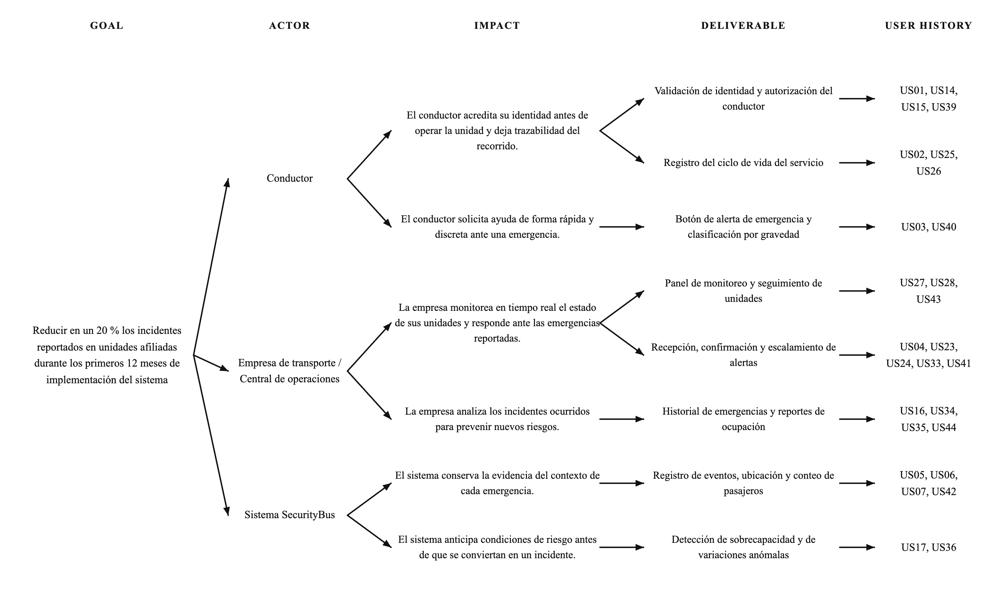
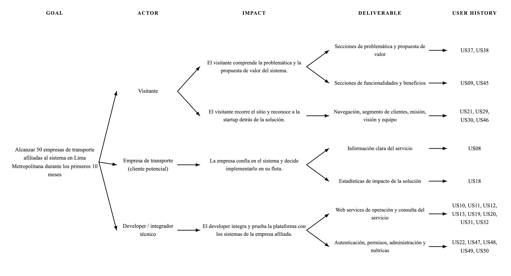

## Capítulo III: Requirements Specification

### 3.1. User Stories

A continuación se especifican las 50 User Stories que delimitan el alcance funcional de **SecurityBus**. Cada historia se enuncia desde la perspectiva de quien obtiene el valor —conductor, empresa operadora, sistema, visitante o developer— y se acompaña de criterios de aceptación en notación Gherkin: un escenario de éxito, que describe el camino esperado, y un escenario de fracaso, que fija cómo debe comportarse el sistema cuando la precondición no se cumple. Esta segunda mitad es la que permite verificar la historia durante las pruebas, por lo que se redactó buscando condiciones observables antes que enunciados generales.

Las historias se agrupan en cinco épicas, que corresponden a los frentes de trabajo del producto:

| Epic ID | Título                             | Descripción                                                                                                                                                                  |
| :------ | :--------------------------------- | :--------------------------------------------------------------------------------------------------------------------------------------------------------------------------- |
| EPNN01  | Gestión de conductores y servicios | Identificación y habilitación del conductor, su vínculo con la unidad asignada y el ciclo de vida del servicio, desde la apertura del recorrido hasta su cierre.             |
| EPNN02  | Gestión de alertas de emergencia   | Recorrido completo de una alerta: emisión desde la unidad, entrega y confirmación en la central, clasificación, reintentos, escalamiento y registro del evento.              |
| EPNN03  | Monitoreo de pasajeros y ocupación | Conteo automático de personas a bordo y su explotación posterior: sobrecapacidad, variaciones anómalas y análisis comparativo de la ocupación.                               |
| EPNN04  | Landing Page informativa           | Contenido público orientado al visitante que evalúa la solución: problemática, propuesta de valor, funcionalidades, beneficios, cifras de impacto e identidad de la startup. |
| EPNN05  | Web Services / API                 | Servicios expuestos para que el equipo técnico y los integradores operen, consulten y administren los recursos del sistema sin pasar por la interfaz.                        |

| Story ID | Título                                            | Descripción                                                                                                                                           | Criterios de Aceptación                                                                                                                                                                                                                                                                                                                                                                                                                                                                                                         | Epic ID |
| :------- | :------------------------------------------------ | :---------------------------------------------------------------------------------------------------------------------------------------------------- | :------------------------------------------------------------------------------------------------------------------------------------------------------------------------------------------------------------------------------------------------------------------------------------------------------------------------------------------------------------------------------------------------------------------------------------------------------------------------------------------------------------------------------ | :------ |
| US01     | Autenticación del conductor al iniciar la jornada | Como conductor, necesito acreditar quién soy antes de tomar la unidad, para que cada viaje quede asociado a una persona identificable.                | **Escenario 1 (Éxito): Identificación con código vigente** **Given** que soy un conductor habilitado y comienzo mi jornada **When** ingreso mi código de verificación vigente **Then** el sistema confirma mi identidad y me habilita para iniciar el servicio  **Escenario 2 (Fracaso): Código inválido o vencido** **Given** que comienzo mi jornada **When** ingreso un código que no corresponde o ya venció **Then** el sistema deniega la autenticación y no me permite continuar                 | EPNN01  |
| US02     | Apertura del registro de servicio                 | Como conductor, quiero dejar constancia del momento en que empiezo a operar, para que el recorrido quede documentado desde su inicio.                 | **Escenario 1 (Éxito): Apertura con identidad confirmada** **Given** que mi identidad ya fue confirmada por el sistema **When** indico que comienzo el recorrido **Then** el sistema abre el registro del servicio con la fecha, la hora y el estado «en curso»  **Escenario 2 (Fracaso): Conductor sin autenticar** **Given** que aún no he superado la autenticación **When** intento abrir el registro del servicio **Then** el sistema bloquea la acción y me indica que debo identificarme primero | EPNN01  |
| US03     | Envío de alerta desde la unidad                   | Como conductor, quiero avisar de una situación de riesgo con una sola acción, para pedir auxilio sin llamar la atención de quien me amenaza.          | **Escenario 1 (Éxito): Alerta emitida durante el servicio** **Given** que tengo un servicio en curso **When** acciono la alerta de emergencia **Then** el sistema la transmite a la central de monitoreo y me devuelve el acuse de envío  **Escenario 2 (Fracaso): Alerta sin recorrido asociado** **Given** que no tengo ningún servicio en curso **When** intento accionar la alerta **Then** el sistema descarta la solicitud por no estar asociada a un recorrido activo                            | EPNN02  |
| US04     | Notificación de la alerta a la central            | Como sistema, debo hacer llegar cada alerta a la central de operaciones, para que alguien pueda hacerse cargo de la emergencia.                       | **Escenario 1 (Éxito): Entrega a la central** **Given** una alerta emitida desde una unidad **When** la proceso **Then** la central la recibe junto con los datos de la unidad y del conductor  **Escenario 2 (Fracaso): Alerta sin datos mínimos** **Given** una alerta que llega sin los datos mínimos de la unidad **When** intento procesarla **Then** la descarto y no la envío a la central                                                                                                       | EPNN02  |
| US05     | Persistencia del evento de emergencia             | Como sistema, debo guardar cada alerta emitida, para que la empresa pueda revisarla después del hecho.                                                | **Escenario 1 (Éxito): Alerta con formato válido** **Given** una alerta que cumple el formato esperado **When** la recibo **Then** la almaceno como un evento consultable  **Escenario 2 (Fracaso): Formato no reconocido** **Given** una alerta con un formato que no reconozco **When** intento almacenarla **Then** no la registro y dejo constancia del rechazo                                                                                                                                     | EPNN02  |
| US06     | Conteo automático de ocupantes                    | Como sistema, debo llevar la cuenta de las personas a bordo, para poder dimensionar el riesgo cuando ocurra una emergencia.                           | **Escenario 1 (Éxito): Actualización por lectura de sensores** **Given** que la unidad se encuentra operando **When** los sensores detectan el ingreso de pasajeros **Then** actualizo el conteo a bordo  **Escenario 2 (Fracaso): Sensores sin lecturas** **Given** que los sensores no están enviando lecturas **When** corresponde actualizar el conteo **Then** conservo el último valor conocido en lugar de reportar cero                                                                         | EPNN03  |
| US07     | Disponibilidad del conteo para reportes           | Como sistema, debo poder informar cuántas personas viajan en la unidad, para acompañar los reportes de emergencia con ese dato.                       | **Escenario 1 (Éxito): Consulta durante un viaje** **Given** un viaje en curso **When** se consulta el estado de la unidad **Then** devuelvo la cantidad de pasajeros a bordo  **Escenario 2 (Fracaso): Unidad sin viaje en curso** **Given** que la unidad no tiene un viaje en curso **When** se consulta el estado **Then** respondo que no hay información de ocupación disponible                                                                                                                  | EPNN03  |
| US08     | Presentación de la propuesta en la landing page   | Como visitante, quiero enterarme de qué ofrece SecurityBus al entrar al sitio, para decidir si me conviene seguir leyendo.                            | **Escenario 1 (Éxito): Carga de la sección principal** **Given** que entro al sitio web **When** la página termina de cargar **Then** encuentro la descripción del servicio en la sección principal  **Escenario 2 (Fracaso): Contenido no recuperable** **Given** que el contenido no puede recuperarse **When** entro al sitio **Then** el sitio me avisa que la información no está disponible por el momento                                                                                        | EPNN04  |
| US09     | Detalle de las funcionalidades                    | Como visitante, quiero ver qué hace concretamente la plataforma, para juzgar si resuelve lo que necesito.                                             | **Escenario 1 (Éxito): Funcionalidades publicadas** **Given** que recorro el sitio **When** abro la sección de funcionalidades **Then** veo listadas las capacidades de la plataforma  **Escenario 2 (Fracaso): Sin funcionalidades cargadas** **Given** que no hay funcionalidades cargadas **When** abro la sección **Then** el sitio me indica que todavía no hay contenido publicado                                                                                                                | EPNN04  |
| US10     | Servicio de validación de conductores             | Como developer, quiero comprobar la identidad de un conductor por API, para no depender de la interfaz cuando necesito ese dato.                      | **Escenario 1 (Éxito): Identificador registrado** **Given** una petición con el identificador de un conductor registrado **When** el servicio la atiende **Then** responde con la confirmación de identidad y el estado del conductor  **Escenario 2 (Fracaso): Identificador inexistente** **Given** una petición cuyo identificador no corresponde a ningún conductor **When** el servicio la atiende **Then** responde con un error de validación                                                    | EPNN05  |
| US11     | Servicio de apertura de servicio                  | Como developer, quiero abrir un servicio por API, para montar escenarios de prueba sin usar la aplicación del conductor.                              | **Escenario 1 (Éxito): Datos completos del servicio** **Given** una petición con los datos completos del servicio **When** la envío al endpoint **Then** el servicio queda abierto y recibo su identificador  **Escenario 2 (Fracaso): Datos inconsistentes** **Given** una petición cuyos datos del servicio son inconsistentes **When** la envío al endpoint **Then** recibo un error y ningún servicio queda abierto                                                                                 | EPNN05  |
| US12     | Servicio de emisión de alertas                    | Como developer, quiero emitir alertas por API, para probar el circuito de emergencia de punta a punta.                                                | **Escenario 1 (Éxito): Alerta con datos completos** **Given** una petición con los datos completos de la alerta **When** el servicio la recibe **Then** la alerta queda registrada y recibo su identificador  **Escenario 2 (Fracaso): Faltan datos obligatorios** **Given** una petición a la que le faltan datos obligatorios **When** el servicio la recibe **Then** recibo un error y la alerta no se registra                                                                                      | EPNN05  |
| US13     | Servicio de actualización del conteo              | Como developer, quiero fijar el número de pasajeros por API, para armar pruebas que dependan de la ocupación de la unidad.                            | **Escenario 1 (Éxito): Conteo válido** **Given** una petición con un conteo válido **When** la envío al endpoint **Then** el valor de ocupación queda actualizado  **Escenario 2 (Fracaso): Error interno del servicio** **Given** una petición que falla por un error interno del servicio **When** la envío al endpoint **Then** recibo un mensaje de error y la ocupación conserva su valor anterior                                                                                                 | EPNN05  |
| US14     | Verificación de habilitación del conductor        | Como sistema, debo comprobar que el conductor esté habilitado para la unidad que pretende operar, para impedir que alguien conduzca sin autorización. | **Escenario 1 (Éxito): Habilitación vigente** **Given** un conductor registrado con habilitación vigente **When** verifico su autorización sobre la unidad **Then** confirmo que puede operarla  **Escenario 2 (Fracaso): Sin habilitación para la unidad** **Given** un conductor sin habilitación vigente para esa unidad **When** verifico su autorización **Then** rechazo la operación del vehículo                                                                                                | EPNN01  |
| US15     | Vínculo entre conductor y unidad                  | Como sistema, debo dejar asentado qué conductor opera cada unidad, para que cualquier evento pueda atribuirse a un responsable.                       | **Escenario 1 (Éxito): Asignación registrada** **Given** un conductor habilitado y una unidad disponible **When** se ejecuta la asignación **Then** registro el vínculo conductor–unidad con su fecha de inicio  **Escenario 2 (Fracaso): Datos que no identifican al conductor o la unidad** **Given** datos que no permiten identificar al conductor o a la unidad **When** se intenta la asignación **Then** rechazo el vínculo y no modifico los registros                                          | EPNN01  |
| US16     | Revisión del historial de emergencias             | Como empresa, quiero repasar las alertas ocurridas en mi flota, para detectar dónde y cuándo se concentran los incidentes.                            | **Escenario 1 (Éxito): Historial con eventos** **Given** que existen eventos almacenados para mi flota **When** consulto el historial **Then** obtengo la lista de emergencias con su fecha, unidad y estado  **Escenario 2 (Fracaso): Historial vacío** **Given** que no hay eventos almacenados **When** consulto el historial **Then** el sistema me informa que no hay registros para mostrar                                                                                                       | EPNN02  |
| US17     | Aviso por exceso de capacidad                     | Como sistema, debo advertir cuando la unidad lleva más personas de las que admite, para prevenir situaciones de conflicto a bordo.                    | **Escenario 1 (Éxito): Umbral superado** **Given** una unidad con capacidad máxima configurada **When** el conteo de pasajeros supera ese límite **Then** emito un aviso de sobrecapacidad  **Escenario 2 (Fracaso): Sin umbral configurado** **Given** una unidad sin capacidad máxima configurada **When** evalúo la ocupación **Then** no emito ningún aviso por falta de un umbral de referencia                                                                                                    | EPNN03  |
| US18     | Estadísticas de impacto en la landing page        | Como visitante, quiero ver cifras sobre el problema y los resultados de la solución, para valorar si vale la pena.                                    | **Escenario 1 (Éxito): Datos estadísticos cargados** **Given** que hay datos estadísticos cargados **When** abro la sección de impacto **Then** veo las cifras presentadas de forma legible  **Escenario 2 (Fracaso): Sin datos estadísticos** **Given** que no hay datos estadísticos cargados **When** abro la sección **Then** el sitio muestra un mensaje informativo en lugar de cifras vacías                                                                                                     | EPNN04  |
| US19     | Servicio de consulta del historial                | Como developer, quiero recuperar los eventos registrados por API, para extraer información sin entrar a la interfaz.                                  | **Escenario 1 (Éxito): Filtros válidos** **Given** una petición con filtros válidos **When** el servicio la atiende **Then** devuelve los eventos que coinciden con los filtros  **Escenario 2 (Fracaso): Filtros mal formados** **Given** una petición con filtros mal formados **When** el servicio la atiende **Then** devuelve un error describiendo el parámetro inválido                                                                                                                          | EPNN05  |
| US20     | Servicio de consulta del estado de la unidad      | Como developer, quiero conocer el estado actual de una unidad por API, para no trabajar a ciegas sobre su situación.                                  | **Escenario 1 (Éxito): Unidad existente** **Given** el identificador de una unidad existente **When** consulto el endpoint **Then** obtengo su estado actual y su ocupación  **Escenario 2 (Fracaso): Unidad inexistente** **Given** un identificador que no corresponde a ninguna unidad **When** consulto el endpoint **Then** obtengo un error de recurso no encontrado                                                                                                                              | EPNN05  |
| US21     | Recorrido por las secciones del sitio             | Como visitante, quiero moverme entre las secciones del sitio, para llegar a lo que me interesa sin buscar a ciegas.                                   | **Escenario 1 (Éxito): Navegación efectiva** **Given** que estoy en el sitio web **When** elijo una sección del menú **Then** el sitio me lleva a esa sección y muestra su contenido  **Escenario 2 (Fracaso): Sección que no carga** **Given** una sección que no puede cargarse **When** intento acceder a ella **Then** el sitio me informa del error de acceso y me deja volver                                                                                                                     | EPNN04  |
| US22     | Servicio de autenticación de peticiones           | Como developer, quiero que las peticiones al sistema exijan credenciales, para que nadie acceda a más de lo que le corresponde.                       | **Escenario 1 (Éxito): Credenciales vigentes** **Given** credenciales válidas y vigentes **When** envío la petición **Then** el servicio la autoriza y devuelve un token de acceso  **Escenario 2 (Fracaso): Credenciales inválidas** **Given** credenciales inválidas o vencidas **When** envío la petición **Then** el servicio rechaza el acceso sin exponer el motivo exacto                                                                                                                        | EPNN05  |
| US23     | Acuse de recepción de la alerta                   | Como sistema, debo asentar si la central efectivamente recibió la alerta, para saber si el pedido de auxilio llegó a destino.                         | **Escenario 1 (Éxito): Acuse recibido** **Given** una alerta transmitida a la central **When** la central acusa su recepción **Then** registro la confirmación con su marca de tiempo  **Escenario 2 (Fracaso): Sin acuse en el plazo** **Given** una alerta transmitida a la central **When** no llega ningún acuse dentro del plazo previsto **Then** marco la alerta como no confirmada                                                                                                              | EPNN02  |
| US24     | Reenvío de alertas sin confirmar                  | Como sistema, debo insistir con las alertas que nadie confirmó, para que un fallo de comunicación no deje una emergencia sin atender.                 | **Escenario 1 (Éxito): Reintento ejecutado** **Given** una alerta marcada como no confirmada **When** ejecuto el reintento **Then** vuelvo a transmitirla y registro el nuevo intento  **Escenario 2 (Fracaso): Reintentos agotados** **Given** una alerta que agotó los reintentos previstos **When** intento reenviarla otra vez **Then** la marco como fallida y suspendo los reintentos                                                                                                             | EPNN02  |
| US25     | Cierre del registro de servicio                   | Como conductor, quiero cerrar el servicio al terminar mi turno, para que el registro del recorrido quede completo.                                    | **Escenario 1 (Éxito): Cierre de un servicio en curso** **Given** un servicio en curso a mi nombre **When** indico que finalizo el recorrido **Then** el sistema cierra el registro con la hora de término  **Escenario 2 (Fracaso): Nada que cerrar** **Given** que no tengo ningún servicio en curso **When** intento finalizar **Then** el sistema rechaza la operación por no haber nada que cerrar                                                                                                 | EPNN01  |
| US26     | Consulta del estado del propio servicio           | Como conductor, quiero saber cómo figura mi servicio en el sistema, para confirmar que todo está registrado como corresponde.                         | **Escenario 1 (Éxito): Servicio en curso** **Given** un servicio en curso a mi nombre **When** consulto su estado **Then** el sistema me muestra la unidad, la hora de inicio y el estado actual  **Escenario 2 (Fracaso): Sin servicio activo** **Given** que no tengo ningún servicio en curso **When** consulto su estado **Then** el sistema me indica que no hay un servicio activo                                                                                                                | EPNN01  |
| US27     | Tablero de estado de la flota                     | Como empresa, quiero ver cómo están mis unidades en operación, para tener una lectura general de la flota sin llamar a cada conductor.                | **Escenario 1 (Éxito): Flota con unidades operando** **Given** unidades registradas y operando **When** consulto el tablero **Then** veo el estado actual de cada unidad con su conductor asignado  **Escenario 2 (Fracaso): Sin unidades registradas** **Given** que no tengo unidades registradas **When** consulto el tablero **Then** el sistema me informa que no hay unidades para mostrar                                                                                                        | EPNN01  |
| US28     | Seguimiento de la ocupación en operación          | Como empresa, quiero seguir cuán llenas van mis unidades, para anticipar riesgos asociados a la aglomeración.                                         | **Escenario 1 (Éxito): Lecturas disponibles** **Given** lecturas de ocupación disponibles para mis unidades **When** genero el reporte **Then** veo la ocupación de cada unidad al momento de la consulta  **Escenario 2 (Fracaso): Lecturas incompletas** **Given** lecturas de ocupación incompletas **When** genero el reporte **Then** el sistema señala qué unidades no tienen información confiable                                                                                               | EPNN03  |
| US29     | Segmento al que apunta la solución                | Como visitante, quiero saber a qué tipo de usuario está dirigido SecurityBus, para reconocer si soy parte de ese público.                             | **Escenario 1 (Éxito): Segmentos definidos** **Given** que los segmentos están definidos en el sitio **When** abro la sección correspondiente **Then** veo descritos los segmentos objetivo  **Escenario 2 (Fracaso): Sin segmentos definidos** **Given** que no hay segmentos definidos **When** abro la sección **Then** el sitio muestra un mensaje informativo                                                                                                                                      | EPNN04  |
| US30     | Misión y visión de la startup                     | Como visitante, quiero conocer hacia dónde va la startup, para entender qué la mueve más allá del producto.                                           | **Escenario 1 (Éxito): Contenido publicado** **Given** que la misión y la visión están publicadas **When** abro la sección «Nosotros» **Then** leo ambas declaraciones  **Escenario 2 (Fracaso): Contenido no publicado** **Given** que ese contenido no está publicado **When** abro la sección **Then** el sitio muestra un mensaje de contenido no disponible                                                                                                                                        | EPNN04  |
| US31     | Servicio de cierre de servicio                    | Como developer, quiero cerrar un servicio por API, para completar su ciclo de vida durante las pruebas.                                               | **Escenario 1 (Éxito): Servicio en curso referenciado** **Given** una petición que referencia un servicio en curso **When** el endpoint la procesa **Then** el servicio queda cerrado con su hora de término  **Escenario 2 (Fracaso): Servicio ya cerrado o inexistente** **Given** una petición que referencia un servicio ya cerrado o inexistente **When** el endpoint la procesa **Then** devuelve un error y no altera ningún registro                                                            | EPNN05  |
| US32     | Servicio de consulta de ocupación                 | Como developer, quiero obtener la ocupación de una unidad por API, para conocer cuántos pasajeros lleva en ese momento.                               | **Escenario 1 (Éxito): Unidad existente** **Given** el identificador de una unidad existente **When** consulto el endpoint **Then** obtengo el número de pasajeros a bordo y la hora de la lectura  **Escenario 2 (Fracaso): Unidad inexistente** **Given** un identificador que no corresponde a ninguna unidad **When** consulto el endpoint **Then** obtengo un error de recurso no encontrado                                                                                                       | EPNN05  |
| US33     | Difusión de la alerta a varios destinatarios      | Como sistema, debo enviar la alerta a todos los destinos configurados, para que el aviso no dependa de un solo receptor.                              | **Escenario 1 (Éxito): Envío a la lista completa** **Given** una alerta emitida y una lista de destinatarios configurada **When** la proceso **Then** la envío a cada destinatario y registro el resultado por destino  **Escenario 2 (Fracaso): Destinatarios no válidos** **Given** destinatarios cuya dirección no es válida **When** intento el envío **Then** registro el fallo para esos destinos y continúo con los restantes                                                                    | EPNN02  |
| US34     | Medición del tiempo de respuesta                  | Como sistema, debo medir cuánto tarda la central en atender cada alerta, para que ese indicador quede disponible en el registro.                      | **Escenario 1 (Éxito): Alerta atendida** **Given** una alerta transmitida a la central **When** la central la atiende **Then** calculo y registro el tiempo transcurrido entre el envío y la atención  **Escenario 2 (Fracaso): Alerta nunca atendida** **Given** una alerta que nunca fue atendida **When** evalúo el evento **Then** registro la ausencia de respuesta en lugar de un tiempo                                                                                                          | EPNN02  |
| US35     | Promedio de pasajeros por viaje                   | Como empresa, quiero conocer el promedio de pasajeros por viaje, para contar con una referencia de la demanda habitual.                               | **Escenario 1 (Éxito): Datos históricos suficientes** **Given** suficientes viajes con datos de ocupación registrados **When** solicito el cálculo **Then** obtengo el promedio de pasajeros por viaje del período  **Escenario 2 (Fracaso): Datos por debajo del mínimo** **Given** menos viajes registrados que el mínimo requerido **When** solicito el cálculo **Then** el sistema me indica que los datos no alcanzan para calcularlo                                                              | EPNN03  |
| US36     | Detección de variaciones anómalas de ocupación    | Como sistema, debo señalar los cambios inusuales en el número de pasajeros, para que la empresa revise qué ocurrió en esa unidad.                     | **Escenario 1 (Éxito): Variación fuera de lo habitual** **Given** una serie de lecturas de ocupación consistentes **When** detecto una variación que se aparta del comportamiento habitual **Then** emito un aviso para su revisión  **Escenario 2 (Fracaso): Lecturas no concluyentes** **Given** lecturas de ocupación inconsistentes o con vacíos **When** analizo la variación **Then** descarto el caso por no ser concluyente                                                                     | EPNN03  |
| US37     | Problemática del transporte en la landing page    | Como visitante, quiero entender el problema que la solución aborda, para situar la propuesta en un contexto real.                                     | **Escenario 1 (Éxito): Problemática publicada** **Given** que el contenido está publicado **When** abro la sección de problemática **Then** leo la descripción del problema con los datos que la respaldan  **Escenario 2 (Fracaso): Contenido no publicado** **Given** que el contenido no está publicado **When** abro la sección **Then** el sitio muestra un mensaje informativo                                                                                                                    | EPNN04  |
| US38     | Propuesta de valor en la landing page             | Como visitante, quiero leer qué promete SecurityBus y hasta dónde llega, para comparar la propuesta con lo que ya conozco.                            | **Escenario 1 (Éxito): Propuesta definida** **Given** que la propuesta de valor está definida **When** abro la sección correspondiente **Then** leo la propuesta y el alcance del servicio  **Escenario 2 (Fracaso): Propuesta incompleta** **Given** que la propuesta está incompleta **When** abro la sección **Then** el sitio advierte que falta información por publicar                                                                                                                           | EPNN04  |
| US39     | Control de operación simultánea                   | Como sistema, debo impedir que un mismo conductor figure operando dos unidades a la vez, para cerrar la puerta al uso indebido de credenciales.       | **Escenario 1 (Éxito): Conductor sin servicios abiertos** **Given** un conductor sin servicios abiertos en otras unidades **When** solicita iniciar un servicio **Then** autorizo la apertura del servicio  **Escenario 2 (Fracaso): Conductor con servicio abierto** **Given** un conductor que ya tiene un servicio abierto en otra unidad **When** solicita iniciar un segundo servicio **Then** rechazo la solicitud y notifico la operación duplicada                                              | EPNN01  |
| US40     | Clasificación de alertas por gravedad             | Como sistema, debo asignar un nivel de gravedad a cada alerta, para que las más críticas no compitan con las menores.                                 | **Escenario 1 (Éxito): Alerta clasificable** **Given** una alerta con su tipo informado **When** evalúo sus datos **Then** le asigno el nivel de prioridad correspondiente  **Escenario 2 (Fracaso): Datos insuficientes para clasificar** **Given** una alerta sin datos suficientes para clasificarla **When** intento evaluarla **Then** le asigno la prioridad por defecto y la marco para revisión                                                                                                 | EPNN02  |
| US41     | Escalamiento de alertas sin atención              | Como sistema, debo derivar a un nivel superior las alertas que nadie atendió, para que ninguna quede olvidada en la cola.                             | **Escenario 1 (Éxito): Plazo de respuesta superado** **Given** una alerta sin atender **When** se supera el plazo máximo de respuesta **Then** la escalo al siguiente nivel y registro el escalamiento  **Escenario 2 (Fracaso): Alerta atendida en plazo** **Given** una alerta ya atendida dentro del plazo **When** evalúo su tiempo de respuesta **Then** no realizo ningún escalamiento                                                                                                            | EPNN02  |
| US42     | Ubicación asociada al evento                      | Como sistema, debo guardar dónde se produjo cada emergencia, para permitir después un análisis por zona.                                              | **Escenario 1 (Éxito): Alerta con coordenadas** **Given** una alerta que llega con coordenadas de ubicación **When** proceso el evento **Then** almaceno la ubicación junto al registro de la alerta  **Escenario 2 (Fracaso): Alerta sin coordenadas** **Given** una alerta que llega sin coordenadas **When** proceso el evento **Then** registro el evento indicando que la ubicación no está disponible                                                                                             | EPNN02  |
| US43     | Seguimiento de la unidad asignada                 | Como empresa, quiero seguir por dónde va la unidad, para saber dónde está cuando necesito ubicarla.                                                   | **Escenario 1 (Éxito): Unidad reportando posición** **Given** una unidad con servicio en curso que reporta su posición **When** consulto su seguimiento **Then** veo su última ubicación registrada con la hora del reporte  **Escenario 2 (Fracaso): Unidad sin señal** **Given** una unidad que no está reportando su posición **When** consulto su seguimiento **Then** el sistema me indica que la ubicación no está disponible                                                                     | EPNN01  |
| US44     | Comparación de ocupación entre viajes             | Como empresa, quiero contrastar la ocupación de distintas unidades y rutas, para ver dónde se concentra la demanda.                                   | **Escenario 1 (Éxito): Registros de varios viajes** **Given** registros de ocupación de varios viajes **When** solicito la comparación **Then** obtengo las diferencias de ocupación entre los viajes seleccionados  **Escenario 2 (Fracaso): Registros insuficientes** **Given** registros insuficientes para comparar **When** solicito la comparación **Then** el sistema me indica que no puede realizarla                                                                                          | EPNN03  |
| US45     | Beneficios del sistema en la landing page         | Como visitante, quiero ver qué gano al usar la plataforma, para traducir las funcionalidades en algo concreto.                                        | **Escenario 1 (Éxito): Beneficios publicados** **Given** que los beneficios están publicados **When** abro la sección correspondiente **Then** leo los beneficios expresados desde la perspectiva del usuario  **Escenario 2 (Fracaso): Beneficios no publicados** **Given** que los beneficios no están publicados **When** abro la sección **Then** el sitio muestra un mensaje informativo                                                                                                           | EPNN04  |
| US46     | Equipo detrás de la solución                      | Como visitante, quiero saber quiénes desarrollan SecurityBus, para poder identificar a los responsables y contactarlos.                               | **Escenario 1 (Éxito): Perfiles cargados** **Given** que los perfiles del equipo están cargados **When** abro la sección del equipo **Then** veo a los integrantes con su rol  **Escenario 2 (Fracaso): Sin perfiles cargados** **Given** que no hay perfiles cargados **When** abro la sección **Then** el sitio muestra un mensaje de contenido faltante                                                                                                                                              | EPNN04  |
| US47     | Servicio de actualización de conductores          | Como developer, quiero modificar los datos de un conductor por API, para mantener la información al día sin intervención manual.                      | **Escenario 1 (Éxito): Datos válidos** **Given** una petición con datos válidos para un conductor existente **When** la envío al endpoint **Then** los datos quedan actualizados y recibo el registro resultante  **Escenario 2 (Fracaso): Datos que no pasan la validación** **Given** una petición con datos que no pasan la validación **When** la envío al endpoint **Then** recibo un error y el registro conserva sus valores anteriores                                                          | EPNN05  |
| US48     | Servicio de baja lógica de registros              | Como developer, quiero desactivar registros sin borrarlos, para no perder el rastro de lo que existió.                                                | **Escenario 1 (Éxito): Registro activo** **Given** un registro existente y activo **When** solicito su desactivación **Then** el registro pasa a estado inactivo y deja de aparecer en las consultas corrientes  **Escenario 2 (Fracaso): Registro inexistente** **Given** un registro que no existe **When** solicito su desactivación **Then** recibo un error de recurso no encontrado                                                                                                               | EPNN05  |
| US49     | Servicio de métricas del sistema                  | Como developer, quiero obtener métricas agregadas del sistema, para tener una lectura general de lo que se está registrando.                          | **Escenario 1 (Éxito): Período con datos** **Given** datos suficientes en el período consultado **When** consulto el endpoint de métricas **Then** obtengo los indicadores agregados del sistema  **Escenario 2 (Fracaso): Período sin datos** **Given** un período sin datos registrados **When** consulto el endpoint **Then** obtengo una respuesta vacía indicando la ausencia de datos                                                                                                             | EPNN05  |
| US50     | Servicio de verificación de permisos              | Como developer, quiero comprobar los permisos antes de ejecutar una operación, para no intentar acciones que serán rechazadas.                        | **Escenario 1 (Éxito): Permisos suficientes** **Given** un solicitante con los permisos requeridos para la operación **When** el servicio los verifica **Then** autoriza la operación  **Escenario 2 (Fracaso): Permisos insuficientes** **Given** un solicitante sin los permisos requeridos **When** el servicio los verifica **Then** rechaza la operación e informa que el permiso es insuficiente                                                                                                  | EPNN05  |

### 3.2. Impact Mapping

El Impact Mapping une lo que el negocio quiere conseguir con lo que el equipo va a construir. Se lee de izquierda a derecha respondiendo cuatro preguntas encadenadas: por qué se hace (_Goal_), quién puede hacerlo posible (_Actor_), cómo debe cambiar su comportamiento (_Impact_) y qué hay que entregarle para lograrlo (_Deliverable_). A esas cuatro columnas se añadió una quinta con las User Stories de la sección 3.1, de modo que cada entregable queda enganchado al backlog y ninguna historia queda suelta.

SecurityBus persigue dos objetivos que se sostienen mutuamente: uno atiende el problema de seguridad que da origen a la solución, y el otro, la adopción que la hace viable. Ambos se derivan de los _Business Outcomes_ y de las _Hypothesis Statements_ del Lean UX Process (sección 1.2.2).

#### Objetivo 1: reducción de incidentes

> Reducir en un 20 % los incidentes reportados en unidades afiliadas durante los primeros 12 meses de implementación del sistema.

Este objetivo se apoya en tres actores. El conductor es quien detecta el riesgo y pide auxilio; la empresa es quien responde y aprende de lo ocurrido; y el propio sistema actúa cuando nadie más puede hacerlo, reintentando envíos, escalando alertas y guardando la evidencia del hecho.

  

<em>Figura 3.1. Impact Mapping — Objetivo 1: reducción de incidentes en unidades afiliadas.</em>

#### Objetivo 2: adopción del sistema

> Alcanzar 50 empresas de transporte afiliadas al sistema en Lima Metropolitana durante los primeros 10 meses.

Aquí el recorrido es distinto: el visitante llega sin conocer la solución y necesita entender el problema y la propuesta antes de interesarse; la empresa evalúa si confiar en la plataforma; y el developer se encarga de que integrarla no represente un obstáculo para afiliarse.

  

<em>Figura 3.2. Impact Mapping — Objetivo 2: adopción del sistema por empresas de transporte.</em>

### 3.3. Product Backlog
