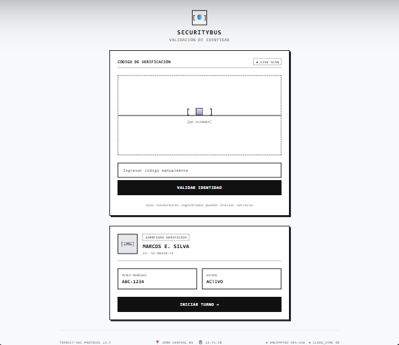
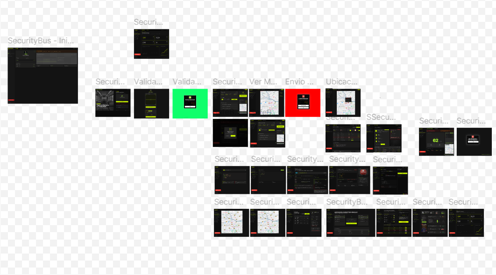

## Capítulo IV: Product Design

### 4.1. Style Guidelines

Las siguientes pautas de estilo definen los principales criterios visuales utilizados en el diseño de SecurityBus, con el objetivo de mantener una interfaz consistente y facilitar el trabajo conjunto entre diseño y desarrollo. Estas pautas contemplan aspectos como la identidad visual, paleta de colores, tipografía, espaciado, componentes e interacción.

El diseño de SecurityBus está orientado a transmitir seguridad, control y monitoreo, priorizando la claridad de la información y la rapidez de interpretación. Esto responde a la naturaleza de la plataforma, enfocada en la gestión y supervisión del transporte público.

#### 4.1.1. General Style Guidelines

Las decisiones generales de estilo se basan en los atributos que busca transmitir SecurityBus como producto: seguridad, precisión, modernidad y disponibilidad constante. A nivel visual, se toma como referencia el diseño de dashboards y sistemas de monitoreo, donde la información debe presentarse de manera clara y organizada.

**Branding y tono de comunicación**

La identidad visual de SecurityBus busca representar una plataforma tecnológica, confiable y eficiente, orientada a la supervisión y gestión del transporte público.

La aplicación busca transmitir las siguientes características:

+ Segura
+ Precisa
+ Moderna
+ Siempre activa

El tono de comunicación es serio, formal, respetuoso y sereno, debido al contexto de seguridad en el que se utiliza la plataforma. Por ello, se priorizan mensajes directos y claros, evitando expresiones informales o ambiguas.

**Color Palette**

La paleta de colores de SecurityBus utiliza principalmente tonos oscuros, acompañados de un verde neón como color principal de acento y rojo para situaciones críticas. Esta combinación busca reforzar la identidad tecnológica del producto y facilitar la identificación de acciones y alertas dentro de la interfaz.

|Color|Hex|Significado y justificación| Uso en la interfaz|Imagen|
|-----|---|---------------------------|-------------------|------|
|Negro| - |Se utiliza como color base debido a que transmite seriedad, profundidad y tecnología. También permite generar un entorno visual enfocado y con pocas distracciones. |Fondo principal y diferentes áreas de la interfaz. | |
|Verde neón| #C3F400 |Es el color principal de acento. Su alta visibilidad permite destacar elementos importantes y transmite dinamismo e innovación. | Botones principales, indicadores y títulos.||
|Verde secundario| #596D0B|Es el color principal de acento. Su alta visibilidad permite destacar elementos importantes y transmite dinamismo e innovación. | Elementos secundarios y variaciones de componentes.||
|Rojo| - |Se utiliza para representar situaciones de emergencia, peligro o acciones que requieren atención inmediata. | Alertas y elementos críticos.||

**Tipografía**

Para la interfaz se utilizan las familias tipográficas Space Grotesk e Inter, seleccionadas por su legibilidad y adaptación a entornos digitales.

+ Títulos: Space Grotesk Bold, 96 px.
+ Subtítulos: Space Grotesk Bold, entre 48 y 60 px.
+ Párrafos: Inter Light/Bold, entre 12 y 24 px.

Esta combinación permite establecer una jerarquía visual clara entre títulos, subtítulos y contenido informativo.


**Spacing y Layout**

El diseño utiliza un sistema de espaciado consistente para mantener una distribución ordenada de los elementos. Las medidas empleadas para padding y spacing siguen múltiplos de 2 px.

+ Base unit: múltiplos de 2 px para padding y spacing.
+ Grid: márgenes de 24 px para mantener una distribución equilibrada.
+ Breakpoints: se considera un ancho de 1440 px y un alto de 1024 px como referencia para la versión web.


**Componentes visuales**

Los principales componentes de la interfaz siguen criterios visuales consistentes:

+ Botones: verde para acciones principales, rojo para acciones críticas y gris para acciones secundarias.


+ Cards: utilizadas para organizar información relacionada dentro de contenedores diferenciados.


+ Iconografía: se emplea un estilo simple y fácilmente reconocible para facilitar la identificación de acciones y funcionalidades.


**Principios de diseño**

Las decisiones de diseño de SecurityBus se basan en los siguientes principios:

+ **Claridad**: presentar la información de forma comprensible.
+ **Jerarquía visual**: destacar los elementos de mayor importancia.
+ **Consistencia:** mantener uniformidad en colores, tipografías y componentes.
+ **Accesibilidad**: asegurar una adecuada legibilidad y contraste.
+ **Feedback inmediato**: proporcionar una respuesta visual ante las acciones realizadas por el usuario.

#### 4.1.2. Web Style Guidelines

Las reglas de estilo web de SecurityBus establecen los criterios visuales e interactivos utilizados en la aplicación para mantener una experiencia consistente y funcional.

La interfaz web se organiza de acuerdo con las principales funciones de la plataforma, priorizando la información relacionada con el monitoreo, seguridad y gestión de las unidades de transporte. Los elementos de navegación se mantienen visibles y diferenciados para facilitar el acceso a las diferentes secciones del sistema.

Asimismo, se utilizan componentes como cards, botones, indicadores y elementos de información para organizar los contenidos y evitar una presentación excesivamente cargada. Los elementos más relevantes, como alertas y estados críticos, presentan una diferenciación visual mediante el uso del color rojo.

Los botones y enlaces mantienen una apariencia consistente y proporcionan retroalimentación visual durante la interacción. De esta manera, el usuario puede identificar fácilmente las acciones disponibles y comprender el resultado de sus interacciones con el sistema.

### 4.2. Information Architecture
La arquitectura de información de SecurityBus define cómo se distribuyen, agrupan y presentan los contenidos de la plataforma para facilitar el acceso a las funciones principales. Su diseño considera las necesidades de los dos segmentos identificados: los conductores de transporte público y las empresas o consorcios responsables de supervisar sus unidades.

La estructura busca que cada usuario pueda encontrar la información y las acciones que necesita sin realizar recorridos innecesarios. Para ello, se consideran diferentes mecanismos de organización, etiquetado, búsqueda y navegación que mantienen una relación coherente entre la Landing Page y la aplicación web.

#### 4.2.1. Organization Systems

La organización de la información se establece de acuerdo con el tipo de contenido y con las actividades que realizan los usuarios dentro de SecurityBus.

- **Organización por segmento de usuario:** La plataforma diferencia las necesidades de los conductores y de las empresas o consorcios. El conductor se enfoca principalmente en acciones relacionadas con su seguridad y el reporte de incidentes, mientras que la empresa requiere información para supervisar unidades, conductores y situaciones reportadas.

- **Organización por función:** Las funcionalidades se agrupan según el objetivo que cumplen dentro de la plataforma. Entre ellas se encuentran el monitoreo GPS, las alertas de emergencia, el registro de incidentes, la gestión de conductores y la consulta de información de la operación.

- **Jerarquía de información:** En las vistas de supervisión se prioriza la información relacionada con situaciones de emergencia e incidentes, seguida de los datos operativos de las unidades y conductores. Esto permite que los eventos que requieren mayor atención puedan identificarse rápidamente.

- **Organización cronológica:** La información relacionada con incidentes y recorridos puede presentarse considerando el orden temporal de los registros, lo cual permite consultar acontecimientos recientes y revisar el historial de una unidad.

- **Organización por niveles:** La información parte de una vista general y permite acceder progresivamente a datos más específicos; por ejemplo, desde la supervisión general de unidades se puede llegar al detalle de una unidad o a los incidentes asociados a ella.

#### 4.2.2. Labeling Systems

El sistema de etiquetado utiliza nombres breves y fáciles de identificar para que los usuarios reconozcan rápidamente el propósito de cada sección y acción. Se mantiene principalmente el inglés en los elementos de interfaz, conforme a la implementación de la plataforma.

- **Etiquetas de navegación:**
    - Home: acceso a la página principal.
    - Features: muestra las principales funcionalidades de SecurityBus.
    - Statistics: presenta indicadores y datos relacionados con la supervisión de la operación.
    - Plans: permite consultar los planes de suscripción disponibles para empresas y consorcios.
    - Contact: proporciona un medio de comunicación con el equipo de SecurityBus.
    - Login: permite acceder a la aplicación web.
- **Etiquetas de acción:**
    - Get Started: inicia el proceso para comenzar a utilizar SecurityBus.
    - Choose Plan: permite seleccionar un plan de suscripción.
    - Report Incident: permite registrar o reportar un incidente.
    - View Details: permite consultar información detallada.
    Contact Us: dirige al usuario hacia los medios de contacto.
- **Etiquetas relacionadas con seguridad y operación:**
    - GPS Monitoring: supervisión de la ubicación de las unidades.
    - Panic Button: mecanismo para generar una alerta de emergencia.
    - Incident Log: registro de incidentes reportados.
    - Emergency Alerts: visualización de alertas generadas ante situaciones de emergencia.
    - Route History: consulta del historial de recorridos.

Estas etiquetas buscan mantener una relación directa entre el nombre de cada elemento y la acción o información que representa, reduciendo posibles confusiones durante la navegación.

#### 4.2.3. SEO tags and Meta Tags

Para SecurityBus se consideran etiquetas SEO y metadatos que permiten identificar correctamente la plataforma y describir su propósito, aplicados principalmente en la Landing Page para mejorar su presentación en buscadores, navegadores y plataformas que generan vistas previas de enlaces.

- Título de página, que incorpora el nombre del producto y una descripción breve de su finalidad:

```html
<title> SecurityBus - Public Transport Security </title>
```

- Codificación de caracteres, para representar correctamente el contenido de la plataforma:

```html
<meta charset = "UTF-8">
```

- Configuración responsive, que permite adaptar la visualización a distintos tamaños de pantalla:

```html
<meta name="viewport" content="width=device-width, initial-scale=1.0">
```

- Descripción SEO, que resume la propuesta principal utilizando términos relacionados con seguridad, monitoreo y transporte público:

```html
<meta name="description" content="SecurityBus provides security and monitoring solutions for public transport companies, with GPS monitoring, emergency alerts and incident management.">
```

- Open Graph, que controla la información mostrada al compartir la Landing Page en redes sociales o servicios de mensajería:

```html
<meta property="og:title" content="SecurityBus - Public Transport Security">
<meta property="og:description" content="Improve public transport security with GPS monitoring, emergency alerts and incident management.">
<meta property="og:type" content="website">
```

- Favicon: se utiliza el ícono asociado a la identidad visual de SecurityBus para facilitar el reconocimiento de la página en las pestañas del navegador.

#### 4.2.4. Searching Systems

Los mecanismos de búsqueda están orientados principalmente a facilitar la localización de información operativa dentro de la aplicación web. Dado que la plataforma maneja múltiples unidades, conductores e incidentes, se consideran mecanismos que reduzcan el tiempo necesario para encontrar un registro específico:

- **Búsqueda por unidad:** permite localizar una unidad mediante información identificativa disponible en el sistema.

- **Búsqueda de conductores:** facilita la localización de un conductor registrado mediante su nombre u otra información asociada.

- **Filtrado de incidentes:** permite consultar los incidentes registrados según criterios como tipo, estado o periodo de registro.

- **Consulta de información específica:** una vez localizado un registro, el usuario accede a su información detallada sin recorrer manualmente todas las secciones de la plataforma.

Estos mecanismos facilitan el trabajo de las empresas y responsables de supervisión, especialmente cuando aumenta la cantidad de unidades, conductores o incidentes.

#### 4.2.5. Navigation Systems

SecurityBus organiza su navegación en función del contexto en el que se encuentra el usuario ya sea explorando la Landing Page o trabajando dentro de la aplicación y del tipo de acciones que cada segmento necesita realizar con mayor frecuencia.

- En la Landing Page, un navbar agrupa el acceso a las secciones informativas (Home, Features, Statistics, Plans, Contact) junto con el ingreso a Login, funcionando como punto de entrada general a la plataforma.

- Los CTA (Call to Action) distribuidos en la Landing Page funcionan como atajos hacia acciones puntuales como "empezar a usar el servicio", "revisar los planes disponibles" o "contactar al equipo" sin que el usuario tenga que buscarlas dentro del menú.

- Dentro de la aplicación, la navegación deja de girar en torno a contenido informativo y se reorganiza alrededor de las funciones de gestión y supervisión disponibles para el usuario autenticado.

- A nivel contextual, la interfaz habilita el paso de una vista general a una más específica: por ejemplo, de un listado de unidades se puede llegar al detalle de una unidad puntual, y de ahí a sus recorridos o incidentes asociados.

- A nivel de tareas, la estructura refleja las prioridades de cada segmento: para los conductores, las acciones de seguridad y reporte de incidentes quedan al frente; para las empresas y consorcios, se prioriza el acceso a supervisión, gestión y consulta de información operativa.

### 4.3. Landing Page UI Design

#### 4.3.1. Landing Page Wireframe

- Landing Page

1. Hero


2. Metrics 


3. Features 


4. How SecurityBus Works 


5. Plan for Consortia 


6. SecurityBus Statistics 


7. Elite Protection CTA 


8. About The Team 


9. Product Gallery 


10. Footer 


- Mobile Web Browser


#### 4.3.2. Landing Page Mock-up

- Landing Page

1. Hero


2. Metrics 


3. Features 


4. How SecurityBus Works 


5. Plan for Consortia 


6. SecurityBus Statistics 


7. Elite Protection CTA 


8. About The Team 


9. Product Gallery 


10. Footer 


- Mobile Web Browser


### 4.4. Web Applications UX/UI Design

#### 4.4.1. Web Applications Wireframes

En esta sección se presentan los wireframes elaborados para la plataforma SecurityBus. Estos constituyen una representación estructural de las interfaces y permiten definir la distribución de los elementos, la organización del contenido y la jerarquía de la información antes de incorporar los componentes visuales del diseño final.

El desarrollo de los wireframes contempla las principales interacciones de los usuarios con la plataforma, considerando de manera diferenciada las necesidades y objetivos correspondientes a los perfiles de consorcio o empresas de transporte público y conductores de trasnporte público. De esta manera, se establece una estructura que facilita la navegación y permite validar la organización de las funcionalidades del sistema.


Trabajo elaborado en Figma: [Web Applications Wireframes](https://www.figma.com/design/dZGVlWuEfGy76GBO9a8nmO/SecurityBus?node-id=130-15&p=f&t=3KHRsRuGU2L8xZIc-0 'Web Applications Wireframes')

**1. Acceso y autenticación del conductor**


**2. Validación de identidad del conductor**


**3. Confirmación del acceso del conductor**


**4. Panel principal del conductor**


**5. Inicio y configuración del servicio**


**6. Registro y monitoreo del conteo de pasajeros**


**7. Alerta asociada al conteo de pasajeros**


**8. Visualización de la ubicación de la unidad**


**9. Generación de una alerta de emergencia**


**10. Confirmación de ubicación durante la emergencia**


**11. Confirmación del envío de la alerta**


**12. Resumen de la jornada de servicio**


**13. Finalización del turno del conductor**


**14. Supervisión general de las unidades**


**15. Visualización y atención de una alerta**


**16. Gestión de notificaciones e incidentes**


**17. Gestión de conductores registrados**


**18. Asignación de conductores y unidades**


**19. Consulta del historial de turnos**


**20. Visualización de indicadores operativos**


**21. Gestión y reenvío de alertas**


#### 4.4.2. Web Applications Wireflow Diagrams


#### 4.4.3. Web Applications Mock-ups

En esta sección se presentan los mockups desarrollados para la plataforma SecurityBus, los cuales permiten visualizar la propuesta de diseño de las interfaces con un mayor nivel de detalle. Estos incorporan elementos visuales como colores, tipografías, iconografía, componentes y distribución gráfica, con el propósito de representar de manera cercana la apariencia final de la plataforma.

Los mockups fueron elaborados considerando los principales perfiles de usuario de SecurityBus: los consorcios o empresas de transporte público y los conductores de transporte público. De esta manera, se busca que cada interfaz responda a las necesidades y funcionalidades correspondientes a cada perfil, al mantener una experiencia visual coherente y que facilite la interacción con el sistema.



Trabajo elaborado en Figma: [Web Application Mockups](https://www.figma.com/design/dZGVlWuEfGy76GBO9a8nmO/SecurityBus?node-id=0-1&p=f&t=rfW5UFtjZ6xjUzo9-0 'Web Application Mockups')

**1. Acceso y autenticación del conductor**


**2. Validación de identidad del conductor**


**3. Confirmación del acceso del conductor**


**4. Panel principal del conductor**


**5. Inicio y configuración del servicio**


**6. Registro y monitoreo del conteo de pasajeros**


**7. Alerta asociada al conteo de pasajeros**


**8. Visualización de la ubicación de la unidad**


**9. Generación de una alerta de emergencia**


**10. Confirmación de ubicación durante la emergencia**


**11. Confirmación del envío de la alerta**


**12. Resumen de la jornada de servicio**


**13. Finalización del turno del conductor**


**14. Supervisión general de las unidades**


**15. Visualización y atención de una alerta**


**16. Gestión de notificaciones e incidentes**


**17. Gestión de conductores registrados**


**18. Asignación de conductores y unidades**


**19. Consulta del historial de turnos**


**20. Visualización de indicadores operativos**


**21. Gestión y reenvío de alertas**


#### 4.4.4. Web Applications User Flow Diagrams

### 4.5. Web Applications Prototyping

### 4.6. Domain-Driven Software Architecture

#### 4.6.1. Design-Level EventStorming
#### 4.6.2. Software Architecture Context Diagram
#### 4.6.3. Software Architecture Container Diagrams
#### 4.6.4. Software Architecture Components Diagrams

### 4.7. Software Object-Oriented Design
#### 4.7.1 Class Diagrams

### 4.8. Database Design
#### 4.8.1. Database Diagrams

