<div align="center">
  
<br>
Universidad Peruana de Ciencias Aplicadas<br>
Facultad de Ingenería, Carrera de Ingeniería de Software<br>
**Ciclo:** 2026-02

**INFORME DE AV1**

**1ASI0730** Aplicaciones Web<br>
**NRC:** 8074<br>
**Profesor:** Alex Humberto Sánchez Ponce<br>

**Nombre del startup:** AstroBus<br>
**Nombre del producto:** SecurityBus<br>
Septiembre, 2026

#### Relación de integrantes

  <table style="margin: auto;">
    <thead>
      <tr>
        <th style="text-align: left;">Código</th>
        <th style="text-align: left;">Apellidos y Nombres</th>
      </tr>
    </thead>
    <tbody>
      <tr>
        <td>U20241B676</td>
        <td>Alvarado Millan, Boris</td>
      </tr>
      <tr>
        <td>U20191C054</td>
        <td>Justo Yauricasa, Alexander Paolo</td>
      </tr>
      <tr>
        <td>U202316246</td>
        <td>Martinez Ramos, Bryan Felix</td>
      </tr>
      <tr>
        <td>U202418823</td>
        <td>Pillaca Gonzales, Andy Saúl</td>
      </tr>
      <tr>
        <td>U202312135</td>
        <td>Nawrocki Loureiro, Ian Andre</td>
      </tr>
    </tbody>
  </table>

</div>

---

<br><br><br><br><br><br><br><br><br><br><br><br><br><br><br><br><br><br><br><br><br><br>

## Registro de Versiones del Informe

<div align="center">
  <table style="margin: auto; text-align: center;">
    <thead>
      <tr>
        <th style="text-align: center;">Versión</th>
        <th style="text-align: center;">Fecha</th>
        <th style="text-align: center;">Autores</th>
        <th style="text-align: left;">Descripción de modificación</th>
      </tr>
    </thead>
    <tbody>
      <tr>
        <td>V1.0</td>
        <td>16/09/2026</td>
        <td>
          Alvarado Millan, Boris<br>
          Justo Yauricasa, Alexander Paolo<br>
          Martinez Ramos, Bryan Felix<br>
          Pillaca Gonzales, Andy Saúl<br>
          Nawrocki Loureiro, Ian Andre
        </td>
        <td style="text-align: left;">
          Elaboración de la primera versión del documento del proyecto SecurityBus, que comprende los Capítulos I al V. Se desarrolló la definición de la startup y la solución propuesta, el análisis de segmentos objetivo, competidores y usuarios, así como el levantamiento y especificación de requerimientos mediante entrevistas, Needfinding, EventStorming, User Stories, Impact Mapping y Product Backlog. Asimismo, se documentó el diseño del producto, incluyendo la arquitectura de información, diseño UX/UI, prototipado, arquitectura de software basada en DDD, diseño orientado a objetos y diseño de base de datos. Finalmente, se incorporaron aspectos relacionados con la configuración del entorno de desarrollo, gestión del código fuente, implementación, despliegue y seguimiento de los Sprints.
        </td>
      </tr>
    </tbody>
  </table>
</div>

## Enlaces del proyecto

- **URL del Repositorio de Documentación:** https://github.com/AstroBusTeam/SecurityBus-730-AW
- **URL del Repositorio de la Landing Page:** https://github.com/AstroBusTeam/SecurityBus-landing-page-aw
- **Video Exposición AV1:**

## Project Report Collaboration Insights

- **AV1:** - [5.2.1.8. Team Collaboration Insights during Sprint](#5218-team-collaboration-insights-during-sprint)
---

## Contenido

- [Student Outcome](#student-outcome)
- [Capítulo I: Introducción](#capítulo-i-introducción)
  - [1.1. Startup Profile](#11-startup-profile)
    - [1.1.1. Descripción de la Startup](#111-descripción-de-la-startup)
    - [1.1.2. Perfiles de integrantes del equipo](#112-perfiles-de-integrantes-del-equipo)
  - [1.2. Solution Profile](#12-solution-profile)
    - [1.2.1 Antecedentes y problemática](#121-antecedentes-y-problemática)
    - [1.2.2 Lean UX Process](#122-lean-ux-process)
      - [1.2.2.1. Lean UX Problem Statements](#1221-lean-ux-problem-statements)
      - [1.2.2.2. Lean UX Assumptions](#1222-lean-ux-assumptions)
      - [1.2.2.3. Lean UX Hypothesis Statements](#1223-lean-ux-hypothesis-statements)
      - [1.2.2.4. Lean UX Canvas](#1224-lean-ux-canvas)
  - [1.3. Segmentos objetivo](#13-segmentos-objetivo)
- [Capítulo II: Requirements Elicitation & Analysis](#capítulo-ii-requirements-elicitation--analysis)
  - [2.1. Competidores](#21-competidores)
    - [2.1.1. Análisis competitivo](#211-análisis-competitivo)
    - [2.1.2. Estrategias y tácticas frente a competidores](#212-estrategias-y-tácticas-frente-a-competidores)
  - [2.2. Entrevistas](#22-entrevistas)
    - [2.2.1. Diseño de entrevistas](#221-diseño-de-entrevistas)
    - [2.2.2. Registro de entrevistas](#222-registro-de-entrevistas)
    - [2.2.3. Análisis de entrevistas](#223-análisis-de-entrevistas)
  - [2.3. Needfinding](#23-needfinding)
    - [2.3.1. User Personas](#231-user-personas)
    - [2.3.2. User Task Matrix](#232-user-task-matrix)
  - [2.3.2. User Task Matrix](#232-user-task-matrix-1)
    - [2.3.3. User Journey Mapping](#233-user-journey-mapping)
    - [2.3.4. Empathy Mapping](#234-empathy-mapping)
  - [2.4. Big Picture EventStorming](#24-big-picture-eventstorming)
  - [2.5. Ubiquitous Language](#25-ubiquitous-language)
- [Capítulo III: Requirements Specification](#capítulo-iii-requirements-specification)
  - [3.1. User Stories](#31-user-stories)
  - [3.4. Impact Mapping](#34-impact-mapping)
  - [3.5. Product Backlog](#35-product-backlog)
- [Capítulo IV: Product Design](#capítulo-iv-product-design)
  - [4.1. Style Guidelines](#41-style-guidelines)
    - [4.1.1. General Style Guidelines](#411-general-style-guidelines)
    - [4.1.2. Web Style Guidelines](#412-web-style-guidelines)
  - [4.2. Information Architecture](#42-information-architecture)
    - [4.2.1. Organization Systems](#421-organization-systems)
    - [4.2.2. Labeling Systems](#422-labeling-systems)
    - [4.2.3. SEO Tags and Meta Tags](#423-seo-tags-and-meta-tags)
    - [4.2.4. Searching Systems](#424-searching-systems)
    - [4.2.5. Navigation Systems](#425-navigation-systems)
  - [4.3. Landing Page UI Design](#43-landing-page-ui-design)
    - [4.3.1. Landing Page Wireframe](#431-landing-page-wireframe)
    - [4.3.2. Landing Page Mock-up](#432-landing-page-mock-up)
  - [4.4. Web Applications UX/UI Design](#44-web-applications-uxui-design)
    - [4.4.1. Web Applications Wireframes](#441-web-applications-wireframes)
    - [4.4.2. Web Applications Wireflow Diagrams](#442-web-applications-wireflow-diagrams)
    - [4.4.3. Web Applications Mock-ups](#443-web-applications-mock-ups)
    - [4.4.4. Web Applications User Flow Diagrams](#444-web-applications-user-flow-diagrams)
  - [4.5. Web Applications Prototyping](#45-web-applications-prototyping)
  - [4.6. Domain-Driven Software Architecture](#46-domain-driven-software-architecture)
    - [4.6.1. Design-Level EventStorming](#461-design-level-eventstorming)
    - [4.6.2. Software Architecture Context Diagram](#462-software-architecture-context-diagram)
    - [4.6.3. Software Architecture Container Diagrams](#463-software-architecture-container-diagrams)
    - [4.6.4. Software Architecture Components Diagrams](#464-software-architecture-components-diagrams)
  - [4.7. Software Object-Oriented Design](#47-software-object-oriented-design)
    - [4.7.1. Class Diagrams](#471-class-diagrams)
  - [4.8. Database Design](#48-database-design)
    - [4.8.1. Database Diagrams](#481-database-diagrams)
- [Capítulo V: Product Implementation, Validation \& Deployment](#capítulo-v-product-implementation-validation--deployment)
  - [5.1. Software Configuration Management](#51-software-configuration-management)
    - [5.1.1. Software Development Environment Configuration](#511-software-development-environment-configuration)
    - [5.1.2. Source Code Management](#512-source-code-management)
    - [5.1.3. Source Code Style Guide \& Conventions](#513-source-code-style-guide--conventions)
    - [5.1.4. Software Deployment Configuration](#514-software-deployment-configuration)
  - [5.2. Landing Page, Services \& Applications Implementation](#52-landing-page-services--applications-implementation)
    - [5.2.1. Sprint 1](#521-sprint-1)
      - [5.2.1.1. Sprint Planning 1](#5211-sprint-planning-1)
      - [5.2.1.2. Aspect Leaders and Collaborators](#5212-aspect-leaders-and-collaborators)
      - [5.2.1.3. Sprint Backlog 1](#5213-sprint-backlog-1)
      - [5.2.1.4. Development Evidence for Sprint Review](#5214-development-evidence-for-sprint-review)
      - [5.2.1.5. Execution Evidence for Sprint Review](#5215-execution-evidence-for-sprint-review)
      - [5.2.1.6. Services Documentation Evidence for Sprint Review](#5216-services-documentation-evidence-for-sprint-review)
      - [5.2.1.7. Software Deployment Evidence for Sprint Review](#5217-software-deployment-evidence-for-sprint-review)
      - [5.2.1.8. Team Collaboration Insights during Sprint](#5218-team-collaboration-insights-during-sprint)
- [Conclusiones](#conclusiones)
  - [Conclusiones y Recomendaciones](#conclusiones-y-recomendaciones)
- [Bibliografía](#bibliografía)
- [Anexos](#anexos)

---

## Student Outcome

<div align="center">
  <table style="margin: auto; text-align: left;">
    <thead>
      <tr>
        <th>Criterio específico</th>
        <th>Acciones realizadas</th>
        <th>Conclusiones</th>
      </tr>
    </thead>
    <tbody>
      <tr>
        <td valign="top">Trabaja en equipo para proporcionar liderazgo en forma conjunta.</td>
        <td valign="top">
          <b>Alvarado Millan, Boris</b>
          <b>Justo Yauricasa, Alexander Paolo</b>
          AV1: 
          Durante todo el proceso del proyecto, participe en el desarrollo en el primer capitulo:  Lean UX Problem Statements, Lean UX Assumptions,Lean UX Hypothesis Statements y el Segmentos objetivo Y el Capitulo 5: Spring Planning 1, Aspect Leaders and Collaborators, Sprint Backlog 1 y Development Evidence for Sprint Review. Asimismo, ayude creando y gestionando el Trello. Por parte de la landing pague, pude ayudar con los Styles de features, how-it-works, plans, about y gallery.
          <b>Martinez Ramos, Bryan Felix</b>
          AV1:
          Durante el desarrollo del proyecto SecurityBus, contribuí con el desarrollo de los Lean UX Problem Statements, Lean UX Assumptions, Lean UX Hypothesis Statements y la definición de los segmentos objetivos, considerando principalmente las necesidades de las empresas de transporte y los conductores.
También participé en el desarrollo del Big Picture Event Storming, colaborando en la identificación y organización de los principales eventos, timelines, pain points y pivotal points relacionados con el funcionamiento y las situaciones que pueden presentarse durante los viajes.
En el Capítulo 5, apoyé en la elaboración del Sprint Planning 1, Aspect Leaders and Collaborators, Sprint Backlog 1 y Development Evidence for Sprint Review. Asimismo, contribuí con la organización y seguimiento de las actividades del equipo mediante Trello y con la gestión de documentación y avances a través del repositorio en GitHub.
          <br><b>Pillaca Gonzales, Andy Saúl</b><br>
          AV1:
          Durante el desarrollo del proyecto, participé en el análisis de usuarios mediante la elaboración de User Personas, User Task Matrix, User Journey Mapping y Empathy Mapping, permitiendo identificar sus principales necesidades, actividades y experiencias. También participé en el diseño UX/UI de SecurityBus, desarrollando las Style Guidelines, la Information Architecture y el diseño de la Landing Page mediante wireframes y mock-ups.
          Asimismo, trabajé en el diseño de las aplicaciones web, elaborando wireframes, wireflow diagrams, mock-ups, user flow diagrams y el prototipo de las principales funcionalidades. Finalmente, participé en la configuración del entorno de desarrollo, gestión del código fuente, definición de convenciones y configuración del despliegue. Estas actividades se realizaron de manera coordinada con el equipo, contribuyendo al avance y cumplimiento de los objetivos establecidos. <br>
          <b>Nawrocki Loureiro, Ian Andre</b><br>
          AV1:
          Contribuí al liderazgo compartido del equipo participando en la especificación de requerimientos, redactando gran parte de las 50 User Stories con sus criterios de aceptación y coordinando la elaboración de los Impact Maps que conectan los objetivos del negocio con el backlog. Además, lideré el diseño de la arquitectura de software del producto, identificando los bounded contexts mediante Domain-Driven Design y elaborando el Design-Level EventStorming junto con los diagramas de Contexto y Contenedores (C4), y apoyé el registro de entrevistas y la documentación de los perfiles del equipo, manteniendo comunicación constante con mis compañeros para alinear el avance del proyecto.
        </td>
        <td valign="top">
        <br>AV1:<br> 
        El desarrollo de las actividades permitió fortalecer el liderazgo compartido dentro del equipo, especialmente mediante la coordinación de los trabajos de análisis de usuarios y diseño UX/UI. La participación en la elaboración de los diferentes artefactos de diseño y en la configuración del entorno de desarrollo facilitó la toma de decisiones conjunta y permitió mantener una organización adecuada para avanzar con los objetivos establecidos.
        </td>
      </tr>
      <tr>
        <td valign="top">Crea un entorno colaborativo e inclusivo, establece metas, planifica tareas y cumple objetivos.</td>
        <td valign="top">
          <b>Alvarado Millan, Boris</b>
          <b>Justo Yauricasa, Alexander Paolo</b>
          AV1: 
          Guestione el Spring en el Implementé Trello con el fin de organizar la carga de trabajo y asegurar que las actividades prioritarias estuvieran claramente definidas. Con el apoyo de la información suministrada por todo el equipo, pude estructurar y completar el Lean UX Canvas. Asimismo, me encargué de delimitar los segmentos objetivo, lo que permitió al grupo enfocar los esfuerzos en nuestro nicho específico y recopilar la información necesaria para el proyecto.
          <b>Martinez Ramos, Bryan Felix</b>
          <br><b>Pillaca Gonzales, Andy Saúl</b><br>
          AV1:
          Organicé y documenté diferentes evidencias de la landing page, ademas de haber recopilado las evidencias de la participacion de todos los miembros del equipo,tambien colabore y apoye en la elaboración del Sprint Planning 1, Sprint Backlog 1, Durante la recopilacion de evidencia de la Landing Page de SecurityBus, contribuí recopilando los estilos de las secciones Features, How It Works, Plans, About y Gallery, coordinando mis aportes con los demás integrantes mediante el uso de GitHub, ramas y commits. De esta manera, cumplí con las actividades asignadas y contribuí al avance conjunto de los objetivos establecidos para el proyecto<br>
          <b>Nawrocki Loureiro, Ian Andre</b><br>
          AV1:
          Planifiqué y documenté el backlog del producto priorizando las User Stories según las épicas definidas, y estructuré los Impact Maps para vincular cada objetivo de negocio con sus entregables. Organicé la refactorización de la documentación del repositorio para mantenerla clara y consistente entre capítulos, registré una entrevista adicional para enriquecer el Needfinding, y diseñé la arquitectura orientada al dominio (EventStorming de diseño y diagramas C4) cumpliendo con los plazos acordados con el equipo, fomentando un ambiente de trabajo donde cada avance quedaba documentado y disponible para todos.
        </td>
        <td valign="top">
        <br>AV1:<br>
        El equipo logró mantener una dinámica de trabajo organizada, basada en la coordinación constante y en la distribución de responsabilidades. La planificación de las actividades de diseño, documentación y configuración permitió dar seguimiento a las tareas asignadas y cumplir con los entregables establecidos, manteniendo una participación activa y colaborativa durante el desarrollo del proyecto.
        </td>
      </tr>
    </tbody>
  </table>
</div>

---

## Capítulo I: Introducción

### 1.1. Startup Profile

#### 1.1.1. Descripción de la startup

ASTROBUS es una startup de tecnología especializada en la seguridad del transporte público urbano. Nace como respuesta al aumento de robos, agresiones, extorciones y situaciones de emergencia que afectan tanto a conductores como a pasajeros durante los recorridos diarios en Lima y otras ciudades del país.

Nuestra propuesta tecnológica SECURITYBus consiste en una plataforma inteligente que permite prevenir, detectar y responder rápidamente ante incidentes dentro de las unidades de transporte para lo cual usaremos las siguientes funcionalidades:

- Envía una alerta inmediata a la central de monitoreo con la ubicación exacta del vehículo mediante GPS
- Activa un modo silencioso para evitar que los agresores detecten que la alerta fue enviada
- Comparte el recorrido en tiempo real para que las autoridades puedan seguir el desplazamiento del bus.

Nuestra Visión y misión se basan en lo siguiente:

**Misión**:Brindar soluciones tecnológicas que incrementen la seguridad del transporte público, permitiendo una atención rápida ante emergencias, una gestión eficiente de incidentes y una mayor protección para conductores y pasajeros

**Visión**:Ser la plataforma de seguridad inteligente más confiable del transporte público en Latinoamérica, contribuyendo a disminuir los índices de delincuencia y fortaleciendo la confianza de los ciudadanos en la movilidad urbana.

---

#### 1.1.2. Perfiles de integrantes del equipo

<div align="center">
  <table style="margin: auto; width: 100%; border-collapse: collapse; border: 1px solid #ddd;">
    <tbody>
      <!-- Integrante 1 -->
      <tr>
        <td style="padding: 20px; border: 1px solid #ddd; width: 70%; vertical-align: middle; text-align: left;">
          <strong>Alvarado Millan, Boris</strong><br><br>
          <i>Soy Boris Alvarado Millan, estudiante de la carrera de Ingeniería de Software, tengo interés hacia esta carrera es porque me gusta la optimización de los procesos en los flujos de trabajo, me llama la atención el internet de las cosas(IoT). En mis tiempos libres me gusta el ejercicio, degustar comida, viajar o salir de casa. Me considero una persona franca, asertiva y persistente. Tengo pensado superarme en el uso de lenguajes de programación, y así también espero aprender mucho de mi profesor y compañeros de grupo.</i>
        </td>
        <td style="padding: 10px; border: 1px solid #ddd; width: 30%; text-align: center; vertical-align: middle;">
          
        </td>
      </tr>
      <!-- Integrante 2 -->
      <tr>
        <td style="padding: 20px; border: 1px solid #ddd; vertical-align: middle; text-align: left;">
          <strong>Justo Yauricasa, Alexander Paolo</strong><br><br>
          <i>Soy Alexander Justo y actualmente estudio la carrera de Ingeniería de Software en la Universidad Peruana de Ciencias Aplicadas (UPC). Me encuentro cursando el sexto ciclo de la carrera.
          A lo largo de mi formación académica y experiencia laboral, he adquirido conocimientos en diferentes lenguajes de programación, como SQL, C#, Python y Java. Además, cuento con habilidades complementarias en herramientas como Excel y en el manejo del idioma inglés.
          Me considero una persona colaborativa, siempre dispuesta a apoyar a los integrantes de mi equipo y contribuir al cumplimiento de los objetivos. Asimismo, me interesa aprender y adaptarme a nuevos entornos y metodologías de trabajo.
          Me entusiasma todo el aprendizaje que podré obtener en el curso de App Web, así como la oportunidad de desarrollar nuevas habilidades y adquirir experiencia mediante el trabajo en equipo.
          </i><br>
        </td>
        <td style="padding: 10px; border: 1px solid #ddd; text-align: center; vertical-align: middle;">
          
        </td>
      </tr>
      <!-- Integrante 3 -->
      <tr>
        <td style="padding: 20px; border: 1px solid #ddd; vertical-align: middle; text-align: left;">
          <strong>Martinez Ramos, Bryan Felix</strong><br><br>
          <i>Soy Bryan Martinez, actualmente estudio la carrera de ingeniera de software en la universidad peruana de ciencias aplicadas, me encuentro a mitad de carrera, me entusiasma mucho poder aprender muchas mas cosas relacionadas a la carrear, en especial al análisis de datos y el estudio de los mismos.
          Tengo conocimientos de diferentes lenguajes de programación aprendidos durante la carrera como SQL,C++,C# Python y otros, ademas de otros habilidades como Excel, ingles y otros.
          Soy alguien que siempre trata de apoyar y resolver lo mas que pueda en los trabajos grupales, no me gusta que mis compañeros tengan que cargar con mis actividades y siempre estoy dispuesto a apoyar lo mas que puedo
          Me entusiasma el aprendizaje que obtendré con el curso de Appweb y las nuevas habilidades que aprenderé con este trabajo grupal</i>
        </td>
        <td style="padding: 10px; border: 1px solid #ddd; text-align: center; vertical-align: middle;">
          
        </td>
      </tr>
      <!-- Integrante 4 -->
      <tr>
        <td style="padding: 20px; border: 1px solid #ddd; vertical-align: middle; text-align: left;">
          <strong>Pillaca Gonzales, Andy Saúl</strong><br><br>
          <i>Soy Andy Saúl Pillaca Gonzales, estudiante de la carrera de Ingeniería de Software, con gran interés en el desarrollo de soluciones tecnológicas innovadoras que contribuyan a resolver problemas reales. Me encuentro en constante proceso de aprendizaje y fortalecimiento de mis conocimientos en el área de programación y desarrollo de software.
          Poseo sólidos conocimientos en lenguajes de programación como C++ y Python, además de experiencia en el manejo de SQL, Excel, Power BI y mecanografía, herramientas que me permiten desarrollar soluciones eficientes, analizar información y optimizar procesos mediante el uso de datos.
          Me interesa especialmente seguir ampliando mis habilidades en el desarrollo de software, bases de datos y análisis de información, así como participar en proyectos que me permitan aplicar mis conocimientos en entornos prácticos y retadores. Entre mis principales habilidades destacan el trabajo en equipo, la escucha activa, la responsabilidad y la capacidad de adaptación al aprendizaje continuo. Me considero una persona comprometida, organizada y con gran disposición para asumir nuevos retos que impulsen mi crecimiento profesional y personal.</i>
        </td>
        <td style="padding: 10px; border: 1px solid #ddd; text-align: center; vertical-align: middle;">
          
        </td>
      </tr>
      <!-- Integrante 5 -->
      <tr>
        <td style="padding: 20px; border: 1px solid #ddd; vertical-align: middle; text-align: left;">
          <strong>Nawrocki Loureiro, Ian Andre</strong><br><br>
          <i><i>Soy Ian Nawrocki y actualmente estudio la carrera de Ingeniería de Software en la Universidad Peruana de Ciencias Aplicadas
          A lo largo de mi formación académica y del desarrollo de proyectos personales, he adquirido conocimientos en desarrollo web full-stack, trabajando con lenguajes y tecnologías como Ruby, JavaScript, HTML, CSS y SQL, además de bases de datos relacionales y control de versiones con Git. También cuento con habilidades complementarias en el manejo del inglés.
          Me considero una persona autodidacta y perseverante: me gusta llevar los proyectos hasta el detalle final y no dejar cabos sueltos. Asimismo, disfruto compartir lo que aprendo y apoyar a mis compañeros de equipo para alcanzar juntos los objetivos propuestos.
          Me entusiasma todo el aprendizaje que podré obtener en el curso de App Web, así como la oportunidad de aplicar buenas prácticas de desarrollo, fortalecer nuevas habilidades y ganar experiencia mediante el trabajo en equipo.</i>
        </td>
        <td style="padding: 10px; border: 1px solid #ddd; text-align: center; vertical-align: middle;">
          
        </td>
      </tr>
    </tbody>
  </table>
</div>

---

### 1.2. Solution Profile

#### 1.2.1. Antecedentes y problemática

Para identificar y comprender las principales necesidades relacionadas con la seguridad en el transporte público urbano, se emplea la metodología 5W's & 2H's, que permite analizar el problema desde diferentes perspectivas: qué ocurre, cuándo y dónde sucede, quiénes son los afectados, por qué ocurre, cómo impacta y cuál es su magnitud.

What (Qué) — ¿Cuál es el problema?

La problemática principal es la inseguridad a la que están expuestos conductores y pasajeros durante los recorridos del transporte público urbano. Situaciones como asaltos, agresiones, extorsiones, accidentes de tránsito y otras emergencias pueden ocurrir durante el servicio sin que exista un mecanismo rápido y discreto que permita comunicar el incidente a una central de monitoreo.

When (Cuándo) — ¿Cuándo sucede el problema?

El riesgo puede presentarse durante cualquier etapa del servicio de transporte, desde el inicio del recorrido hasta la llegada al destino. Una situación de emergencia puede producirse durante una parada, mientras el vehículo se encuentra en movimiento o en zonas con poca presencia de seguridad.

¿Cuándo utilizará el cliente el producto? el sistema será utilizado principalmente durante la jornada laboral del conductor y mientras la unidad se encuentre realizando un servicio.

Where (Dónde) — ¿Dónde ocurre el problema?

La problemática se presenta principalmente en las vías urbanas donde circulan las unidades de transporte público
en las diferentes ciudades y distritos del Perú

Who (Quién) — ¿A quiénes afecta el problema?
A conductores y pasajeros del transporte público, además de las empresas operadoras que necesitan responder rápidamente ante situaciones de emergencia y ante las extorciones.

Why (Por qué) — ¿Por qué ocurre el problema?
Por la falta de sistemas tecnológicos que permitan alertar rápidamente ante robos, extorsiones, agresiones o accidentes y comunicar la ubicación de la unidad,ademas de la poca efectividad y poca importancia que le ha dado el sistema de seguridad del país a los delitos y extorciones a los conductores y empresas de transporte.

How (Cómo) — ¿Cómo afecta este problema?
La falta de una alerta inmediata retrasa la intervención policial, aumenta el riesgo de los conductores y pasajeros ante las acciones de los delincuentes

How Much (Cuánto) — ¿Qué datos respaldan la problemática?

Segun datos del Ministerio publico se registro en el rango desde agosto de 2024 y mayo de 2026 que hubieron 214 atentados vehiculares producto de la extorsión, de estos atentados 283 fueron afectadas siendo 152 fallecidas y 131 heridas.

#### 1.2.2. Lean UX Process

##### 1.2.2.1. Lean UX Problem Statements

Problem Statement 1: Los conductores de transporte público están expuestos a situaciones de peligro como robos, agresiones y extorsiones durante sus recorridos. La ausencia de un mecanismo de alerta rápido y discreto dificulta que puedan solicitar ayuda en el momento de una emergencia, aumentando el riesgo para ellos y los pasajeros.

Problem Statement 2: Las empresas de transporte tienen dificultades para conocer y reaccionar ante situaciones de emergencia que ocurren durante los recorridos de sus unidades. La falta de monitoreo en tiempo real y de información sobre la ubicación del vehículo limita su capacidad para coordinar una respuesta rápida ante un incidente.

Problem Statement 3: Los pasajeros utilizan el transporte público sin contar con mecanismos tecnológicos que permitan responder rápidamente ante situaciones de peligro dentro de la unidad. Esta falta de herramientas de seguridad genera una mayor percepción de inseguridad y reduce la confianza de los usuarios durante sus viajes.

##### 1.2.2.2. Lean UX Assumptions

Business Assumptions:

- Partimos de la idea de que una plataforma enfocada en la seguridad sera adoptada de forma efectiva por las empresas de transporte debido a la realidad del país que se vive hoy en día
- Creemos que las empresas de transporte público necesitan herramientas de seguridad en tiempo real para responder rápidamente ante robos, extorsiones y otras situaciones de emergencia.
- Suponemos que las empresas estarían dispuestas a implementar ASTROBUS si les permite mejorar la seguridad de sus conductores y pasajeros sin afectar el desarrollo normal de sus operaciones.
- Esperamos que las empresas consideren útil recibir alertas de emergencia acompañadas de la ubicación de la unidad para poder actuar ante un incidente.
- Asumimos que las empresas podrían estar interesadas en contar con un registro de las emergencias ocurridas para identificar patrones de riesgo y mejorar sus medidas de seguridad.

Business Outcomes:

- Incrementar la adopción de ASTROBUS por parte de empresas de transporte público, posicionándolo como una alternativa tecnológica para fortalecer la seguridad de sus operaciones.
- Reducir el tiempo de respuesta ante situaciones de emergencia, facilitando que las empresas puedan recibir y gestionar alertas de robos, extorsiones y otros incidentes en tiempo real.
- Mejorar la percepción de seguridad de conductores y pasajeros, proporcionando un mecanismo accesible para solicitar asistencia durante situaciones de riesgo.
  Facilitar la identificación y localización de unidades en emergencia, permitiendo a las empresas actuar con mayor rapidez y precisión ante los incidentes reportados.
- Generar información útil sobre los incidentes de seguridad registrados, permitiendo a las empresas identificar patrones de riesgo y tomar decisiones para prevenir futuras situaciones de peligro.

User Benefits:

- Mayor seguridad durante el recorrido, al contar con un sistema destinado a responder ante situaciones de peligro.
- Solicitud de ayuda rápida y discreta, permitiendo al conductor activar una alerta sin necesidad de realizar una llamada durante una emergencia.
- Mayor tranquilidad para los pasajeros, al saber que la unidad cuenta con mecanismos tecnológicos para reportar situaciones de riesgo.
- Respuesta más eficiente ante emergencias, gracias al envío de la ubicación de la unidad junto con la alerta.
- Mayor confianza en el servicio de transporte, al contar con herramientas que buscan proteger a conductores y pasajeros durante el viaje.

##### 1.2.2.3. Lean UX Hypothesis Statements

Hypothesis Statement 1: Creemos que al implementar un botón de emergencia de activación rápida y discreta, los conductores podrán solicitar asistencia con mayor facilidad durante situaciones de peligro. Sabremos que esto es cierto cuando al menos el 90% de los robos,asaltos y ataques al transporte sean informados por la alarma en los primeros 15 segundos.

Hypothesis Statement 2: Creemos que el envío automático de la ubicación y datos de la unidad al momento de activar una alerta permitirá a la central identificar rápidamente el vehículo que requiere asistencia. Sabremos que esto es cierto cuando al menos el 80% de las veces la central pueda localizar y reconocer la unidad fácilmente al llegar al punto indicado por la alerta.

Hypothesis Statement 3: Creemos que un sistema de monitoreo y registro de emergencias permitirá a las empresas tener mayor control sobre los incidentes ocurridos durante sus recorridos. Sabremos que esto es cierto cuando se les consulte a los encargados del monitoreo y al menos el 70% considere que ASTROBUS facilita la supervisión y gestión de emergencias.

##### 1.2.2.4. Lean UX Canvas

| 1. BUSINESS PROBLEM                                                                                                                                                                                                                                                                           | 5. SOLUTIONS                                                                                                                                                                                                                                                                                  | 2. BUSINESS OUTCOMES                                                                                                                                                                                                                                      |
| :-------------------------------------------------------------------------------------------------------------------------------------------------------------------------------------------------------------------------------------------------------------------------------------------- | :-------------------------------------------------------------------------------------------------------------------------------------------------------------------------------------------------------------------------------------------------------------------------------------------- | :-------------------------------------------------------------------------------------------------------------------------------------------------------------------------------------------------------------------------------------------------------- |
| **Conductores:** Expuestos a robos, agresiones y extorsiones sin un mecanismo de alerta discreto.<br><br>**Empresas:** Sin monitoreo, rastreo GPS en tiempo real ni registro de incidentes.<br><br>**Pasajeros:** Vulnerables ante emergencias, lo que genera alta percepción de inseguridad. | • **Botón de pánico/emergencia:** Activación rápida y discreta para el conductor.<br><br>• **Alerta y geolocalización:** Envío automático de ubicación en tiempo real a la central.<br><br>• **Dashboard de gestión:** Registro e historial de incidentes para las empresas.                  | • Incrementar la adopción de ASTROBUS en empresas de transporte.<br><br>• Reducir el tiempo de respuesta ante emergencias.<br><br>• Mejorar la percepción de seguridad de conductores y usuarios.<br><br>• Identificar patrones de riesgo mediante datos. |
| **3. USERS & CUSTOMERS**                                                                                                                                                                                                                                                                      | **6. HYPOTHESES**                                                                                                                                                                                                                                                                             | **4. USER BENEFITS**                                                                                                                                                                                                                                      |
| • **Conductores de transporte público:** Requieren pedir ayuda de forma discreta.<br><br>• **Empresas de transporte / Monitores:** Necesitan supervisar y gestionar incidentes.                                                                                                               | • **H1:** El botón discreto notificará $\ge 90\%$ de los robos en $\le 15$ segundos.<br><br>• **H2:** La alerta con GPS permitirá a la central ubicar el $\ge 80\%$ de unidades rápidamente.<br><br>• **H3:** El registro de emergencias mejorará la gestión para el $\ge 70\%$ de monitores. | • Activación de ayuda rápida y discreta sin exponerse.<br><br>• Respuesta eficiente con ubicación GPS en vivo.<br><br>• Mayor tranquilidad y confianza durante los recorridos.                                                                            |
| **7. MOST IMPORTANT LEARNING (SUPUESTOS)**                                                                                                                                                                                                                                                    |                                                                                                                                                                                                                                                                                               | **8. MVP & EXPERIMENTS**                                                                                                                                                                                                                                  |
| • ¿El conductor puede activar el botón de forma discreta sin ponerse en riesgo ante un atraco?<br><br>• ¿Las empresas adoptarán el sistema sin interrumpir sus operaciones diarias?                                                                                                           |                                                                                                                                                                                                                                                                                               | • **Prototipo del botón:** Medir si la activación del botón toma menos de 15 segundos.<br><br>• **Piloto de seguimiento:** Simular el envío y recepción de GPS en vivo hacia la central.                                                                  |

---

### 1.3. Segmentos objetivo

| Segmento objetivo                                          | Características demográficas                                                                                                                                                                                                                                                                                                                                                                                                                                                                                                                                               | Información estadística de sustento                                                                                                                                                                                                                                                                                                                                              | Necesidades principales                                                                                                                                                                                                                                                                                                                                                                                                                                                                             |
| ---------------------------------------------------------- | -------------------------------------------------------------------------------------------------------------------------------------------------------------------------------------------------------------------------------------------------------------------------------------------------------------------------------------------------------------------------------------------------------------------------------------------------------------------------------------------------------------------------------------------------------------------------- | -------------------------------------------------------------------------------------------------------------------------------------------------------------------------------------------------------------------------------------------------------------------------------------------------------------------------------------------------------------------------------- | --------------------------------------------------------------------------------------------------------------------------------------------------------------------------------------------------------------------------------------------------------------------------------------------------------------------------------------------------------------------------------------------------------------------------------------------------------------------------------------------------- |
| Empresas y organizaciones operadoras de transporte publico | Transporte a cargo: Al menos 5 unidades a cargo de la empresa o organizacion. <br><br> Edad: Adultos de 18 años en adelante. <br><br> Cargo: Conductores de vehiculos publicos asociados a una empresa o organización. <br><br> Ubicación: Lima metropolitada. <br><br> Interés: Poder generar seguridad y bienestar de los pasajeros a bordo <br><br> Nivel de operación: Gestión y supervisión de múltiples unidades y rutas. <br><br> Personal: Conductores u operarios de la empresa. <br><br> Nivel de operación: Gestión y supervisión de múltiples unidades y rutas | Según Gestión (2025), representantes del sector transporte señalaron que las empresas de transporte urbano vienen siendo afectadas por el cobro de cuotas extorsivas, llegando algunas a enfrentar pérdidas superiores a S/ 1,000 diarios por cada unidad que deja de operar debido a estas amenazas                                                                             | - Reportar rápidamente incidentes o situaciones de riesgo <br><br> - Supervisar las unidades y sus recorridos. <br><br> - Recibir información sobre incidentes en tiempo real.<br><br> - Mejorar la coordinación entre conductores y responsables de la empresa. <br><br>- Reducir el tiempo de respuesta ante situaciones de emergencia. <br><br>- Contar con información para mejorar la supervisión y gestión de sus operaciones. <br><br>- Incrementar la percepción de seguridad del servicio. |
| Conductores de transporte público                          | Transporte a cargo: Uno o dos vehículos a su disposición. <br><br> Edad: Adultos de 18 años en adelante. <br><br>Cargo: Conductores u operarios de transporte público vinculados a un empresa o ruta.<br><br> Ubicación: Lima Metropolitana y el Callao. <br><br>Interés: Garantizar su seguridad y la de los pasajeros durante sus recorridos. <br><br> Jornada laboral: Jornadas extensas, incluyendo horarios de madrugada y noche. <br><br> Contexto laboral: Exposición a situaciones de inseguridad y extorsión durante recorridos.                                  | Según RPP (2025), desde septiembre de 2024, 15 conductores de transporte público formal fueron asesinados y otros 20 resultaron heridos a causa de la extorsión. Además, más del 70 % de las empresas de transporte formal de Lima y Callao eran víctimas de este delito, evidenciando la situación de inseguridad que enfrentan los conductores durante sus jornadas laborales. | - Contar con un mecanismo de alerta ante emergencias <br><br> - Facilitar la comunicación con la empresa durante una situación de peligro <br><br> -Contar con información que permita responder oportunamente ante incidentes <br><br> - Incrementar la percepción de seguridad durante sus recorridos                                                                                                                                                                                             |

## Mercado al que apunta la solución

SecurityBus está dirigido a conductores y empresas u organizaciones operadoras de transporte público de Lima Metropolitana y el Callao. La solución busca atender las principales necesidades de seguridad que enfrentan estos actores durante la operación del servicio, especialmente ante situaciones de riesgo, amenazas y extorsión.

La plataforma permitirá facilitar el reporte de incidentes, generar alertas y mejorar la supervisión de las unidades y recorridos. De esta manera, se busca fortalecer la comunicación entre conductores y empresas, reducir los tiempos de respuesta ante emergencias y contribuir a una mayor seguridad para conductores y pasajeros.

---

## Capítulo II: Requirements Elicitation & Analysis

### 2.1. Competidores

En esta sección, se presenta un análisis de los principales competidores de SecurityBus, centrado en aquellos que operan dentro del sector del transporte público y que ofrecen servicios o soluciones relacionadas con la movilidad, seguridad, monitoreo y gestión del transporte. Evaluamos tanto competidores directos, que cuentan con sistemas de monitoreo y seguridad para sus unidades, como competidores indirectos, que ofrecen servicios de transporte público con diferentes niveles de integración tecnológica.

Este análisis nos permitirá comprender mejor el entorno competitivo de SecurityBus, identificar las fortalezas y debilidades de las alternativas existentes y determinar oportunidades de diferenciación mediante soluciones tecnológicas orientadas a mejorar la seguridad de pasajeros y operadores durante los recorridos.

1. ### Metropolitano:

Es uno de los principales sistemas de transporte público de Lima Metropolitana. Cuenta con una infraestructura organizada, estaciones, rutas definidas, carriles exclusivos y sistemas de videovigilancia destinados a mejorar la seguridad y eficiencia del servicio.

- **Fortalezas:** infraestructura organizada, rutas definidas, carriles exclusivos, estaciones y cámaras de videovigilancia. Además, cuenta con una marca reconocida y un sistema formal de transporte.
- **Debilidades:** saturación durante las horas punta, posibles fallas operativas y problemas asociados a la inseguridad ciudadana y la congestión en determinadas zonas.

2. ### RTP:

Es un sistema de transporte público que incorpora diferentes tecnologías y mecanismos orientados a mejorar la seguridad y experiencia de los usuarios. Entre sus características se encuentran las cámaras de seguridad, monitoreo en tiempo real y capacitación del personal.

- **Fortalezas:** incorporación de tecnología, cámaras de seguridad, monitoreo en tiempo real, conductores capacitados y tarifas accesibles para diferentes segmentos de usuarios.
- **Debilidades:** dependencia de la infraestructura existente, costos asociados a la modernización de la flota y competencia con alternativas de transporte concesionado e informal.

3. ### Mi Transporte:

Es un sistema orientado a ofrecer una experiencia de transporte integrada, incorporando herramientas digitales y mecanismos de seguimiento para mejorar la movilidad de los usuarios. Entre sus soluciones se encuentran servicios multimodales, aplicaciones móviles y sistemas de información para pasajeros.

- **Fortalezas:** integración de diferentes modalidades de transporte, herramientas digitales, modernización de la flota, monitoreo y protocolos de seguimiento en tiempo real.
- **Debilidades:** resistencia al cambio por parte de algunos usuarios y operadores, dependencia de la infraestructura disponible, inseguridad e incidentes de vandalismo.

#### 2.1.1. Análisis competitivo

<table>
  <tr>
    <th colspan="6">Competitive Analysis Landscape</th>
  </tr>

  <tr>
    <td colspan="2" rowspan="2">¿Por qué llevar a cabo este análisis?</td>
    <td colspan="4">
      Este análisis busca comprender el posicionamiento de SecurityBus frente a sus principales competidores en el sector del transporte público.
    </td>
  </tr>

  <tr>
    <td colspan="4">
      SecurityBus busca diferenciarse mediante el monitoreo en tiempo real, botón de emergencia y conteo de pasajeros mediante sensores instalados en los vehículos.
    </td>
  </tr>

  <tr>
    <td colspan="2">Productos</td>
    <td>SecurityBus</td>
    <td>Metropolitano</td>
    <td>RTP</td>
    <td>Mi Transporte</td>
  </tr>

  <tr>
    <td rowspan="2">Perfil</td>
    <td>Overview</td>
    <td>Plataforma de seguridad para transporte público con monitoreo en tiempo real.</td>
    <td>Sistema de transporte urbano con estaciones, rutas definidas y cámaras.</td>
    <td>Sistema de transporte con cámaras, monitoreo y capacitación del personal.</td>
    <td>Sistema de transporte con seguimiento en tiempo real y reportes ciudadanos.</td>
  </tr>

  <tr>
    <td>Ventaja competitiva</td>
    <td>Monitoreo en tiempo real, botón de emergencia y conteo de pasajeros mediante sensores.</td>
    <td>Infraestructura organizada, estaciones, rutas definidas, carriles exclusivos y videovigilancia.</td>
    <td>Cámaras de seguridad, monitoreo en tiempo real y capacitación del personal.</td>
    <td>Monitoreo, protocolos de seguimiento en tiempo real y reportes ciudadanos.</td>
  </tr>

  <tr>
    <td rowspan="2">Perfil de Marketing</td>
    <td>Mercado Objetivo</td>
    <td>Consorcios y empresas de transporte público y operadores de vehículos.</td>
    <td>Usuarios urbanos de Lima Metropolitana.</td>
    <td>Población de zonas periféricas, estudiantes y grupos vulnerables.</td>
    <td>Población de zonas periféricas y estudiantes.</td>
  </tr>

  <tr>
    <td>Estrategias de Marketing</td>
    <td>Enfatizar la seguridad durante la ruta mediante un sistema integrado al vehículo.</td>
    <td>Servicio rápido, moderno, formal y seguro, destacando eficiencia y orden.</td>
    <td>Campaña "Yo Soy RTP" y sustentabilidad mediante unidades eléctricas.</td>
    <td>Posicionamiento del transporte como sistema integrado, moderno y eficiente.</td>
  </tr>

  <tr>
    <td rowspan="3">Perfil de Producto</td>
    <td>Productos & Servicios</td>
    <td>Botón de pánico, información sobre paraderos y monitoreo de riesgos 24h.</td>
    <td>Transporte troncal, tarjeta recargable, estaciones seguras e información de rutas.</td>
    <td>Servicio ordinario, expreso, Ecobús y Nochebús.</td>
    <td>Transporte multimodal, Tarjeta Mi Movilidad, App Mi Saldo y Mi Pasaje.</td>
  </tr>

  <tr>
    <td>Precios & Costos</td>
    <td>Desde S/. 99 por unidad/mes incluyendo instalación. 20% de descuento desde 3 unidades.</td>
    <td>S/. 3.50 por viaje.</td>
    <td>De S/. 0.40 para servicio ordinario a S/. 1.50 para Nochebús.</td>
    <td>Tarifa plana S/. 2.00 y tarifa preferencial S/. 1.00.</td>
  </tr>

  <tr>
    <td>Canales de distribución (Web y/o Móvil)</td>
    <td>Web y aplicación móvil.</td>
    <td>Web, móvil, recarga digital y puntos físicos.</td>
    <td>App, tarjeta de movilidad integrada y sitio web oficial.</td>
    <td>Web, App Mi Saldo y puntos físicos.</td>
  </tr>

  <tr>
    <td rowspan="4">Análisis SWOT</td>
    <td>Fortalezas</td>
    <td>Monitoreo en tiempo real, botón de emergencia, conteo de pasajeros y enfoque en seguridad.</td>
    <td>Marca reconocida, sistema formal, infraestructura organizada y modernización digital.</td>
    <td>Tarifas sociales subsidiadas, flota moderna eléctrica y conductores capacitados.</td>
    <td>Marca unificada, interoperabilidad y modernización de flota.</td>
  </tr>

  <tr>
    <td>Debilidades</td>
    <td>Startup en etapa inicial, inversión para sensores y dependencia de adopción por empresas.</td>
    <td>Saturación en horas punta y posibles fallas operativas.</td>
    <td>Dependencia de subsidios y necesidad de mantener la flota moderna.</td>
    <td>Resistencia al cambio y dependencia de infraestructura disponible.</td>
  </tr>

  <tr>
    <td>Oportunidades</td>
    <td>Expansión a provincias, acuerdos con la policía y alianzas con empresas de transporte.</td>
    <td>Expansión urbana y digitalización del servicio.</td>
    <td>Expansión de rutas eléctricas y modernización del transporte.</td>
    <td>Crecimiento urbano y oportunidades relacionadas con la crisis de combustibles.</td>
  </tr>

  <tr>
    <td>Amenazas</td>
    <td>Extorsiones a transportistas, competencia tecnológica, resistencia a la adopción y costos de implementación.</td>
    <td>Inseguridad ciudadana, saturación en horas punta y fallas operativas.</td>
    <td>Competencia del transporte concesionado informal y congestión vial.</td>
    <td>Resistencia al cambio, inseguridad e incidentes de vandalismo.</td>
  </tr>
</table>

#### 2.1.2. Estrategias y tácticas frente a competidores

Para posicionar a SecurityBus de manera competitiva, se plantean las siguientes estrategias:

**Estrategias de vinculación y fidelización con usuarios clave:**

**#1 Implementación colaborativa con conductores y empresas**  
SecurityBus adoptará un enfoque participativo, donde conductores y empresas de transporte formen parte del proceso de implementación y adaptación del sistema. Esto permitirá reducir la resistencia al cambio y asegurar que la solución se ajuste a necesidades reales del entorno.

**#2 Programa integral de capacitación y soporte técnico continuo**  
Se ofrecerán programas de capacitación para conductores y empresas, junto con soporte técnico constante. Esta estrategia responde a la baja adopción tecnológica en el sector.

**#3 Empoderamiento del usuario como actor activo**  
SecurityBus integrará funcionalidades visibles para los usuarios (como monitoreo de rutas o estado del viaje), aumentando la percepción de seguridad.

**Estrategias de diferenciación tecnológica y funcional:**

**#1 Sistema integral de seguridad en tiempo real**  
SecurityBus integrará monitoreo en tiempo real, botón de emergencia y sensores de conteo de pasajeros en una sola plataforma.

**#2 Plataforma centralizada de información**  
Se consolidará toda la información del vehículo (ubicación, alertas, estado) en un sistema único accesible para empresas.

**#3 Integración de hardware y software**  
SecurityBus combinará aplicación móvil con dispositivos físicos (sensores, botón de pánico), generando una solución más robusta.

**#4 Analítica y reportes de seguridad**  
Se incorporarán reportes sobre incidentes, zonas de riesgo y comportamiento de rutas.

**Estrategias de posicionamiento y enfoque de mercado:**

**#1 Enfoque en seguridad como valor principal**  
SecurityBus se posicionará como una solución centrada en la protección de conductores y pasajeros, destacando su impacto social.

**#2 Segmentación hacia empresas formales de transporte**  
Se priorizará trabajar con consorcios organizados que busquen mejorar su gestión y seguridad.

**#3 Adaptación al contexto local (Perú)**  
La solución estará diseñada considerando problemáticas reales como extorsión, informalidad y falta de regulación tecnológica.

**#4 Alianzas estratégicas**  
Se buscarán acuerdos con autoridades, municipalidades y entidades de seguridad para fortalecer la credibilidad y efectividad del sistema.

---

### 2.2. Entrevistas

#### 2.2.1. Diseño de entrevistas

User: Empresas y organizaciones de transporte publico

1. ¿Cómo gestionan actualmente las emergencias que ocurren durante el recorrido de sus unidades?
2. ¿Cuándo ocurre un asalto, extorsión o incidente, ¿cuál es el procedimiento que siguen para atenderlo?
3. ¿Qué dificultades encuentran para conocer en tiempo real lo que sucede dentro de una unidad?
4. ¿Cuáles son los riesgos de seguridad que más afectan a su empresa y a sus conductores?
5. ¿Cuánto tiempo suele transcurrir entre el incidente y que la empresa sea informada?
6. ¿Qué herramientas tecnológicas utilizan actualmente para monitorear sus vehículos y conductores?
7. ¿Considera útil que el conductor pueda activar un botón de pánico con envío automático de ubicación GPS? ¿Por qué?
8. ¿Qué información sería indispensable que reciba la central al momento de una alerta de emergencia?
9. ¿Qué factores influirían en la decisión de implementar este sistema en su organización?
10. ¿Qué beneficios esperaría obtener de una plataforma de seguridad y monitoreo de transporte publico?

User: Conductores de transporte público

1. ¿Qué situaciones de inseguridad has vivido o presenciado durante tu jornada laboral?
2. ¿Qué tipo de apoyo o asistencia esperas recibir por parte de tu empresa después de reportar una emergencia?
3. ¿En qué momentos del recorrido sientes que existe mayor riesgo de sufrir un asalto o una amenaza?
4. ¿Cuando ocurre una emergencia, ¿cómo solicitas ayuda actualmente?
5. ¿Qué tan seguro te sentirías utilizando un botón de pánico que envíe una alerta de forma silenciosa?
6. ¿Qué tan importante consideras que la empresa conozca tu ubicación en tiempo real durante una emergencia?
7. ¿Qué dificultades enfrentas para comunicarte con tu empresa mientras estás conduciendo?
8. ¿Qué información te gustaría que recibiera la central al activar una alerta de emergencia?
9. ¿Crees que un sistema de seguridad y seguimiento podría ayudarte a reaccionar mejor ante situaciones de riesgo? ¿Por qué?
10. ¿Qué características considerarías indispensables en una aplicación de seguridad para conductores?

#### 2.2.2. Registro de entrevistas

**Segmento Objetivo 1 : Conductores de transporte público**

**Entrevista 1: Conductor de transporte público**

- Nombre: Diego Ruiz Soto
- Edad: 30 años
- Residencia: San Juan de Lurigancho, Lima, Perú
- Ocupación: Conductor de transporte público
- Inicio: 0:12
- Duración: 7:20

Link:<br>
[Ver video](https://upcedupe-my.sharepoint.com/personal/u202418823_upc_edu_pe/_layouts/15/stream.aspx?id=%2Fpersonal%2Fu202418823%5Fupc%5Fedu%5Fpe%2FDocuments%2FSecurity%20Bus%2FU202418823%5FConductor%5FDiego%2Emp4&referrer=StreamWebApp%2EWeb&referrerScenario=AddressBarCopied%2Eview%2E7a646787%2D9374%2D44ab%2D9528%2D0eb31fcb2c93)

---

**Resumen:**<br>

El entrevistado Diego, de 30 años, es conductor de transporte público. Su labor diaria consiste en la conducción de buses, enfrentando de manera constante la congestión vehicular de Lima y el estricto control de tránsito en las zonas céntricas, lo que le dificulta e imposibilita manipular el teléfono móvil mientras maneja por el riesgo de ser multado. Respecto a la seguridad, aunque afortunadamente no ha presenciado situaciones delictivas de manera directa, percibe un incremento sostenido de la inseguridad y una falta de apoyo de las autoridades al sector transporte, identificando a los distritos de Lima Norte y Lima Sur (como Villa El Salvador, San Juan de Miraflores o Villa María del Triunfo) como los de mayor riesgo debido a la escasa presencia policial.

Actualmente, para gestionar emergencias o accidentes, su primer canal de comunicación es la llamada telefónica hacia la empresa que lo contrata, recurriendo como alternativas secundarias a servicios municipales o al contacto con familiares y amigos. Frente a la propuesta de soluciones tecnológicas, demuestra una actitud altamente receptiva hacia un sistema de seguridad y seguimiento. Destaca que herramientas como un botón de pánico silencioso, el monitoreo en tiempo real (integrado al vehículo para detectar desvíos de ruta) y la transmisión de audio y video en vivo son funcionalidades clave. Para él, estas opciones le brindarían el respaldo de no sentirse solo, permitiendo a la central deducir anomalías y enviar asistencia rápida (como grúas o auxilio mecánico). Finalmente, enfatiza que cualquier aplicación enfocada en el conductor debe priorizar la accesibilidad, exigiendo una interfaz directa con un botón de alerta en la pantalla principal para responder en cuestión de segundos ante un evento crítico.<br>

---

**Evidencia:**<br>


---

**Entrevista 2: Conductor de transporte público**

- Nombre: Renzo Baldeon
- Edad: 27 años
- Residencia: San Martin de Porres, Lima, Perú
- Ocupación: Conductor de transporte público
- Inicio: 0:00
- Duración: 5:30

Link:<br>
[Ver video](https://upcedupe-my.sharepoint.com/:v:/g/personal/u20191c054_upc_edu_pe/IQCafsY8x7sOSqukvMmXMFyoAVl7C4qydnHb8NbOpXa81b4?e=wgnskb&nav=eyJyZWZlcnJhbEluZm8iOnsicmVmZXJyYWxBcHAiOiJTdHJlYW1XZWJBcHAiLCJyZWZlcnJhbFZpZXciOiJTaGFyZURpYWxvZy1MaW5rIiwicmVmZXJyYWxBcHBQbGF0Zm9ybSI6IldlYiIsInJlZmVycmFsTW9kZSI6InZpZXcifX0%3D)

---

**Resumen:**<br>

El entrevistado Renzo, conductor de transporte público, indica que no ha presenciado directamente incidentes de inseguridad recientemente, pero sí conoce casos de compañeros de su misma empresa que han recibido notas y mensajes extorsivos. Frente a una emergencia, espera que su empresa aplique planes de contingencia y se coordine activamente con la policía para resguardar la vida del personal. Identifica la noche y los trayectos de retorno —cuando hay menor afluencia de pasajeros y calles más despejadas— como los momentos de mayor riesgo para sufrir asaltos o atentados. Asimismo, señala que la principal dificultad para comunicarse durante el manejo es la imposibilidad de manipular el celular mientras conduce debido al tráfico y al control por cámaras. Ante esto, valora positivamente un botón de pánico silencioso y el rastreo por ubicación en tiempo real, ya que permitirían a la empresa detectar anomalías —como la falta de movimiento— y enviar auxilio de forma rápida y sencilla sin necesidad de realizar llamadas.<br>

---

**Evidencia:**<br>


---

**Entrevista 3: Conductor de transporte público**

- Nombre: Janet Linda Gomez
- Edad: 53 años
- Residencia: Villa el salvador, Lima, Perú
- Ocupación: Conductor de transporte público
- Inicio: 0:02
- Duración: 8:56

Link:<br>
[Ver video](https://upcedupe-my.sharepoint.com/:v:/g/personal/u202418823_upc_edu_pe/IQCwl8UgRY7sT67ipDf8i4CMAevjO6BK_gkIuROOGWtTEqE?e=rE1L6A)

---

**Resumen:**<br>

La entrevistada Janet tiene 53 años, trabaja para una empresa de transporte publico, trabaja de Lunes a Viernes, esto hace que este muy comprometida con la empresa ya que ocupa gran parte de su vida, suele tener una ruta muy congestionada y durante su trabajo a vivido muchas experiencias desagradables por culpa de la inseguirdad, siente que cada dia aumenta y no tiene herramientas reales para poder combatirlas, ya que siente que no tiene apoyo de autoridades o la policia y siente que su empresa no puede hacer nada mas, ella indica que la situacion es tan mala que todas las zonas a cierta hora son peligrosas.

Cuando sucede alguna emergencia o accidente ya que no tiene un sistema que le permita actual de inmediato debe esperar que el evento pase y recién poder pedir ayuda, la cual muchas veces no es efectiva ya que llega cuando todo ya sucedió, ella nos indica que seria bueno que exista una herramienta tecnológica que le permita responder de forma inmediata y discreta ante los peligros que suceden durante su trabajo, indica que le parece una buena opción el botón de emergencia pero también requiere una intervención real y un apoyo mutuo entre la empresa y las autoridades , también le parece interesante la idea de que la empresa puede monitorear el vehículo en todo momento porque las zonas no siempre tienen cobertura y no siempre se podra pedir ayuda de forma efectiva.

---

**Evidencia:**<br>


---

**Segmento Objetivo 2 : Empresas o Consorcios (Representantes)**

**Entrevista 1: Representante de Consorcio**

- Nombre: Kiara Nuñez
- Edad: 28 años
- Residencia: Puente Piedra, Lima, Perú
- Ocupación: Administrativa de ETUCHISA SAC
- Inicio: 0:12
- Duración: 10:05

Link:<br>
https://upcedupe-my.sharepoint.com/:v:/g/personal/u20241b676_upc_edu_pe/IQCL3fTvBLxITYjDhPrtLj7KAcQFgukmFh_QtFFPPKJ-eHY?nav=eyJyZWZlcnJhbEluZm8iOnsicmVmZXJyYWxBcHAiOiJPbmVEcml2ZUZvckJ1c2luZXNzIiwicmVmZXJyYWxBcHBQbGF0Zm9ybSI6IldlYiIsInJlZmVycmFsTW9kZSI6InZpZXciLCJyZWZlcnJhbFZpZXciOiJNeUZpbGVzTGlua0NvcHkifX0&e=ckw8Ai

---

**Resumen:**<br>

La representante de ETUCHISA SAC señala que actualmente la empresa gestiona las situaciones de emergencia mediante medidas básicas de seguridad, como cámaras instaladas en algunas unidades, supervisión en determinados paraderos y comunicación con las autoridades. Sin embargo, estas medidas presentan una cobertura limitada y no forman parte de un sistema integral que permita conocer en tiempo real lo que ocurre durante el recorrido de cada unidad.
Entre los principales riesgos que afectan a la empresa se encuentran la extorsión y los robos, los cuales representan una preocupación para la seguridad de conductores y pasajeros. Ante un incidente, la comunicación mediante medios tradicionales dificulta conocer rápidamente lo ocurrido y actuar de manera oportuna. Asimismo, la empresa presenta dificultades para realizar un seguimiento constante de sus unidades y conductores durante la jornada.
La entrevistada considera que una solución tecnológica que permita monitorear las unidades en tiempo real y enviar alertas de emergencia con ubicación GPS podría facilitar la atención de incidentes y mejorar la capacidad de respuesta de la empresa. También considera importante que la central pueda recibir información relevante al momento de producirse una emergencia. Finalmente, manifiesta que entre los principales factores que podrían influir en la implementación de este tipo de sistema se encuentran el costo de implementación y la capacitación del personal.<br>

---

**Evidencia:**<br>


---

**Entrevista 2: Representante de Consorcio**

- Nombre: Nicanor Yamocca
- Edad: 48 años
- Residencia: Santa Anita, Lima, Perú
- Ocupación: Administrativo de la Sociedad Anónima
- Inicio: 0:00
- Duración: 9:09

Link:<br>
https://upcedupe-my.sharepoint.com/:v:/g/personal/u20241b676_upc_edu_pe/IQBcP-tLhCQARb4AwSg-W0BFAbZ7pD90b24OMl_0ON6_G3Y?nav=eyJyZWZlcnJhbEluZm8iOnsicmVmZXJyYWxBcHAiOiJPbmVEcml2ZUZvckJ1c2luZXNzIiwicmVmZXJyYWxBcHBQbGF0Zm9ybSI6IldlYiIsInJlZmVycmFsTW9kZSI6InZpZXciLCJyZWZlcnJhbFZpZXciOiJNeUZpbGVzTGlua0NvcHkifX0&e=vIKChc

---

**Resumen:**<br>
El entrevistado, propietario de 12 unidades de transporte público que realizan el recorrido desde Pacasmayo hasta Santa Anita, manifiesta que la empresa y sus conductores desarrollan sus actividades en un entorno de alta inseguridad. La extorsión constituye el principal riesgo, debido a los constantes cobros de cupos y amenazas dirigidas hacia los transportistas. Además, señala que las organizaciones criminales pueden llegar a conocer información personal de los conductores, incrementando su nivel de vulnerabilidad.
Ante situaciones de emergencia, la respuesta de las autoridades suele ser lenta, lo que dificulta atender oportunamente los incidentes. Esta situación genera consecuencias directas en la operación, ya que los conductores se ven obligados a trabajar más y, en algunos casos, incrementar las tarifas para afrontar los pagos exigidos por los extorsionadores.

El entrevistado considera que el uso de herramientas tecnológicas para monitorear las unidades y atender emergencias podría contribuir a mejorar la seguridad durante los recorridos. Entre las alternativas que considera útiles se encuentran las cámaras, sensores y sistemas de monitoreo. Asimismo, muestra una percepción favorable hacia una solución que permita generar alertas y proporcionar información a la central durante una emergencia. Sin embargo, señala que para implementar adecuadamente este tipo de sistema sería necesario considerar la capacitación de los usuarios y del personal encargado de utilizar la plataforma.<br>

---

Link


---

**Entrevista 3: Representante de Empresa de Transporte**

- Nombre: Jaime A. Russvelt
- Edad: 50 años
- Residencia: Ancón
- Ocupación: Representante de la empresa Nueva Estrella
- Inicio: 0:00
- Duración: 10:11

Link:<br>

https://upcedupe-my.sharepoint.com/:v:/g/personal/u20241b676_upc_edu_pe/IQDCZZFwhpmnTbMiDpsMPlX1ATSjSjmOMbAAfT8FFxeKJJo?nav=eyJyZWZlcnJhbEluZm8iOnsicmVmZXJyYWxBcHAiOiJPbmVEcml2ZUZvckJ1c2luZXNzIiwicmVmZXJyYWxBcHBQbGF0Zm9ybSI6IldlYiIsInJlZmVycmFsTW9kZSI6InZpZXciLCJyZWZlcnJhbFZpZXciOiJNeUZpbGVzTGlua0NvcHkifX0&e=6pfzBw

---

**Resumen:**<br>

El representante de la empresa Nueva Estrella describe un contexto altamente crítico donde la extorsión es el principal problema estructural, con cobros elevados por parte de organizaciones criminales, incluso múltiples grupos simultáneamente. Menciona que estas situaciones generan escasez de conductores, ya que muchos abandonan el trabajo o migran al extranjero por temor. La empresa no cuenta con mecanismos efectivos de prevención. Reconoce que no existen herramientas tecnológicas adecuadas y que dependen de procesos manuales. Considera que una solución tecnológica sería útil, especialmente si permite comunicación directa con autoridades, pero señala que su principal preocupación es la falta de respuesta del Estado.<br>

---

**Evidencia:**<br>


---

**Entrevista 4: Representante de Empresa de Transporte**

- Nombre: Luisana Falla
- Edad: 30 años
- Residencia: Lima, Perú
- Ocupación: Representante de empresa de transporte público urbano
- Inicio: 0:00
- Duración: 2:43

Link:<br>

https://upcedupe-my.sharepoint.com/:v:/g/personal/u202418823_upc_edu_pe/IQAh67Qa_nB2T7570M-iamP3AcTgmIbi4jbhVjuJhRDEV-w?e=lEUTTf

---

**Resumen:**<br>

La representante entrevistada indica que su empresa gestiona las emergencias de forma reactiva: el conductor se comunica por celular con el área de despacho o reporta a través del grupo de WhatsApp de la empresa, desde donde se coordina con la PNP, bomberos o serenazgo según el caso, ya que actualmente no cuentan con una central de monitoreo que opere las 24 horas. Ante un asalto, la indicación institucional es que el conductor no oponga resistencia y priorice la vida de los pasajeros, para luego reportar al despacho, detenerse en un lugar seguro y acudir a la comisaría a denunciar; en los casos de extorsión, la gerencia recibe el reporte, presenta la denuncia ante la División de Extorsiones de la PNP y evalúa medidas como cambios de horario o de ruta. Sin embargo, reconoce que no existe un protocolo formal y documentado, y que cada caso se maneja según la situación.

La principal limitación para conocer en tiempo real lo que ocurre dentro de una unidad es que el GPS solo permite ver la ubicación, mas no lo que sucede a bordo: si una unidad se detiene o se desvía, no es posible distinguir si se trata de tráfico, una avería o un asalto. Algunas unidades cuentan con cámaras, pero estas graban de forma local y el video se revisa recién después del incidente, además el conductor no puede comunicarse durante una emergencia sin exponerse. Sobre los riesgos que más afectan a la empresa, señala en primer lugar la extorsión —que incluye cobro de cupos, amenazas y ataques contra conductores y unidades—, seguida de los asaltos a pasajeros y personal, las agresiones dentro de las unidades, los accidentes de tránsito y el robo de autopartes; estos riesgos generan además una alta rotación de conductores y dificultades para operar en ciertas rutas y horarios.<br>

---

**Evidencia:**<br>


---

#### 2.2.3. Análisis de entrevistas

**Conductores de transporte público**

**Entrevista 1: El segmento objetivo del entrevistado corresponde a un conductor de transporte público que desarrolla su jornada laboral en diferentes zonas de Lima y enfrenta dificultades para solicitar asistencia mientras conduce.**

Los aspectos más relevantes identificados son:
-Percibe un incremento de la inseguridad en Lima y una limitada presencia de las autoridades en determinadas zonas.
-Identifica principalmente algunas zonas de Lima Norte y Lima Sur como sectores de mayor riesgo.
-Actualmente, ante una emergencia, utiliza principalmente la comunicación telefónica con la empresa, recurriendo también a servicios municipales, familiares o amigos.
-Presenta dificultades para comunicarse mientras conduce debido a que no puede manipular el teléfono celular de manera segura.
-Considera que un botón de pánico silencioso facilitaría la solicitud de ayuda sin necesidad de realizar una llamada.
-Valora el monitoreo de ubicación en tiempo real, ya que permitiría a la empresa identificar anomalías durante el recorrido.
-Considera útil el monitoreo de la unidad para detectar situaciones como desvíos de ruta.
-También identifica como beneficiosas la transmisión de audio y video en vivo, permitiendo que la central tenga mayor información sobre lo que sucede durante una emergencia.
-Considera indispensable que la aplicación tenga una interfaz sencilla y accesible, con un botón de alerta visible que permita solicitar ayuda rápidamente.

**Entrevista 2: El segmento objetivo del entrevistado corresponde a un conductor de transporte público que trabaja en rutas urbanas y reconoce la existencia de riesgos relacionados principalmente con la extorsión y los asaltos.**

Los aspectos más relevantes identificados son:

-Aunque no ha experimentado directamente un incidente recientemente, conoce casos de compañeros que han recibido notas y mensajes extorsivos.
-Considera importante que la empresa cuente con planes de contingencia para responder ante emergencias.
-Espera que la empresa pueda coordinar rápidamente con las autoridades para proteger la integridad de los conductores.
-Identifica los horarios nocturnos y los trayectos de retorno como los momentos de mayor riesgo debido a la menor afluencia de pasajeros y al menor movimiento en las calles.
-Presenta dificultades para comunicarse con la empresa durante la conducción, debido a que no puede manipular el teléfono mientras maneja.
-Considera útil un botón de pánico silencioso, ya que permitiría solicitar ayuda sin tener que realizar una llamada.
-Valora el rastreo de ubicación en tiempo real, debido a que permitiría a la empresa identificar posibles anomalías durante el recorrido.
-Considera que el sistema podría detectar situaciones anormales, como la falta de movimiento de la unidad, y facilitar el envío de asistencia.
-Percibe positivamente una solución que permita solicitar ayuda de forma rápida, sencilla y sin comunicación verbal.

**Hallazgos principales del segmento Objetivo 1**

A partir de ambas entrevistas, se identifica que los conductores presentan una limitación importante para solicitar ayuda durante una emergencia, principalmente porque la comunicación tradicional mediante llamadas telefónicas requiere manipular el celular mientras conducen. Asimismo, existe una percepción de mayor riesgo durante determinados horarios y recorridos, especialmente en zonas con menor presencia policial.

Los entrevistados muestran una percepción favorable hacia un sistema tecnológico de seguridad, especialmente cuando este permite activar una alerta silenciosa, compartir la ubicación en tiempo real y proporcionar información a la empresa para facilitar una respuesta rápida. Por ello, las principales necesidades identificadas para este segmento son solicitar asistencia sin manipular el teléfono, informar su ubicación y recibir respaldo oportuno por parte de la empresa.

**Empresas y organizaciones de transporte público**

**Entrevista 1: El segmento objetivo corresponde a una representante de una empresa de transporte público que actualmente utiliza mecanismos básicos de seguridad para atender situaciones de emergencia durante la operación de sus unidades.**

Los aspectos más relevantes identificados son:

-Actualmente utiliza medidas como cámaras en algunas unidades, supervisión en paraderos y comunicación con las autoridades.
-La cobertura de estas medidas es limitada y no existe un sistema integral que permita centralizar la información de seguridad.
-Identifica la extorsión y los robos como algunos de los principales riesgos que afectan a la empresa y a sus unidades.
-Presenta dificultades para conocer en tiempo real lo que sucede dentro de las unidades durante sus recorridos.
-La utilización de medios tradicionales de comunicación limita la capacidad de conocer y atender rápidamente una emergencia.
-Considera que una solución tecnológica permitiría mejorar el monitoreo de las unidades y la capacidad de respuesta ante incidentes.
-Valora la posibilidad de contar con información de las unidades en tiempo real para facilitar la supervisión desde la empresa.
-Considera que la implementación de una solución tecnológica requiere tomar en cuenta factores como el costo de implementación y la capacitación del personal.

**Entrevista 2: El segmento objetivo corresponde al propietario de 12 unidades de transporte público que realizan recorridos desde Pacasmayo hasta Santa Anita y que se encuentran expuestas a situaciones recurrentes de inseguridad.**

Los aspectos más relevantes identificados son:

-La extorsión y el cobro de cupos constituyen uno de los principales problemas de seguridad que afectan a los conductores y a la operación.
-Los transportistas pueden recibir amenazas y los delincuentes pueden llegar a conocer información personal de los conductores.
-La inseguridad tiene un impacto directo en la operación y en la economía de los transportistas.
-La respuesta de las autoridades ante situaciones de emergencia es percibida como lenta, dificultando la atención oportuna de los incidentes.
-Existe una dificultad para supervisar adecuadamente las unidades durante recorridos extensos.
-Considera favorable la utilización de cámaras, sensores y sistemas de monitoreo para mejorar la seguridad de las unidades.
-Percibe la tecnología como una alternativa que podría contribuir a mejorar el control y la atención de emergencias.
-Considera necesario brindar capacitación al personal antes de implementar una solución tecnológica.

**Hallazgos principales del segmento objetivo 2**

A partir de ambas entrevistas, se identifica que las empresas y organizaciones de transporte público enfrentan principalmente una falta de herramientas integrales para supervisar y responder ante incidentes de seguridad en sus unidades. Si bien algunas organizaciones utilizan cámaras, supervisión presencial y comunicación telefónica, estas herramientas no permiten centralizar la información ni conocer de manera oportuna lo que sucede durante los recorridos.
La extorsión constituye uno de los principales riesgos identificados, debido a su impacto sobre la seguridad de los conductores y la continuidad de las operaciones. Asimismo, la respuesta tardía ante emergencias y las dificultades para supervisar unidades que se encuentran en circulación evidencian la necesidad de contar con mecanismos de alerta y monitoreo en tiempo real.

Los entrevistados muestran una actitud favorable hacia la incorporación de tecnología para mejorar la seguridad, especialmente mediante sistemas de monitoreo, cámaras, sensores y alertas. Sin embargo, factores como el costo de implementación y la capacitación del personal deben ser considerados para facilitar la adopción de la solución.

### 2.3. Needfinding

#### 2.3.1. User Personas

**User Persona 1: Conductor de transporte público**<br><br>
Perfil de un conductor de transporte público que necesita un mecanismo rápido y discreto para alertar sobre situaciones de riesgo durante su recorrido.


**User Persona 2: Jefa de operaciones/Monitoreo de flota**<br><br>
Perfil de una administradora de flota que gestiona el monitoreo, las alertas de emergencia y la seguridad de las unidades y conductores a su cargo.


#### 2.3.2. User Task Matrix

El presente User Task Matrix destaca las tareas que ejecutan actualmente los dos User Personas definidos para el proyecto SecurityBus: Carlos Ramírez, en su rol de conductor, y Rosa Salazar, en su rol de jefa de operaciones. Las actividades registradas corresponden a prácticas que ambos segmentos desarrollan en su gestión cotidiana mediante llamadas telefónicas, mensajería instantánea y registros manuales, con independencia de la solución tecnológica propuesta, y constituyen el punto de partida para reconocer las oportunidades de mejora que ofrecería su digitalización.

<table style="text-align:center;">
    <tr>
    <th rowspan="2" style="text-align:center;">User Task (Tarea del usuario)</th>
    <th colspan="2" style="text-align:center;">Carlos Ramírez (Conductor)</th>
    <th colspan="2" style="text-align:center;">Rosa Salazar (Jefa de operaciones)</th>
  </tr>

  <tr>
    <th style="text-align:center;">Frecuencia</th>
    <th style="text-align:center;">Importancia</th>
    <th style="text-align:center;">Frecuencia</th>
    <th style="text-align:center;">Importancia</th>
  </tr>
  <tr>
    <td>Activar una alerta de emergencia de forma discreta</td>
    <td>Baja (situacional, pero crítica cuando ocurre)</td>
    <td>Crítica</td>
    <td>N/A</td>
    <td>N/A</td>
  </tr>
  <tr>
    <td>Compartir la ubicación del vehículo en tiempo real</td>
    <td>Alta (durante todo el recorrido)</td>
    <td>Crítica</td>
    <td>Alta (continua durante la jornada)</td>
    <td>Crítica</td>
  </tr>
  <tr>
    <td>Reportar un incidente ya ocurrido</td>
    <td>Baja</td>
    <td>Alta</td>
    <td>Media</td>
    <td>Crítica</td>
  </tr>
  <tr>
    <td>Recibir confirmación o retroalimentación tras enviar una alerta</td>
    <td>Baja (situacional)</td>
    <td>Crítica</td>
    <td>N/A</td>
    <td>N/A</td>
  </tr>
  <tr>
    <td>Monitorear la ubicación y el estado de todas las unidades de la flota</td>
    <td>N/A</td>
    <td>N/A</td>
    <td>Alta (continua)</td>
    <td>Crítica</td>
  </tr>
  <tr>
    <td>Visualizar y gestionar las alertas de emergencia entrantes</td>
    <td>N/A</td>
    <td>N/A</td>
    <td>Baja (situacional, alta prioridad)</td>
    <td>Crítica</td>
  </tr>
  <tr>
    <td>Registrar el historial de incidentes por unidad y por conductor</td>
    <td>Baja</td>
    <td>Media</td>
    <td>Media</td>
    <td>Crítica</td>
  </tr>
  <tr>
    <td>Generar reportes o análisis de zonas y rutas de riesgo</td>
    <td>N/A</td>
    <td>N/A</td>
    <td>Media(mensual)</td>
    <td>Alta</td>
  </tr>
  <tr>
    <td>Coordinar la respuesta ante una emergencia con las autoridades</td>
    <td>Baja</td>
    <td>Alta</td>
    <td>Baja(situacional)</td>
    <td>Crítica</td>
  </tr>
  <tr>
    <td>Comunicar el estado del recorrido a la empresa en condiciones normales</td>
    <td>Media</td>
    <td>Media</td>
    <td>Media</td>
    <td>Alta</td>
  </tr>
  <tr>
    <td>Recibir o brindar capacitación sobre el uso del sistema de seguridad</td>
    <td>Baja</td>
    <td>Media</td>
    <td>Baja(periódica)</td>
    <td>Media</td>
  </tr>
  <tr>
    <td>Sustentar ante la gerencia la necesidad de inversión en seguridad</td>
    <td>N/A</td>
    <td>N/A</td>
    <td>Baja(trimestral o según necesidad)</td>
    <td>Alta</td>
  </tr>
</table>

**Análisis del User Task Matrix**

Del análisis de la matriz se identifican tres puntos relevantes para el diseño de la solución.

En primer lugar, se observa una coincidencia crítica entre ambos segmentos: la necesidad de conocer la ubicación de la unidad en tiempo real. Para Carlos esta información surge de forma natural durante su recorrido, mientras que para Rosa es indispensable para poder supervisar la flota. Actualmente esto depende de que el conductor se comunique manualmente, dejando a la empresa sin visibilidad efectiva la mayor parte del tiempo, por lo que automatizar la geolocalización sería una de las mejoras con mayor impacto.

En segundo lugar, se advierte una diferencia clara entre las prioridades de cada segmento. Carlos concentra la criticidad de sus tareas en un momento breve y de alta tensión, como activar la alerta y confirmar que fue recibida, mientras que sus tareas administrativas tienen menor frecuencia e importancia. Rosa, en cambio, mantiene una carga crítica constante durante toda su jornada, ya que su labor exige supervisar varias unidades a la vez, algo que hoy se ve limitado por no contar con una herramienta que le brinde esa visión conjunta.

En tercer lugar, la matriz muestra la oportunidad de integrar en un solo flujo digital las tareas de gestión de emergencias, actualmente dispersas entre la reacción del conductor, la disponibilidad de la jefa de operaciones y el registro posterior del incidente. Unir estas etapas en un mismo sistema permitiría reducir los tiempos de respuesta y contar con información confiable para sustentar decisiones de seguridad ante la gerencia y las autoridades.

#### 2.3.3. User Journey Mapping

**Journey Map 1: Conductor de transporte público**<br>
Representa el recorrido del conductor desde el inicio de su turno hasta la resolución de un intento de extorsión durante el servicio.


**Journey Map 2: Conductor de transporte público**<br>
Describe la gestión de una alerta de emergencia por parte de la jefa de operaciones, desde el monitoreo rutinario hasta el cierre del incidente.


#### 2.3.4. Empathy Mapping

A continuación se presentan los Empathy Maps correspondientes a cada uno de los dos User Personas definidos, elaborados a partir de la información recogida en la problemática, las entrevistas y los perfiles descritos previamente. Estas herramientas permiten profundizar en las percepciones, emociones y comportamientos de Carlos y Rosa frente a la inseguridad del transporte público, complementando así los hallazgos obtenidos mediante el Task Matrix y el Journey Mapping.

**Empathy Map 1: Conductor de transporte público**<br><br>
Identifica pensamientos, emociones y necesidades del conductor ante situaciones de riesgo durante su recorrido.<br>


**Empathy Map 2: Jefa de operaciones/Monitoreo de flota**<br><br>
Refleja las preocupaciones, objetivos y frustraciones de la jefa de operaciones al gestionar la seguridad de la flota.<br>


### 2.4. Big Picture EventStorming

1.- Unstructured Exploration


2.- Timelines


3.- Pain Points


4.- Pivotal Points


5.- Commands


6.- Policies


7.- Read Models


8.- Aggregates


### 2.5. Ubiquitous Language

**Unidad de Transporte (Unidad de Transporte):** Vehículo que forma parte del sistema y que es monitoreado durante su recorrido. Representa el elemento principal sobre el cual se registra la ubicación, estado y eventos de seguridad.

**Conductor (Conductor):** Persona responsable de operar una unidad de transporte durante un recorrido. Está asociada a una unidad y puede activar alertas de emergencia cuando se encuentra ante una situación de riesgo.

**Empresa de Transporte (Empresa de Transporte):** Organización responsable de gestionar y supervisar las unidades y conductores que forman parte de su operación. Utiliza el sistema para monitorear recorridos y atender eventos de seguridad.

**Ruta (Ruta):** Trayecto establecido que debe seguir una unidad de transporte, incluyendo su punto de inicio, paradas y destino final.

**Viaje (Viaje):** Recorrido específico realizado por una unidad de transporte dentro de una ruta y durante un período determinado.

**Monitoreo en Tiempo Real (Monitoreo en Tiempo Real):** Seguimiento continuo de la ubicación y estado de una unidad durante su recorrido, permitiendo a la central identificar cambios o situaciones anómalas.

**Ubicación GPS (Ubicación GPS):** Posición geográfica de una unidad de transporte obtenida mediante el sistema de posicionamiento global. Es utilizada para conocer dónde se encuentra una unidad, especialmente durante una emergencia.

**Estado de Unidad (Estado de Unidad):** Condición actual de una unidad dentro del sistema, como en operación, detenida, fuera de ruta o en situación de alerta.

**Evento de Seguridad (Evento de Seguridad):** Situación ocurrida durante el recorrido que puede representar un riesgo para el conductor, pasajeros o unidad de transporte y que requiere registro, seguimiento o intervención.

**Incidente (Incidente):** Evento inesperado que afecta o puede afectar el desarrollo normal del viaje, como un asalto, extorsión, accidente u otra situación que requiera atención.

**Emergencia (Emergencia):** Situación de riesgo que requiere una respuesta rápida para proteger al conductor, pasajeros o unidad de transporte.

**Alerta de Emergencia (Alerta de Emergencia):** Notificación generada por el sistema para informar a la central que una unidad se encuentra ante una posible situación de emergencia.

**Botón de Pánico (Botón de Pánico):** Funcionalidad que permite al conductor activar manualmente una alerta de emergencia desde el sistema para solicitar asistencia.

**Alerta de Pánico (Alerta de Pánico):** Señal de emergencia generada mediante la activación del botón de pánico por parte del conductor. La alerta permite informar a la central y asociar la ubicación de la unidad.

**Botón de Pánico Silencioso (Botón de Pánico Silencioso):** Mecanismo de activación de una alerta de emergencia que permite al conductor solicitar asistencia sin emitir una señal sonora que pueda alertar al agresor.

**Central de Monitoreo (Central de Monitoreo):** Componente del sistema utilizado por la empresa para supervisar las unidades, visualizar su ubicación y recibir alertas y eventos de seguridad durante los recorridos.

**Alerta GPS (Alerta GPS):** Alerta de emergencia que incorpora la ubicación geográfica de la unidad al momento de su activación, facilitando su identificación y atención.

**Información de Emergencia (Información de Emergencia):** Datos asociados a una alerta que permiten a la central conocer las características básicas de la situación, como unidad involucrada, conductor, ubicación, hora y tipo de alerta.

**Respuesta ante Emergencia (Respuesta ante Emergencia):** Conjunto de acciones realizadas por la empresa o central de monitoreo después de recibir una alerta, con el objetivo de verificar el incidente y coordinar la asistencia correspondiente.

**Flota (Flota):** Conjunto de unidades de transporte administradas por una empresa u organización dentro del sistema.

**Seguimiento (Tracking):** Proceso de registrar y visualizar la ubicación y comportamiento de una unidad durante un período determinado.

**Desvío de Ruta (Desvío de Ruta):** Situación en la que una unidad se aleja del recorrido establecido para el viaje, pudiendo representar una anomalía que requiere supervisión.

**Anomalía (Anomalía):** Comportamiento o condición inusual detectada durante el recorrido de una unidad, como un desvío de ruta o una detención inesperada, que puede requerir verificación.

**Nivel de Alerta (Nivel de Alerta):** Clasificación de la gravedad o prioridad de una alerta que permite a la central determinar el nivel de atención requerido.

**Control Operativo (Control Operativo):** Supervisión de las unidades, conductores, rutas, viajes y eventos con el propósito de mantener la continuidad y seguridad de la operación.

**Interrupción del Servicio (Interrupción del Servicio):** Situación en la que una unidad deja de realizar su recorrido de manera parcial o total debido a una emergencia, incidente, falla u otra circunstancia.

---

## Capítulo III: Requirements Specification

### 3.1. User Stories

A continuación se especifican las 50 User Stories que delimitan el alcance funcional de **SecurityBus**. Cada historia se enuncia desde la perspectiva de quien obtiene el valor —conductor, empresa operadora, sistema, visitante o developer— y se acompaña de criterios de aceptación en notación Gherkin: un escenario de éxito, que describe el camino esperado, y un escenario de fracaso, que fija cómo debe comportarse el sistema cuando la precondición no se cumple. Esta segunda mitad es la que permite verificar la historia durante las pruebas, por lo que se redactó buscando condiciones observables antes que enunciados generales.

Las historias se agrupan en cinco épicas, que corresponden a los frentes de trabajo del producto:

| Epic ID | Título                             | Descripción                                                                                                                                                                  |
| :------ | :--------------------------------- | :--------------------------------------------------------------------------------------------------------------------------------------------------------------------------- |
| EPNN01  | Gestión de conductores y servicios | Identificación y habilitación del conductor, su vínculo con la unidad asignada y el ciclo de vida del servicio, desde la apertura del recorrido hasta su cierre.             |
| EPNN02  | Gestión de alertas de emergencia   | Recorrido completo de una alerta: emisión desde la unidad, entrega y confirmación en la central, clasificación, reintentos, escalamiento y registro del evento.              |
| EPNN03  | Monitoreo de pasajeros y ocupación | Conteo automático de personas a bordo y su explotación posterior: sobrecapacidad, variaciones anómalas y análisis comparativo de la ocupación.                               |
| EPNN04  | Landing Page informativa           | Contenido público orientado al visitante que evalúa la solución: problemática, propuesta de valor, funcionalidades, beneficios, cifras de impacto e identidad de la startup. |
| EPNN05  | Web Services / API                 | Servicios expuestos para que el equipo técnico y los integradores operen, consulten y administren los recursos del sistema sin pasar por la interfaz.                        |

| Story ID | Título                                            | Descripción                                                                                                                                           | Criterios de Aceptación                                                                                                                                                                                                                                                                                                                                                                                                                                                                                                         | Epic ID |
| :------- | :------------------------------------------------ | :---------------------------------------------------------------------------------------------------------------------------------------------------- | :------------------------------------------------------------------------------------------------------------------------------------------------------------------------------------------------------------------------------------------------------------------------------------------------------------------------------------------------------------------------------------------------------------------------------------------------------------------------------------------------------------------------------ | :------ |
| US01     | Autenticación del conductor al iniciar la jornada | Como conductor, necesito acreditar quién soy antes de tomar la unidad, para que cada viaje quede asociado a una persona identificable.                | **Escenario 1 (Éxito): Identificación con código vigente**<br>**Given** que soy un conductor habilitado y comienzo mi jornada<br>**When** ingreso mi código de verificación vigente<br>**Then** el sistema confirma mi identidad y me habilita para iniciar el servicio<br><br>**Escenario 2 (Fracaso): Código inválido o vencido**<br>**Given** que comienzo mi jornada<br>**When** ingreso un código que no corresponde o ya venció<br>**Then** el sistema deniega la autenticación y no me permite continuar                 | EPNN01  |
| US02     | Apertura del registro de servicio                 | Como conductor, quiero dejar constancia del momento en que empiezo a operar, para que el recorrido quede documentado desde su inicio.                 | **Escenario 1 (Éxito): Apertura con identidad confirmada**<br>**Given** que mi identidad ya fue confirmada por el sistema<br>**When** indico que comienzo el recorrido<br>**Then** el sistema abre el registro del servicio con la fecha, la hora y el estado «en curso»<br><br>**Escenario 2 (Fracaso): Conductor sin autenticar**<br>**Given** que aún no he superado la autenticación<br>**When** intento abrir el registro del servicio<br>**Then** el sistema bloquea la acción y me indica que debo identificarme primero | EPNN01  |
| US03     | Envío de alerta desde la unidad                   | Como conductor, quiero avisar de una situación de riesgo con una sola acción, para pedir auxilio sin llamar la atención de quien me amenaza.          | **Escenario 1 (Éxito): Alerta emitida durante el servicio**<br>**Given** que tengo un servicio en curso<br>**When** acciono la alerta de emergencia<br>**Then** el sistema la transmite a la central de monitoreo y me devuelve el acuse de envío<br><br>**Escenario 2 (Fracaso): Alerta sin recorrido asociado**<br>**Given** que no tengo ningún servicio en curso<br>**When** intento accionar la alerta<br>**Then** el sistema descarta la solicitud por no estar asociada a un recorrido activo                            | EPNN02  |
| US04     | Notificación de la alerta a la central            | Como sistema, debo hacer llegar cada alerta a la central de operaciones, para que alguien pueda hacerse cargo de la emergencia.                       | **Escenario 1 (Éxito): Entrega a la central**<br>**Given** una alerta emitida desde una unidad<br>**When** la proceso<br>**Then** la central la recibe junto con los datos de la unidad y del conductor<br><br>**Escenario 2 (Fracaso): Alerta sin datos mínimos**<br>**Given** una alerta que llega sin los datos mínimos de la unidad<br>**When** intento procesarla<br>**Then** la descarto y no la envío a la central                                                                                                       | EPNN02  |
| US05     | Persistencia del evento de emergencia             | Como sistema, debo guardar cada alerta emitida, para que la empresa pueda revisarla después del hecho.                                                | **Escenario 1 (Éxito): Alerta con formato válido**<br>**Given** una alerta que cumple el formato esperado<br>**When** la recibo<br>**Then** la almaceno como un evento consultable<br><br>**Escenario 2 (Fracaso): Formato no reconocido**<br>**Given** una alerta con un formato que no reconozco<br>**When** intento almacenarla<br>**Then** no la registro y dejo constancia del rechazo                                                                                                                                     | EPNN02  |
| US06     | Conteo automático de ocupantes                    | Como sistema, debo llevar la cuenta de las personas a bordo, para poder dimensionar el riesgo cuando ocurra una emergencia.                           | **Escenario 1 (Éxito): Actualización por lectura de sensores**<br>**Given** que la unidad se encuentra operando<br>**When** los sensores detectan el ingreso de pasajeros<br>**Then** actualizo el conteo a bordo<br><br>**Escenario 2 (Fracaso): Sensores sin lecturas**<br>**Given** que los sensores no están enviando lecturas<br>**When** corresponde actualizar el conteo<br>**Then** conservo el último valor conocido en lugar de reportar cero                                                                         | EPNN03  |
| US07     | Disponibilidad del conteo para reportes           | Como sistema, debo poder informar cuántas personas viajan en la unidad, para acompañar los reportes de emergencia con ese dato.                       | **Escenario 1 (Éxito): Consulta durante un viaje**<br>**Given** un viaje en curso<br>**When** se consulta el estado de la unidad<br>**Then** devuelvo la cantidad de pasajeros a bordo<br><br>**Escenario 2 (Fracaso): Unidad sin viaje en curso**<br>**Given** que la unidad no tiene un viaje en curso<br>**When** se consulta el estado<br>**Then** respondo que no hay información de ocupación disponible                                                                                                                  | EPNN03  |
| US08     | Presentación de la propuesta en la landing page   | Como visitante, quiero enterarme de qué ofrece SecurityBus al entrar al sitio, para decidir si me conviene seguir leyendo.                            | **Escenario 1 (Éxito): Carga de la sección principal**<br>**Given** que entro al sitio web<br>**When** la página termina de cargar<br>**Then** encuentro la descripción del servicio en la sección principal<br><br>**Escenario 2 (Fracaso): Contenido no recuperable**<br>**Given** que el contenido no puede recuperarse<br>**When** entro al sitio<br>**Then** el sitio me avisa que la información no está disponible por el momento                                                                                        | EPNN04  |
| US09     | Detalle de las funcionalidades                    | Como visitante, quiero ver qué hace concretamente la plataforma, para juzgar si resuelve lo que necesito.                                             | **Escenario 1 (Éxito): Funcionalidades publicadas**<br>**Given** que recorro el sitio<br>**When** abro la sección de funcionalidades<br>**Then** veo listadas las capacidades de la plataforma<br><br>**Escenario 2 (Fracaso): Sin funcionalidades cargadas**<br>**Given** que no hay funcionalidades cargadas<br>**When** abro la sección<br>**Then** el sitio me indica que todavía no hay contenido publicado                                                                                                                | EPNN04  |
| US10     | Servicio de validación de conductores             | Como developer, quiero comprobar la identidad de un conductor por API, para no depender de la interfaz cuando necesito ese dato.                      | **Escenario 1 (Éxito): Identificador registrado**<br>**Given** una petición con el identificador de un conductor registrado<br>**When** el servicio la atiende<br>**Then** responde con la confirmación de identidad y el estado del conductor<br><br>**Escenario 2 (Fracaso): Identificador inexistente**<br>**Given** una petición cuyo identificador no corresponde a ningún conductor<br>**When** el servicio la atiende<br>**Then** responde con un error de validación                                                    | EPNN05  |
| US11     | Servicio de apertura de servicio                  | Como developer, quiero abrir un servicio por API, para montar escenarios de prueba sin usar la aplicación del conductor.                              | **Escenario 1 (Éxito): Datos completos del servicio**<br>**Given** una petición con los datos completos del servicio<br>**When** la envío al endpoint<br>**Then** el servicio queda abierto y recibo su identificador<br><br>**Escenario 2 (Fracaso): Datos inconsistentes**<br>**Given** una petición cuyos datos del servicio son inconsistentes<br>**When** la envío al endpoint<br>**Then** recibo un error y ningún servicio queda abierto                                                                                 | EPNN05  |
| US12     | Servicio de emisión de alertas                    | Como developer, quiero emitir alertas por API, para probar el circuito de emergencia de punta a punta.                                                | **Escenario 1 (Éxito): Alerta con datos completos**<br>**Given** una petición con los datos completos de la alerta<br>**When** el servicio la recibe<br>**Then** la alerta queda registrada y recibo su identificador<br><br>**Escenario 2 (Fracaso): Faltan datos obligatorios**<br>**Given** una petición a la que le faltan datos obligatorios<br>**When** el servicio la recibe<br>**Then** recibo un error y la alerta no se registra                                                                                      | EPNN05  |
| US13     | Servicio de actualización del conteo              | Como developer, quiero fijar el número de pasajeros por API, para armar pruebas que dependan de la ocupación de la unidad.                            | **Escenario 1 (Éxito): Conteo válido**<br>**Given** una petición con un conteo válido<br>**When** la envío al endpoint<br>**Then** el valor de ocupación queda actualizado<br><br>**Escenario 2 (Fracaso): Error interno del servicio**<br>**Given** una petición que falla por un error interno del servicio<br>**When** la envío al endpoint<br>**Then** recibo un mensaje de error y la ocupación conserva su valor anterior                                                                                                 | EPNN05  |
| US14     | Verificación de habilitación del conductor        | Como sistema, debo comprobar que el conductor esté habilitado para la unidad que pretende operar, para impedir que alguien conduzca sin autorización. | **Escenario 1 (Éxito): Habilitación vigente**<br>**Given** un conductor registrado con habilitación vigente<br>**When** verifico su autorización sobre la unidad<br>**Then** confirmo que puede operarla<br><br>**Escenario 2 (Fracaso): Sin habilitación para la unidad**<br>**Given** un conductor sin habilitación vigente para esa unidad<br>**When** verifico su autorización<br>**Then** rechazo la operación del vehículo                                                                                                | EPNN01  |
| US15     | Vínculo entre conductor y unidad                  | Como sistema, debo dejar asentado qué conductor opera cada unidad, para que cualquier evento pueda atribuirse a un responsable.                       | **Escenario 1 (Éxito): Asignación registrada**<br>**Given** un conductor habilitado y una unidad disponible<br>**When** se ejecuta la asignación<br>**Then** registro el vínculo conductor–unidad con su fecha de inicio<br><br>**Escenario 2 (Fracaso): Datos que no identifican al conductor o la unidad**<br>**Given** datos que no permiten identificar al conductor o a la unidad<br>**When** se intenta la asignación<br>**Then** rechazo el vínculo y no modifico los registros                                          | EPNN01  |
| US16     | Revisión del historial de emergencias             | Como empresa, quiero repasar las alertas ocurridas en mi flota, para detectar dónde y cuándo se concentran los incidentes.                            | **Escenario 1 (Éxito): Historial con eventos**<br>**Given** que existen eventos almacenados para mi flota<br>**When** consulto el historial<br>**Then** obtengo la lista de emergencias con su fecha, unidad y estado<br><br>**Escenario 2 (Fracaso): Historial vacío**<br>**Given** que no hay eventos almacenados<br>**When** consulto el historial<br>**Then** el sistema me informa que no hay registros para mostrar                                                                                                       | EPNN02  |
| US17     | Aviso por exceso de capacidad                     | Como sistema, debo advertir cuando la unidad lleva más personas de las que admite, para prevenir situaciones de conflicto a bordo.                    | **Escenario 1 (Éxito): Umbral superado**<br>**Given** una unidad con capacidad máxima configurada<br>**When** el conteo de pasajeros supera ese límite<br>**Then** emito un aviso de sobrecapacidad<br><br>**Escenario 2 (Fracaso): Sin umbral configurado**<br>**Given** una unidad sin capacidad máxima configurada<br>**When** evalúo la ocupación<br>**Then** no emito ningún aviso por falta de un umbral de referencia                                                                                                    | EPNN03  |
| US18     | Estadísticas de impacto en la landing page        | Como visitante, quiero ver cifras sobre el problema y los resultados de la solución, para valorar si vale la pena.                                    | **Escenario 1 (Éxito): Datos estadísticos cargados**<br>**Given** que hay datos estadísticos cargados<br>**When** abro la sección de impacto<br>**Then** veo las cifras presentadas de forma legible<br><br>**Escenario 2 (Fracaso): Sin datos estadísticos**<br>**Given** que no hay datos estadísticos cargados<br>**When** abro la sección<br>**Then** el sitio muestra un mensaje informativo en lugar de cifras vacías                                                                                                     | EPNN04  |
| US19     | Servicio de consulta del historial                | Como developer, quiero recuperar los eventos registrados por API, para extraer información sin entrar a la interfaz.                                  | **Escenario 1 (Éxito): Filtros válidos**<br>**Given** una petición con filtros válidos<br>**When** el servicio la atiende<br>**Then** devuelve los eventos que coinciden con los filtros<br><br>**Escenario 2 (Fracaso): Filtros mal formados**<br>**Given** una petición con filtros mal formados<br>**When** el servicio la atiende<br>**Then** devuelve un error describiendo el parámetro inválido                                                                                                                          | EPNN05  |
| US20     | Servicio de consulta del estado de la unidad      | Como developer, quiero conocer el estado actual de una unidad por API, para no trabajar a ciegas sobre su situación.                                  | **Escenario 1 (Éxito): Unidad existente**<br>**Given** el identificador de una unidad existente<br>**When** consulto el endpoint<br>**Then** obtengo su estado actual y su ocupación<br><br>**Escenario 2 (Fracaso): Unidad inexistente**<br>**Given** un identificador que no corresponde a ninguna unidad<br>**When** consulto el endpoint<br>**Then** obtengo un error de recurso no encontrado                                                                                                                              | EPNN05  |
| US21     | Recorrido por las secciones del sitio             | Como visitante, quiero moverme entre las secciones del sitio, para llegar a lo que me interesa sin buscar a ciegas.                                   | **Escenario 1 (Éxito): Navegación efectiva**<br>**Given** que estoy en el sitio web<br>**When** elijo una sección del menú<br>**Then** el sitio me lleva a esa sección y muestra su contenido<br><br>**Escenario 2 (Fracaso): Sección que no carga**<br>**Given** una sección que no puede cargarse<br>**When** intento acceder a ella<br>**Then** el sitio me informa del error de acceso y me deja volver                                                                                                                     | EPNN04  |
| US22     | Servicio de autenticación de peticiones           | Como developer, quiero que las peticiones al sistema exijan credenciales, para que nadie acceda a más de lo que le corresponde.                       | **Escenario 1 (Éxito): Credenciales vigentes**<br>**Given** credenciales válidas y vigentes<br>**When** envío la petición<br>**Then** el servicio la autoriza y devuelve un token de acceso<br><br>**Escenario 2 (Fracaso): Credenciales inválidas**<br>**Given** credenciales inválidas o vencidas<br>**When** envío la petición<br>**Then** el servicio rechaza el acceso sin exponer el motivo exacto                                                                                                                        | EPNN05  |
| US23     | Acuse de recepción de la alerta                   | Como sistema, debo asentar si la central efectivamente recibió la alerta, para saber si el pedido de auxilio llegó a destino.                         | **Escenario 1 (Éxito): Acuse recibido**<br>**Given** una alerta transmitida a la central<br>**When** la central acusa su recepción<br>**Then** registro la confirmación con su marca de tiempo<br><br>**Escenario 2 (Fracaso): Sin acuse en el plazo**<br>**Given** una alerta transmitida a la central<br>**When** no llega ningún acuse dentro del plazo previsto<br>**Then** marco la alerta como no confirmada                                                                                                              | EPNN02  |
| US24     | Reenvío de alertas sin confirmar                  | Como sistema, debo insistir con las alertas que nadie confirmó, para que un fallo de comunicación no deje una emergencia sin atender.                 | **Escenario 1 (Éxito): Reintento ejecutado**<br>**Given** una alerta marcada como no confirmada<br>**When** ejecuto el reintento<br>**Then** vuelvo a transmitirla y registro el nuevo intento<br><br>**Escenario 2 (Fracaso): Reintentos agotados**<br>**Given** una alerta que agotó los reintentos previstos<br>**When** intento reenviarla otra vez<br>**Then** la marco como fallida y suspendo los reintentos                                                                                                             | EPNN02  |
| US25     | Cierre del registro de servicio                   | Como conductor, quiero cerrar el servicio al terminar mi turno, para que el registro del recorrido quede completo.                                    | **Escenario 1 (Éxito): Cierre de un servicio en curso**<br>**Given** un servicio en curso a mi nombre<br>**When** indico que finalizo el recorrido<br>**Then** el sistema cierra el registro con la hora de término<br><br>**Escenario 2 (Fracaso): Nada que cerrar**<br>**Given** que no tengo ningún servicio en curso<br>**When** intento finalizar<br>**Then** el sistema rechaza la operación por no haber nada que cerrar                                                                                                 | EPNN01  |
| US26     | Consulta del estado del propio servicio           | Como conductor, quiero saber cómo figura mi servicio en el sistema, para confirmar que todo está registrado como corresponde.                         | **Escenario 1 (Éxito): Servicio en curso**<br>**Given** un servicio en curso a mi nombre<br>**When** consulto su estado<br>**Then** el sistema me muestra la unidad, la hora de inicio y el estado actual<br><br>**Escenario 2 (Fracaso): Sin servicio activo**<br>**Given** que no tengo ningún servicio en curso<br>**When** consulto su estado<br>**Then** el sistema me indica que no hay un servicio activo                                                                                                                | EPNN01  |
| US27     | Tablero de estado de la flota                     | Como empresa, quiero ver cómo están mis unidades en operación, para tener una lectura general de la flota sin llamar a cada conductor.                | **Escenario 1 (Éxito): Flota con unidades operando**<br>**Given** unidades registradas y operando<br>**When** consulto el tablero<br>**Then** veo el estado actual de cada unidad con su conductor asignado<br><br>**Escenario 2 (Fracaso): Sin unidades registradas**<br>**Given** que no tengo unidades registradas<br>**When** consulto el tablero<br>**Then** el sistema me informa que no hay unidades para mostrar                                                                                                        | EPNN01  |
| US28     | Seguimiento de la ocupación en operación          | Como empresa, quiero seguir cuán llenas van mis unidades, para anticipar riesgos asociados a la aglomeración.                                         | **Escenario 1 (Éxito): Lecturas disponibles**<br>**Given** lecturas de ocupación disponibles para mis unidades<br>**When** genero el reporte<br>**Then** veo la ocupación de cada unidad al momento de la consulta<br><br>**Escenario 2 (Fracaso): Lecturas incompletas**<br>**Given** lecturas de ocupación incompletas<br>**When** genero el reporte<br>**Then** el sistema señala qué unidades no tienen información confiable                                                                                               | EPNN03  |
| US29     | Segmento al que apunta la solución                | Como visitante, quiero saber a qué tipo de usuario está dirigido SecurityBus, para reconocer si soy parte de ese público.                             | **Escenario 1 (Éxito): Segmentos definidos**<br>**Given** que los segmentos están definidos en el sitio<br>**When** abro la sección correspondiente<br>**Then** veo descritos los segmentos objetivo<br><br>**Escenario 2 (Fracaso): Sin segmentos definidos**<br>**Given** que no hay segmentos definidos<br>**When** abro la sección<br>**Then** el sitio muestra un mensaje informativo                                                                                                                                      | EPNN04  |
| US30     | Misión y visión de la startup                     | Como visitante, quiero conocer hacia dónde va la startup, para entender qué la mueve más allá del producto.                                           | **Escenario 1 (Éxito): Contenido publicado**<br>**Given** que la misión y la visión están publicadas<br>**When** abro la sección «Nosotros»<br>**Then** leo ambas declaraciones<br><br>**Escenario 2 (Fracaso): Contenido no publicado**<br>**Given** que ese contenido no está publicado<br>**When** abro la sección<br>**Then** el sitio muestra un mensaje de contenido no disponible                                                                                                                                        | EPNN04  |
| US31     | Servicio de cierre de servicio                    | Como developer, quiero cerrar un servicio por API, para completar su ciclo de vida durante las pruebas.                                               | **Escenario 1 (Éxito): Servicio en curso referenciado**<br>**Given** una petición que referencia un servicio en curso<br>**When** el endpoint la procesa<br>**Then** el servicio queda cerrado con su hora de término<br><br>**Escenario 2 (Fracaso): Servicio ya cerrado o inexistente**<br>**Given** una petición que referencia un servicio ya cerrado o inexistente<br>**When** el endpoint la procesa<br>**Then** devuelve un error y no altera ningún registro                                                            | EPNN05  |
| US32     | Servicio de consulta de ocupación                 | Como developer, quiero obtener la ocupación de una unidad por API, para conocer cuántos pasajeros lleva en ese momento.                               | **Escenario 1 (Éxito): Unidad existente**<br>**Given** el identificador de una unidad existente<br>**When** consulto el endpoint<br>**Then** obtengo el número de pasajeros a bordo y la hora de la lectura<br><br>**Escenario 2 (Fracaso): Unidad inexistente**<br>**Given** un identificador que no corresponde a ninguna unidad<br>**When** consulto el endpoint<br>**Then** obtengo un error de recurso no encontrado                                                                                                       | EPNN05  |
| US33     | Difusión de la alerta a varios destinatarios      | Como sistema, debo enviar la alerta a todos los destinos configurados, para que el aviso no dependa de un solo receptor.                              | **Escenario 1 (Éxito): Envío a la lista completa**<br>**Given** una alerta emitida y una lista de destinatarios configurada<br>**When** la proceso<br>**Then** la envío a cada destinatario y registro el resultado por destino<br><br>**Escenario 2 (Fracaso): Destinatarios no válidos**<br>**Given** destinatarios cuya dirección no es válida<br>**When** intento el envío<br>**Then** registro el fallo para esos destinos y continúo con los restantes                                                                    | EPNN02  |
| US34     | Medición del tiempo de respuesta                  | Como sistema, debo medir cuánto tarda la central en atender cada alerta, para que ese indicador quede disponible en el registro.                      | **Escenario 1 (Éxito): Alerta atendida**<br>**Given** una alerta transmitida a la central<br>**When** la central la atiende<br>**Then** calculo y registro el tiempo transcurrido entre el envío y la atención<br><br>**Escenario 2 (Fracaso): Alerta nunca atendida**<br>**Given** una alerta que nunca fue atendida<br>**When** evalúo el evento<br>**Then** registro la ausencia de respuesta en lugar de un tiempo                                                                                                          | EPNN02  |
| US35     | Promedio de pasajeros por viaje                   | Como empresa, quiero conocer el promedio de pasajeros por viaje, para contar con una referencia de la demanda habitual.                               | **Escenario 1 (Éxito): Datos históricos suficientes**<br>**Given** suficientes viajes con datos de ocupación registrados<br>**When** solicito el cálculo<br>**Then** obtengo el promedio de pasajeros por viaje del período<br><br>**Escenario 2 (Fracaso): Datos por debajo del mínimo**<br>**Given** menos viajes registrados que el mínimo requerido<br>**When** solicito el cálculo<br>**Then** el sistema me indica que los datos no alcanzan para calcularlo                                                              | EPNN03  |
| US36     | Detección de variaciones anómalas de ocupación    | Como sistema, debo señalar los cambios inusuales en el número de pasajeros, para que la empresa revise qué ocurrió en esa unidad.                     | **Escenario 1 (Éxito): Variación fuera de lo habitual**<br>**Given** una serie de lecturas de ocupación consistentes<br>**When** detecto una variación que se aparta del comportamiento habitual<br>**Then** emito un aviso para su revisión<br><br>**Escenario 2 (Fracaso): Lecturas no concluyentes**<br>**Given** lecturas de ocupación inconsistentes o con vacíos<br>**When** analizo la variación<br>**Then** descarto el caso por no ser concluyente                                                                     | EPNN03  |
| US37     | Problemática del transporte en la landing page    | Como visitante, quiero entender el problema que la solución aborda, para situar la propuesta en un contexto real.                                     | **Escenario 1 (Éxito): Problemática publicada**<br>**Given** que el contenido está publicado<br>**When** abro la sección de problemática<br>**Then** leo la descripción del problema con los datos que la respaldan<br><br>**Escenario 2 (Fracaso): Contenido no publicado**<br>**Given** que el contenido no está publicado<br>**When** abro la sección<br>**Then** el sitio muestra un mensaje informativo                                                                                                                    | EPNN04  |
| US38     | Propuesta de valor en la landing page             | Como visitante, quiero leer qué promete SecurityBus y hasta dónde llega, para comparar la propuesta con lo que ya conozco.                            | **Escenario 1 (Éxito): Propuesta definida**<br>**Given** que la propuesta de valor está definida<br>**When** abro la sección correspondiente<br>**Then** leo la propuesta y el alcance del servicio<br><br>**Escenario 2 (Fracaso): Propuesta incompleta**<br>**Given** que la propuesta está incompleta<br>**When** abro la sección<br>**Then** el sitio advierte que falta información por publicar                                                                                                                           | EPNN04  |
| US39     | Control de operación simultánea                   | Como sistema, debo impedir que un mismo conductor figure operando dos unidades a la vez, para cerrar la puerta al uso indebido de credenciales.       | **Escenario 1 (Éxito): Conductor sin servicios abiertos**<br>**Given** un conductor sin servicios abiertos en otras unidades<br>**When** solicita iniciar un servicio<br>**Then** autorizo la apertura del servicio<br><br>**Escenario 2 (Fracaso): Conductor con servicio abierto**<br>**Given** un conductor que ya tiene un servicio abierto en otra unidad<br>**When** solicita iniciar un segundo servicio<br>**Then** rechazo la solicitud y notifico la operación duplicada                                              | EPNN01  |
| US40     | Clasificación de alertas por gravedad             | Como sistema, debo asignar un nivel de gravedad a cada alerta, para que las más críticas no compitan con las menores.                                 | **Escenario 1 (Éxito): Alerta clasificable**<br>**Given** una alerta con su tipo informado<br>**When** evalúo sus datos<br>**Then** le asigno el nivel de prioridad correspondiente<br><br>**Escenario 2 (Fracaso): Datos insuficientes para clasificar**<br>**Given** una alerta sin datos suficientes para clasificarla<br>**When** intento evaluarla<br>**Then** le asigno la prioridad por defecto y la marco para revisión                                                                                                 | EPNN02  |
| US41     | Escalamiento de alertas sin atención              | Como sistema, debo derivar a un nivel superior las alertas que nadie atendió, para que ninguna quede olvidada en la cola.                             | **Escenario 1 (Éxito): Plazo de respuesta superado**<br>**Given** una alerta sin atender<br>**When** se supera el plazo máximo de respuesta<br>**Then** la escalo al siguiente nivel y registro el escalamiento<br><br>**Escenario 2 (Fracaso): Alerta atendida en plazo**<br>**Given** una alerta ya atendida dentro del plazo<br>**When** evalúo su tiempo de respuesta<br>**Then** no realizo ningún escalamiento                                                                                                            | EPNN02  |
| US42     | Ubicación asociada al evento                      | Como sistema, debo guardar dónde se produjo cada emergencia, para permitir después un análisis por zona.                                              | **Escenario 1 (Éxito): Alerta con coordenadas**<br>**Given** una alerta que llega con coordenadas de ubicación<br>**When** proceso el evento<br>**Then** almaceno la ubicación junto al registro de la alerta<br><br>**Escenario 2 (Fracaso): Alerta sin coordenadas**<br>**Given** una alerta que llega sin coordenadas<br>**When** proceso el evento<br>**Then** registro el evento indicando que la ubicación no está disponible                                                                                             | EPNN02  |
| US43     | Seguimiento de la unidad asignada                 | Como empresa, quiero seguir por dónde va la unidad, para saber dónde está cuando necesito ubicarla.                                                   | **Escenario 1 (Éxito): Unidad reportando posición**<br>**Given** una unidad con servicio en curso que reporta su posición<br>**When** consulto su seguimiento<br>**Then** veo su última ubicación registrada con la hora del reporte<br><br>**Escenario 2 (Fracaso): Unidad sin señal**<br>**Given** una unidad que no está reportando su posición<br>**When** consulto su seguimiento<br>**Then** el sistema me indica que la ubicación no está disponible                                                                     | EPNN01  |
| US44     | Comparación de ocupación entre viajes             | Como empresa, quiero contrastar la ocupación de distintas unidades y rutas, para ver dónde se concentra la demanda.                                   | **Escenario 1 (Éxito): Registros de varios viajes**<br>**Given** registros de ocupación de varios viajes<br>**When** solicito la comparación<br>**Then** obtengo las diferencias de ocupación entre los viajes seleccionados<br><br>**Escenario 2 (Fracaso): Registros insuficientes**<br>**Given** registros insuficientes para comparar<br>**When** solicito la comparación<br>**Then** el sistema me indica que no puede realizarla                                                                                          | EPNN03  |
| US45     | Beneficios del sistema en la landing page         | Como visitante, quiero ver qué gano al usar la plataforma, para traducir las funcionalidades en algo concreto.                                        | **Escenario 1 (Éxito): Beneficios publicados**<br>**Given** que los beneficios están publicados<br>**When** abro la sección correspondiente<br>**Then** leo los beneficios expresados desde la perspectiva del usuario<br><br>**Escenario 2 (Fracaso): Beneficios no publicados**<br>**Given** que los beneficios no están publicados<br>**When** abro la sección<br>**Then** el sitio muestra un mensaje informativo                                                                                                           | EPNN04  |
| US46     | Equipo detrás de la solución                      | Como visitante, quiero saber quiénes desarrollan SecurityBus, para poder identificar a los responsables y contactarlos.                               | **Escenario 1 (Éxito): Perfiles cargados**<br>**Given** que los perfiles del equipo están cargados<br>**When** abro la sección del equipo<br>**Then** veo a los integrantes con su rol<br><br>**Escenario 2 (Fracaso): Sin perfiles cargados**<br>**Given** que no hay perfiles cargados<br>**When** abro la sección<br>**Then** el sitio muestra un mensaje de contenido faltante                                                                                                                                              | EPNN04  |
| US47     | Servicio de actualización de conductores          | Como developer, quiero modificar los datos de un conductor por API, para mantener la información al día sin intervención manual.                      | **Escenario 1 (Éxito): Datos válidos**<br>**Given** una petición con datos válidos para un conductor existente<br>**When** la envío al endpoint<br>**Then** los datos quedan actualizados y recibo el registro resultante<br><br>**Escenario 2 (Fracaso): Datos que no pasan la validación**<br>**Given** una petición con datos que no pasan la validación<br>**When** la envío al endpoint<br>**Then** recibo un error y el registro conserva sus valores anteriores                                                          | EPNN05  |
| US48     | Servicio de baja lógica de registros              | Como developer, quiero desactivar registros sin borrarlos, para no perder el rastro de lo que existió.                                                | **Escenario 1 (Éxito): Registro activo**<br>**Given** un registro existente y activo<br>**When** solicito su desactivación<br>**Then** el registro pasa a estado inactivo y deja de aparecer en las consultas corrientes<br><br>**Escenario 2 (Fracaso): Registro inexistente**<br>**Given** un registro que no existe<br>**When** solicito su desactivación<br>**Then** recibo un error de recurso no encontrado                                                                                                               | EPNN05  |
| US49     | Servicio de métricas del sistema                  | Como developer, quiero obtener métricas agregadas del sistema, para tener una lectura general de lo que se está registrando.                          | **Escenario 1 (Éxito): Período con datos**<br>**Given** datos suficientes en el período consultado<br>**When** consulto el endpoint de métricas<br>**Then** obtengo los indicadores agregados del sistema<br><br>**Escenario 2 (Fracaso): Período sin datos**<br>**Given** un período sin datos registrados<br>**When** consulto el endpoint<br>**Then** obtengo una respuesta vacía indicando la ausencia de datos                                                                                                             | EPNN05  |
| US50     | Servicio de verificación de permisos              | Como developer, quiero comprobar los permisos antes de ejecutar una operación, para no intentar acciones que serán rechazadas.                        | **Escenario 1 (Éxito): Permisos suficientes**<br>**Given** un solicitante con los permisos requeridos para la operación<br>**When** el servicio los verifica<br>**Then** autoriza la operación<br><br>**Escenario 2 (Fracaso): Permisos insuficientes**<br>**Given** un solicitante sin los permisos requeridos<br>**When** el servicio los verifica<br>**Then** rechaza la operación e informa que el permiso es insuficiente                                                                                                  | EPNN05  |

### 3.2. Impact Mapping

El Impact Mapping une lo que el negocio quiere conseguir con lo que el equipo va a construir. Se lee de izquierda a derecha respondiendo cuatro preguntas encadenadas: por qué se hace (_Goal_), quién puede hacerlo posible (_Actor_), cómo debe cambiar su comportamiento (_Impact_) y qué hay que entregarle para lograrlo (_Deliverable_). A esas cuatro columnas se añadió una quinta con las User Stories de la sección 3.1, de modo que cada entregable queda enganchado al backlog y ninguna historia queda suelta.

SecurityBus persigue dos objetivos que se sostienen mutuamente: uno atiende el problema de seguridad que da origen a la solución, y el otro, la adopción que la hace viable. Ambos se derivan de los _Business Outcomes_ y de las _Hypothesis Statements_ del Lean UX Process (sección 1.2.2).

#### Objetivo 1: reducción de incidentes

> Reducir en un 20 % los incidentes reportados en unidades afiliadas durante los primeros 12 meses de implementación del sistema.

Este objetivo se apoya en tres actores. El conductor es quien detecta el riesgo y pide auxilio; la empresa es quien responde y aprende de lo ocurrido; y el propio sistema actúa cuando nadie más puede hacerlo, reintentando envíos, escalando alertas y guardando la evidencia del hecho.

<p align="center">
  
</p>

<p align="center"><em>Figura 3.1. Impact Mapping — Objetivo 1: reducción de incidentes en unidades afiliadas.</em></p>

#### Objetivo 2: adopción del sistema

> Alcanzar 50 empresas de transporte afiliadas al sistema en Lima Metropolitana durante los primeros 10 meses.

Aquí el recorrido es distinto: el visitante llega sin conocer la solución y necesita entender el problema y la propuesta antes de interesarse; la empresa evalúa si confiar en la plataforma; y el developer se encarga de que integrarla no represente un obstáculo para afiliarse.

<p align="center">
  
</p>

<p align="center"><em>Figura 3.2. Impact Mapping — Objetivo 2: adopción del sistema por empresas de transporte.</em></p>

### 3.3. Product Backlog

| #   | US_ID | Título                                            | Descripción                                                                                                                                           | Story Point |
| :-- | :---- | :------------------------------------------------ | :---------------------------------------------------------------------------------------------------------------------------------------------------- | :---------- |
| 1   | US01  | Autenticación del conductor al iniciar la jornada | Como conductor, necesito acreditar quién soy antes de tomar la unidad, para que cada viaje quede asociado a una persona identificable.                | 3           |
| 2   | US02  | Apertura del registro de servicio                 | Como conductor, quiero dejar constancia del momento en que empiezo a operar, para que el recorrido quede documentado desde su inicio.                 | 3           |
| 3   | US14  | Verificación de habilitación del conductor        | Como sistema, debo comprobar que el conductor esté habilitado para la unidad que pretende operar, para impedir que alguien conduzca sin autorización. | 3           |
| 4   | US15  | Vínculo entre conductor y unidad                  | Como sistema, debo dejar asentado qué conductor opera cada unidad, para que cualquier evento pueda atribuirse a un responsable.                       | 3           |
| 5   | US03  | Envío de alerta desde la unidad                   | Como conductor, quiero avisar de una situación de riesgo con una sola acción, para pedir auxilio sin llamar la atención de quien me amenaza.          | 5           |
| 6   | US04  | Notificación de la alerta a la central            | Como sistema, debo hacer llegar cada alerta a la central de operaciones, para que alguien pueda hacerse cargo de la emergencia.                       | 5           |
| 7   | US05  | Persistencia del evento de emergencia             | Como sistema, debo guardar cada alerta emitida, para que la empresa pueda revisarla después del hecho.                                                | 3           |
| 8   | US23  | Acuse de recepción de la alerta                   | Como sistema, debo asentar si la central efectivamente recibió la alerta, para saber si el pedido de auxilio llegó a destino.                         | 3           |
| 9   | US42  | Ubicación asociada al evento                      | Como sistema, debo guardar dónde se produjo cada emergencia, para permitir después un análisis por zona.                                              | 5           |
| 10  | US24  | Reenvío de alertas sin confirmar                  | Como sistema, debo insistir con las alertas que nadie confirmó, para que un fallo de comunicación no deje una emergencia sin atender.                 | 5           |
| 11  | US40  | Clasificación de alertas por gravedad             | Como sistema, debo asignar un nivel de gravedad a cada alerta, para que las más críticas no compitan con las menores.                                 | 3           |
| 12  | US41  | Escalamiento de alertas sin atención              | Como sistema, debo derivar a un nivel superior las alertas que nadie atendió, para que ninguna quede olvidada en la cola.                             | 5           |
| 13  | US33  | Difusión de la alerta a varios destinatarios      | Como sistema, debo enviar la alerta a todos los destinos configurados, para que el aviso no dependa de un solo receptor.                              | 5           |
| 14  | US25  | Cierre del registro de servicio                   | Como conductor, quiero cerrar el servicio al terminar mi turno, para que el registro del recorrido quede completo.                                    | 2           |
| 15  | US26  | Consulta del estado del propio servicio           | Como conductor, quiero saber cómo figura mi servicio en el sistema, para confirmar que todo está registrado como corresponde.                         | 2           |
| 16  | US08  | Presentación de la propuesta en la landing page   | Como visitante, quiero enterarme de qué ofrece SecurityBus al entrar al sitio, para decidir si me conviene seguir leyendo.                            | 2           |
| 17  | US37  | Problemática del transporte en la landing page    | Como visitante, quiero entender el problema que la solución aborda, para situar la propuesta en un contexto real.                                     | 2           |
| 18  | US38  | Propuesta de valor en la landing page             | Como visitante, quiero leer qué promete SecurityBus y hasta dónde llega, para comparar la propuesta con lo que ya conozco.                            | 2           |
| 19  | US09  | Detalle de las funcionalidades                    | Como visitante, quiero ver qué hace concretamente la plataforma, para juzgar si resuelve lo que necesito.                                             | 3           |
| 20  | US45  | Beneficios del sistema en la landing page         | Como visitante, quiero ver qué gano al usar la plataforma, para traducir las funcionalidades en algo concreto.                                        | 2           |
| 21  | US21  | Recorrido por las secciones del sitio             | Como visitante, quiero moverme entre las secciones del sitio, para llegar a lo que me interesa sin buscar a ciegas.                                   | 3           |
| 22  | US27  | Tablero de estado de la flota                     | Como empresa, quiero ver cómo están mis unidades en operación, para tener una lectura general de la flota sin llamar a cada conductor.                | 8           |
| 23  | US43  | Seguimiento de la unidad asignada                 | Como empresa, quiero seguir por dónde va la unidad, para saber dónde está cuando necesito ubicarla.                                                   | 8           |
| 24  | US16  | Revisión del historial de emergencias             | Como empresa, quiero repasar las alertas ocurridas en mi flota, para detectar dónde y cuándo se concentran los incidentes.                            | 5           |
| 25  | US06  | Conteo automático de ocupantes                    | Como sistema, debo llevar la cuenta de las personas a bordo, para poder dimensionar el riesgo cuando ocurra una emergencia.                           | 8           |
| 26  | US07  | Disponibilidad del conteo para reportes           | Como sistema, debo poder informar cuántas personas viajan en la unidad, para acompañar los reportes de emergencia con ese dato.                       | 2           |
| 27  | US17  | Aviso por exceso de capacidad                     | Como sistema, debo advertir cuando la unidad lleva más personas de las que admite, para prevenir situaciones de conflicto a bordo.                    | 3           |
| 28  | US28  | Seguimiento de la ocupación en operación          | Como empresa, quiero seguir cuán llenas van mis unidades, para anticipar riesgos asociados a la aglomeración.                                         | 5           |
| 29  | US34  | Medición del tiempo de respuesta                  | Como sistema, debo medir cuánto tarda la central en atender cada alerta, para que ese indicador quede disponible en el registro.                      | 3           |
| 30  | US39  | Control de operación simultánea                   | Como sistema, debo impedir que un mismo conductor figure operando dos unidades a la vez, para cerrar la puerta al uso indebido de credenciales.       | 5           |
| 31  | US22  | Servicio de autenticación de peticiones           | Como developer, quiero que las peticiones al sistema exijan credenciales, para que nadie acceda a más de lo que le corresponde.                       | 5           |
| 32  | US50  | Servicio de verificación de permisos              | Como developer, quiero comprobar los permisos antes de ejecutar una operación, para no intentar acciones que serán rechazadas.                        | 3           |
| 33  | US10  | Servicio de validación de conductores             | Como developer, quiero comprobar la identidad de un conductor por API, para no depender de la interfaz cuando necesito ese dato.                      | 3           |
| 34  | US11  | Servicio de apertura de servicio                  | Como developer, quiero abrir un servicio por API, para montar escenarios de prueba sin usar la aplicación del conductor.                              | 3           |
| 35  | US31  | Servicio de cierre de servicio                    | Como developer, quiero cerrar un servicio por API, para completar su ciclo de vida durante las pruebas.                                               | 2           |
| 36  | US12  | Servicio de emisión de alertas                    | Como developer, quiero emitir alertas por API, para probar el circuito de emergencia de punta a punta.                                                | 3           |
| 37  | US13  | Servicio de actualización del conteo              | Como developer, quiero fijar el número de pasajeros por API, para armar pruebas que dependan de la ocupación de la unidad.                            | 2           |
| 38  | US20  | Servicio de consulta del estado de la unidad      | Como developer, quiero conocer el estado actual de una unidad por API, para no trabajar a ciegas sobre su situación.                                  | 3           |
| 39  | US32  | Servicio de consulta de ocupación                 | Como developer, quiero obtener la ocupación de una unidad por API, para conocer cuántos pasajeros lleva en ese momento.                               | 2           |
| 40  | US19  | Servicio de consulta del historial                | Como developer, quiero recuperar los eventos registrados por API, para extraer información sin entrar a la interfaz.                                  | 3           |
| 41  | US47  | Servicio de actualización de conductores          | Como developer, quiero modificar los datos de un conductor por API, para mantener la información al día sin intervención manual.                      | 3           |
| 42  | US48  | Servicio de baja lógica de registros              | Como developer, quiero desactivar registros sin borrarlos, para no perder el rastro de lo que existió.                                                | 3           |
| 43  | US49  | Servicio de métricas del sistema                  | Como developer, quiero obtener métricas agregadas del sistema, para tener una lectura general de lo que se está registrando.                          | 5           |
| 44  | US18  | Estadísticas de impacto en la landing page        | Como visitante, quiero ver cifras sobre el problema y los resultados de la solución, para valorar si vale la pena.                                    | 3           |
| 45  | US29  | Segmento al que apunta la solución                | Como visitante, quiero saber a qué tipo de usuario está dirigido SecurityBus, para reconocer si soy parte de ese público.                             | 2           |
| 46  | US30  | Misión y visión de la startup                     | Como visitante, quiero conocer hacia dónde va la startup, para entender qué la mueve más allá del producto.                                           | 2           |
| 47  | US46  | Equipo detrás de la solución                      | Como visitante, quiero saber quiénes desarrollan SecurityBus, para poder identificar a los responsables y contactarlos.                               | 2           |
| 48  | US35  | Promedio de pasajeros por viaje                   | Como empresa, quiero conocer el promedio de pasajeros por viaje, para contar con una referencia de la demanda habitual.                               | 3           |
| 49  | US44  | Comparación de ocupación entre viajes             | Como empresa, quiero contrastar la ocupación de distintas unidades y rutas, para ver dónde se concentra la demanda.                                   | 5           |
| 50  | US36  | Detección de variaciones anómalas de ocupación    | Como sistema, debo señalar los cambios inusuales en el número de pasajeros, para que la empresa revise qué ocurrió en esa unidad.                     | 8           |

---

## Capítulo IV: Product Design

### 4.1. Style Guidelines

Las siguientes pautas de estilo definen los principales criterios visuales utilizados en el diseño de SecurityBus, con el objetivo de mantener una interfaz consistente y facilitar el trabajo conjunto entre diseño y desarrollo. Estas pautas contemplan aspectos como la identidad visual, paleta de colores, tipografía, espaciado, componentes e interacción.

El diseño de SecurityBus está orientado a transmitir seguridad, control y monitoreo, priorizando la claridad de la información y la rapidez de interpretación. Esto responde a la naturaleza de la plataforma, enfocada en la gestión y supervisión del transporte público.

#### 4.1.1. General Style Guidelines

Las decisiones generales de estilo se basan en los atributos que busca transmitir SecurityBus como producto: seguridad, precisión, modernidad y disponibilidad constante. A nivel visual, se toma como referencia el diseño de dashboards y sistemas de monitoreo, donde la información debe presentarse de manera clara y organizada.

**Branding y tono de comunicación**

La identidad visual de SecurityBus busca representar una plataforma tecnológica, confiable y eficiente, orientada a la supervisión y gestión del transporte público.

La aplicación busca transmitir las siguientes características:

- Segura
- Precisa
- Moderna
- Siempre activa

El tono de comunicación es serio, formal, respetuoso y sereno, debido al contexto de seguridad en el que se utiliza la plataforma. Por ello, se priorizan mensajes directos y claros, evitando expresiones informales o ambiguas.

**Color Palette**

La paleta de colores de SecurityBus utiliza principalmente tonos oscuros, acompañados de un verde neón como color principal de acento y rojo para situaciones críticas. Esta combinación busca reforzar la identidad tecnológica del producto y facilitar la identificación de acciones y alertas dentro de la interfaz.

| Color            | Hex     | Significado y justificación                                                                                                                                         | Uso en la interfaz                                  | Imagen                                                              |
| ---------------- | ------- | ------------------------------------------------------------------------------------------------------------------------------------------------------------------- | --------------------------------------------------- | ------------------------------------------------------------------- |
| Negro            | -       | Se utiliza como color base debido a que transmite seriedad, profundidad y tecnología. También permite generar un entorno visual enfocado y con pocas distracciones. | Fondo principal y diferentes áreas de la interfaz.  |                        |
| Verde neón       | #C3F400 | Es el color principal de acento. Su alta visibilidad permite destacar elementos importantes y transmite dinamismo e innovación.                                     | Botones principales, indicadores y títulos.         |              |
| Verde secundario | #596D0B | Es el color principal de acento. Su alta visibilidad permite destacar elementos importantes y transmite dinamismo e innovación.                                     | Elementos secundarios y variaciones de componentes. |  |
| Rojo             | -       | Se utiliza para representar situaciones de emergencia, peligro o acciones que requieren atención inmediata.                                                         | Alertas y elementos críticos.                       |                          |

**Tipografía**

Para la interfaz se utilizan las familias tipográficas Space Grotesk e Inter, seleccionadas por su legibilidad y adaptación a entornos digitales.

- Títulos: Space Grotesk Bold, 96 px.
- Subtítulos: Space Grotesk Bold, entre 48 y 60 px.
- Párrafos: Inter Light/Bold, entre 12 y 24 px.

Esta combinación permite establecer una jerarquía visual clara entre títulos, subtítulos y contenido informativo.


**Spacing y Layout**

El diseño utiliza un sistema de espaciado consistente para mantener una distribución ordenada de los elementos. Las medidas empleadas para padding y spacing siguen múltiplos de 2 px.

- Base unit: múltiplos de 2 px para padding y spacing.
- Grid: márgenes de 24 px para mantener una distribución equilibrada.
- Breakpoints: se considera un ancho de 1440 px y un alto de 1024 px como referencia para la versión web.


**Componentes visuales**

Los principales componentes de la interfaz siguen criterios visuales consistentes:

- Botones: verde para acciones principales, rojo para acciones críticas y gris para acciones secundarias.


- Cards: utilizadas para organizar información relacionada dentro de contenedores diferenciados.


- Iconografía: se emplea un estilo simple y fácilmente reconocible para facilitar la identificación de acciones y funcionalidades.


**Principios de diseño**

Las decisiones de diseño de SecurityBus se basan en los siguientes principios:

- **Claridad**: presentar la información de forma comprensible.
- **Jerarquía visual**: destacar los elementos de mayor importancia.
- **Consistencia:** mantener uniformidad en colores, tipografías y componentes.
- **Accesibilidad**: asegurar una adecuada legibilidad y contraste.
- **Feedback inmediato**: proporcionar una respuesta visual ante las acciones realizadas por el usuario.

#### 4.1.2. Web Style Guidelines

Las reglas de estilo web de SecurityBus establecen los criterios visuales e interactivos utilizados en la aplicación para mantener una experiencia consistente y funcional.

La interfaz web se organiza de acuerdo con las principales funciones de la plataforma, priorizando la información relacionada con el monitoreo, seguridad y gestión de las unidades de transporte. Los elementos de navegación se mantienen visibles y diferenciados para facilitar el acceso a las diferentes secciones del sistema.

Asimismo, se utilizan componentes como cards, botones, indicadores y elementos de información para organizar los contenidos y evitar una presentación excesivamente cargada. Los elementos más relevantes, como alertas y estados críticos, presentan una diferenciación visual mediante el uso del color rojo.

Los botones y enlaces mantienen una apariencia consistente y proporcionan retroalimentación visual durante la interacción. De esta manera, el usuario puede identificar fácilmente las acciones disponibles y comprender el resultado de sus interacciones con el sistema.

### 4.2. Information Architecture

La arquitectura de información de SecurityBus define cómo se distribuyen, agrupan y presentan los contenidos de la plataforma para facilitar el acceso a las funciones principales. Su diseño considera las necesidades de los dos segmentos identificados: los conductores de transporte público y las empresas o consorcios responsables de supervisar sus unidades.

La estructura busca que cada usuario pueda encontrar la información y las acciones que necesita sin realizar recorridos innecesarios. Para ello, se consideran diferentes mecanismos de organización, etiquetado, búsqueda y navegación que mantienen una relación coherente entre la Landing Page y la aplicación web.

#### 4.2.1. Organization Systems

La organización de la información se establece de acuerdo con el tipo de contenido y con las actividades que realizan los usuarios dentro de SecurityBus.

- **Organización por segmento de usuario:** La plataforma diferencia las necesidades de los conductores y de las empresas o consorcios. El conductor se enfoca principalmente en acciones relacionadas con su seguridad y el reporte de incidentes, mientras que la empresa requiere información para supervisar unidades, conductores y situaciones reportadas.

- **Organización por función:** Las funcionalidades se agrupan según el objetivo que cumplen dentro de la plataforma. Entre ellas se encuentran el monitoreo GPS, las alertas de emergencia, el registro de incidentes, la gestión de conductores y la consulta de información de la operación.

- **Jerarquía de información:** En las vistas de supervisión se prioriza la información relacionada con situaciones de emergencia e incidentes, seguida de los datos operativos de las unidades y conductores. Esto permite que los eventos que requieren mayor atención puedan identificarse rápidamente.

- **Organización cronológica:** La información relacionada con incidentes y recorridos puede presentarse considerando el orden temporal de los registros, lo cual permite consultar acontecimientos recientes y revisar el historial de una unidad.

- **Organización por niveles:** La información parte de una vista general y permite acceder progresivamente a datos más específicos; por ejemplo, desde la supervisión general de unidades se puede llegar al detalle de una unidad o a los incidentes asociados a ella.

#### 4.2.2. Labeling Systems

El sistema de etiquetado utiliza nombres breves y fáciles de identificar para que los usuarios reconozcan rápidamente el propósito de cada sección y acción. Se mantiene principalmente el inglés en los elementos de interfaz, conforme a la implementación de la plataforma.

- **Etiquetas de navegación:**
  - Home: acceso a la página principal.
  - Features: muestra las principales funcionalidades de SecurityBus.
  - Statistics: presenta indicadores y datos relacionados con la supervisión de la operación.
  - Plans: permite consultar los planes de suscripción disponibles para empresas y consorcios.
  - Contact: proporciona un medio de comunicación con el equipo de SecurityBus.
  - Login: permite acceder a la aplicación web.
- **Etiquetas de acción:**
  - Get Started: inicia el proceso para comenzar a utilizar SecurityBus.
  - Choose Plan: permite seleccionar un plan de suscripción.
  - Report Incident: permite registrar o reportar un incidente.
  - View Details: permite consultar información detallada.
    Contact Us: dirige al usuario hacia los medios de contacto.
- **Etiquetas relacionadas con seguridad y operación:**
  - GPS Monitoring: supervisión de la ubicación de las unidades.
  - Panic Button: mecanismo para generar una alerta de emergencia.
  - Incident Log: registro de incidentes reportados.
  - Emergency Alerts: visualización de alertas generadas ante situaciones de emergencia.
  - Route History: consulta del historial de recorridos.

Estas etiquetas buscan mantener una relación directa entre el nombre de cada elemento y la acción o información que representa, reduciendo posibles confusiones durante la navegación.

#### 4.2.3. SEO tags and Meta Tags

Para SecurityBus se consideran etiquetas SEO y metadatos que permiten identificar correctamente la plataforma y describir su propósito, aplicados principalmente en la Landing Page para mejorar su presentación en buscadores, navegadores y plataformas que generan vistas previas de enlaces.

- Título de página, que incorpora el nombre del producto y una descripción breve de su finalidad:

```html
<title>SecurityBus - Public Transport Security</title>
```

- Codificación de caracteres, para representar correctamente el contenido de la plataforma:

```html
<meta charset="UTF-8" />
```

- Configuración responsive, que permite adaptar la visualización a distintos tamaños de pantalla:

```html
<meta name="viewport" content="width=device-width, initial-scale=1.0" />
```

- Descripción SEO, que resume la propuesta principal utilizando términos relacionados con seguridad, monitoreo y transporte público:

```html
<meta
  name="description"
  content="SecurityBus provides security and monitoring solutions for public transport companies, with GPS monitoring, emergency alerts and incident management."
/>
```

- Open Graph, que controla la información mostrada al compartir la Landing Page en redes sociales o servicios de mensajería:

```html
<meta property="og:title" content="SecurityBus - Public Transport Security" />
<meta
  property="og:description"
  content="Improve public transport security with GPS monitoring, emergency alerts and incident management."
/>
<meta property="og:type" content="website" />
```

- Favicon: se utiliza el ícono asociado a la identidad visual de SecurityBus para facilitar el reconocimiento de la página en las pestañas del navegador.

#### 4.2.4. Searching Systems

Los mecanismos de búsqueda están orientados principalmente a facilitar la localización de información operativa dentro de la aplicación web. Dado que la plataforma maneja múltiples unidades, conductores e incidentes, se consideran mecanismos que reduzcan el tiempo necesario para encontrar un registro específico:

- **Búsqueda por unidad:** permite localizar una unidad mediante información identificativa disponible en el sistema.

- **Búsqueda de conductores:** facilita la localización de un conductor registrado mediante su nombre u otra información asociada.

- **Filtrado de incidentes:** permite consultar los incidentes registrados según criterios como tipo, estado o periodo de registro.

- **Consulta de información específica:** una vez localizado un registro, el usuario accede a su información detallada sin recorrer manualmente todas las secciones de la plataforma.

Estos mecanismos facilitan el trabajo de las empresas y responsables de supervisión, especialmente cuando aumenta la cantidad de unidades, conductores o incidentes.

#### 4.2.5. Navigation Systems

SecurityBus organiza su navegación en función del contexto en el que se encuentra el usuario ya sea explorando la Landing Page o trabajando dentro de la aplicación y del tipo de acciones que cada segmento necesita realizar con mayor frecuencia.

- En la Landing Page, un navbar agrupa el acceso a las secciones informativas (Home, Features, Statistics, Plans, Contact) junto con el ingreso a Login, funcionando como punto de entrada general a la plataforma.

- Los CTA (Call to Action) distribuidos en la Landing Page funcionan como atajos hacia acciones puntuales como "empezar a usar el servicio", "revisar los planes disponibles" o "contactar al equipo" sin que el usuario tenga que buscarlas dentro del menú.

- Dentro de la aplicación, la navegación deja de girar en torno a contenido informativo y se reorganiza alrededor de las funciones de gestión y supervisión disponibles para el usuario autenticado.

- A nivel contextual, la interfaz habilita el paso de una vista general a una más específica: por ejemplo, de un listado de unidades se puede llegar al detalle de una unidad puntual, y de ahí a sus recorridos o incidentes asociados.

- A nivel de tareas, la estructura refleja las prioridades de cada segmento: para los conductores, las acciones de seguridad y reporte de incidentes quedan al frente; para las empresas y consorcios, se prioriza el acceso a supervisión, gestión y consulta de información operativa.

### 4.3. Landing Page UI Design

#### 4.3.1. Landing Page Wireframe

- Landing Page

1. Hero


2. Metrics


3. Features


4. How SecurityBus Works


5. Plan for Consortia


6. SecurityBus Statistics


7. Elite Protection CTA


8. About The Team


9. Product Gallery


10. Footer


- Mobile Web Browser


#### 4.3.2. Landing Page Mock-up

- Landing Page

1. Hero


2. Metrics


3. Features


4. How SecurityBus Works


5. Plan for Consortia


6. SecurityBus Statistics


7. Elite Protection CTA


8. About The Team


9. Product Gallery


10. Footer


- Mobile Web Browser


### 4.4. Web Applications UX/UI Design

#### 4.4.1. Web Applications Wireframes

En esta sección se presentan los wireframes elaborados para la plataforma SecurityBus. Estos constituyen una representación estructural de las interfaces y permiten definir la distribución de los elementos, la organización del contenido y la jerarquía de la información antes de incorporar los componentes visuales del diseño final.

El desarrollo de los wireframes contempla las principales interacciones de los usuarios con la plataforma, considerando de manera diferenciada las necesidades y objetivos correspondientes a los perfiles de consorcio o empresas de transporte público y conductores de trasnporte público. De esta manera, se establece una estructura que facilita la navegación y permite validar la organización de las funcionalidades del sistema.


Trabajo elaborado en Figma: [Web Applications Wireframes](https://www.figma.com/design/dZGVlWuEfGy76GBO9a8nmO/SecurityBus?node-id=130-15&p=f&t=3KHRsRuGU2L8xZIc-0 'Web Applications Wireframes')

**1. Acceso y autenticación del conductor**


**2. Validación de identidad del conductor**


**3. Confirmación del acceso del conductor**


**4. Panel principal del conductor**


**5. Inicio y configuración del servicio**


**6. Registro y monitoreo del conteo de pasajeros**


**7. Alerta asociada al conteo de pasajeros**


**8. Visualización de la ubicación de la unidad**


**9. Generación de una alerta de emergencia**


**10. Confirmación de ubicación durante la emergencia**


**11. Confirmación del envío de la alerta**


**12. Resumen de la jornada de servicio**


**13. Finalización del turno del conductor**


**14. Supervisión general de las unidades**


**15. Visualización y atención de una alerta**


**16. Gestión de notificaciones e incidentes**


**17. Gestión de conductores registrados**


**18. Asignación de conductores y unidades**


**19. Consulta del historial de turnos**


**20. Visualización de indicadores operativos**


**21. Gestión y reenvío de alertas**


#### 4.4.2. Web Applications Wireflow Diagrams

En esta sección se presenta la propuesta de Wireflows, elaborada a partir de los User Goals y las User Stories definidas para las aplicaciones incluidas en el alcance del proyecto SecurityBus.

**Task Flow 1: Autenticación y acceso del conductor**
Objetivo del usuario: Permitir que el conductor valide su identidad mediante código QR para iniciar su turno de forma segura y trazable.

Pasos del Task Flow:

1. Acceder a la pantalla de Acceso Conductor y escanear el código QR o ingresar el código de empleado.
2. El sistema valida las credenciales contra el registro central.
3. Confirmar la identidad y visualizar los datos del conductor y del vehículo asignado.
4. Iniciar turno desde la confirmación de acceso.

User Goal 1: Como conductor, quiero validar mi identidad antes de iniciar el servicio, para asegurar la trazabilidad del viaje.

User Persona: Conductor
El conductor accede a la pantalla de Acceso Conductor, escanea su credencial digital o ingresa su código de empleado y presiona "Verificar credenciales". El sistema muestra la pantalla de Validación de Identidad con el escaneo del QR; una vez validado, se presenta la tarjeta de confirmación con nombre, placa del vehículo y estado "Activo", habilitando el botón "Iniciar Turno".

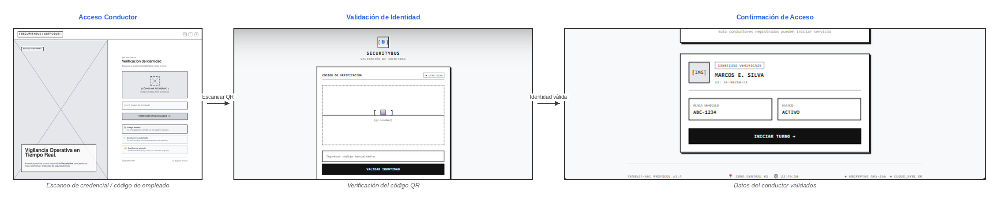

Secuencia: Acceso Conductor → Validación de Identidad → Confirmación del acceso

**Task Flow 2: Inicio de servicio y monitoreo de pasajeros**
Objetivo del usuario: Permitir al conductor iniciar el servicio, monitorear su ruta y controlar el conteo de pasajeros en tiempo real.

Pasos del Task Flow:

1. Configurar el servicio: seleccionar vehículo y turno de trabajo.
2. Iniciar el servicio y acceder al panel principal.
3. Registrar el abordaje y bajada de pasajeros.
4. Recibir alerta si se excede la capacidad máxima.
5. Consultar la ubicación de la unidad en el mapa.

User Goal 2: Como conductor, deseo registrar el inicio del servicio, para dejar evidencia del recorrido.

User Persona: Conductor
Desde Inicio de Servicio, el conductor selecciona el vehículo y el turno (mañana/tarde/noche) y confirma "Iniciar Servicio". El sistema lo redirige al Panel principal (Inicio), donde ve distancia, tiempo, pasajeros y la ruta operada en tiempo real.


User Goal 3: Como sistema, deseo contabilizar los pasajeros a bordo y alertar cuando se supera la capacidad del vehículo, para evitar altercados y estimar el riesgo.

User Persona: Conductor
Desde el panel de Conteo de Pasajeros, el conductor registra abordajes (+) y bajadas (−). Si el conteo (62/60) supera la capacidad máxima, el sistema dispara el modal "Has alcanzado el límite de pasajeros", que el conductor reconoce con "OK". Desde el mismo panel puede acceder a Ver Mapa para visualizar la ubicación de la unidad y su ruta.


Secuencia: Inicio de Servicio → Panel principal (Inicio) → Conteo de Pasajeros → Alerta de límite de pasajeros → Ver Mapa

**Task Flow 3: Gestión de una alerta de emergencia**
Objetivo del usuario: Permitir al conductor iniciar el servicio, monitorear su ruta y controlar el conteo de pasajeros en tiempo real.

Objetivo del usuario: Permitir al conductor activar una alerta de pánico y a la central confirmar su recepción y ubicación.
Pasos del Task Flow:

1. Activar el botón de pánico (Panic Signal) ante una situación de riesgo.
2. Confirmar el envío de la alerta.
3. La central recibe la ubicación de la unidad en el mapa de operaciones.
4. La central confirma la recepción de la alerta.

User Goal 4: Como conductor, deseo enviar una alerta de emergencia, para notificar una situación de riesgo; como sistema, deseo notificar a la central de operaciones, para gestionar la emergencia.
User Persona: Conductor / Central de Operaciones
Al presionar "Panic Signal", el conductor ve el modal "¡Alerta enviada!" con coordenadas GPS, estado de notificación a central y audio remoto activo, pudiendo cancelar en 5 segundos. La central, en su mapa de operaciones, recibe el pin "SOS" con el popup "Alerta crítica – Unidad" y accede a "Ver detalles". Finalmente, el sistema de central confirma la alerta mediante los pasos "Alert Sent → Alert Received → Confirmed".


Secuencia: Envío de Alerta → Ubicación de Envío de Alerta (vista central) → Confirmación de Alerta (central)

**Task Flow 4: Cierre de turno del conductor**
Objetivo del usuario: Permitir al conductor finalizar su turno dejando evidencia del servicio realizado.

Pasos del Task Flow:

1. Consultar el resumen del turno (distancia, tiempo, pasajeros, recaudación).
2. Completar el protocolo de cierre (checklist).
3. Confirmar la finalización del servicio.
   Visualizar la confirmación de cierre exitoso.

User Goal 5: Como conductor, quiero finalizar mi turno de forma segura y con evidencia registrada, para garantizar la trazabilidad del servicio.
User Persona: Conductor
Al terminar la ruta, el panel muestra el Resumen de Servicio con los totales del turno y el checklist de protocolo de cierre. Al presionar "Finalizar Servicio" (acción irreversible), el sistema muestra el modal "Servicio finalizado correctamente", con opciones "Ver reporte" o "Salir".


Secuencia: Resumen de Servicio → Finalizar Turno (confirmación)

**Task Flow 5: Supervisión y atención de alertas (Administrador)**
Objetivo del usuario: Permitir a la central supervisar las unidades activas y atender alertas críticas en tiempo real.

Pasos del Task Flow:

1. Visualizar el mapa con las unidades activas.
2. Detectar una alerta activa sobre el mapa.
3. Gestionar notificaciones y destinatarios de la red de alertas.

User Goal 6: Como empresa, deseo conocer el estado de mis vehículos en operación y clasificar las alertas según su gravedad, para tener control operativo.
User Persona: Administrador / Central de Operaciones
Desde el Centro de Control, el administrador visualiza las unidades activas sobre el mapa de Lima. Cuando ocurre una emergencia, el mismo mapa resalta "Alerts: 1 Active". Desde Notificaciones, el administrador gestiona los destinatarios activos y simula el envío de alertas según prioridad (baja/media/urgente).


Secuencia: Centro de Control → Centro de Control con Alerta → Notificaciones

**Task Flow 6: Gestión de conductores y unidades**
Objetivo del usuario: Permitir administrar el registro de conductores y su asociación con los vehículos disponibles.

Pasos del Task Flow:

1. Consultar el listado de conductores registrados.
2. Revisar el detalle, licencias y línea de autorizaciones de un conductor.
3. Asociar un conductor disponible a un vehículo disponible.
4. Confirmar la asignación.

User Goal 7: Como sistema, deseo asociar un conductor a un vehículo, para asegurar la trazabilidad.
User Persona: Administrador
Desde Gestión de Conductores, el administrador revisa el listado y accede al detalle de un conductor (licencia, puntos, calificación, historial de autorizaciones). Desde Asignación de Unidades, selecciona un conductor disponible y un vehículo disponible, y confirma con "Confirmar Asignación", quedando reflejado en la tabla de asignaciones vigentes.


Secuencia: Gestión de Conductores → Asignación de Unidades

Task Flow 7: Trazabilidad y reportes operativos (Administrador)
Objetivo del usuario: Permitir a la central consultar el historial de turnos, indicadores de impacto y gestionar el reenvío de alertas no confirmadas.

Pasos del Task Flow:

1. Filtrar y consultar el historial de turnos por ruta y fecha.
2. Visualizar los indicadores de impacto del sistema.
3. Revisar y reenviar alertas no confirmadas.

**User Goal 8**: Como empresa, deseo conocer la cantidad de personas en distintas unidades, para comparar la ocupación entre distintas rutas.
User Persona: Administrador
Desde Historial de Turnos, el administrador filtra por rango de fecha y ruta, revisando el log de operaciones, pasajeros transportados e incidentes de cada turno. Desde Impacto en Números consulta métricas globales (conductores verificados, alertas gestionadas, pasajeros protegidos). Desde Gestión de Reenvíos, monitorea alertas pendientes/críticas y reenvía las que no fueron confirmadas.


Secuencia: Historial de Turnos → Impacto en Números → Gestión de Reenvíos

#### 4.4.3. Web Applications Mock-ups

En esta sección se presentan los mockups desarrollados para la plataforma SecurityBus, los cuales permiten visualizar la propuesta de diseño de las interfaces con un mayor nivel de detalle. Estos incorporan elementos visuales como colores, tipografías, iconografía, componentes y distribución gráfica, con el propósito de representar de manera cercana la apariencia final de la plataforma.

Los mockups fueron elaborados considerando los principales perfiles de usuario de SecurityBus: los consorcios o empresas de transporte público y los conductores de transporte público. De esta manera, se busca que cada interfaz responda a las necesidades y funcionalidades correspondientes a cada perfil, al mantener una experiencia visual coherente y que facilite la interacción con el sistema.


Trabajo elaborado en Figma: [Web Application Mockups](https://www.figma.com/design/dZGVlWuEfGy76GBO9a8nmO/SecurityBus?node-id=0-1&p=f&t=rfW5UFtjZ6xjUzo9-0 'Web Application Mockups')

**1. Acceso y autenticación del conductor**


**2. Validación de identidad del conductor**


**3. Confirmación del acceso del conductor**


**4. Panel principal del conductor**


**5. Inicio y configuración del servicio**


**6. Registro y monitoreo del conteo de pasajeros**


**7. Alerta asociada al conteo de pasajeros**


**8. Visualización de la ubicación de la unidad**


**9. Generación de una alerta de emergencia**


**10. Confirmación de ubicación durante la emergencia**


**11. Confirmación del envío de la alerta**


**12. Resumen de la jornada de servicio**


**13. Finalización del turno del conductor**


**14. Supervisión general de las unidades**


**15. Visualización y atención de una alerta**


**16. Gestión de notificaciones e incidentes**


**17. Gestión de conductores registrados**


**18. Asignación de conductores y unidades**


**19. Consulta del historial de turnos**


**20. Visualización de indicadores operativos**


**21. Gestión y reenvío de alertas**


#### 4.4.4. Web Applications User Flow Diagrams

**User Flow 1: Autenticación e inicio de servicio del conductor**

Relacionado al User Goal 1: Como conductor, quiero validar mi identidad mediante código QR antes de iniciar mi turno, para asegurar la trazabilidad del servicio.
El conductor accede a la pantalla de Acceso Conductor, escanea su credencial digital o ingresa su código de empleado. El sistema muestra la pantalla de Validación de Identidad con el escaneo del QR; una vez validado, se presenta la confirmación de acceso autorizado con la transmisión activa hacia central, habilitando el turno.


Relacionado al User Goal 2: Como conductor, quiero configurar e iniciar mi servicio, para dejar registro del recorrido que voy a realizar.
Desde Inicio de Servicio, el conductor selecciona el vehículo y el turno de trabajo y confirma "Iniciar Servicio". El sistema lo redirige al Panel Principal (Dashboard), donde visualiza distancia, tiempo, pasajeros y la ruta operada en tiempo real.


**User Flow 2: Monitoreo de pasajeros y atención de emergencias**

Relacionado al User Goal 3: Como sistema, deseo contabilizar los pasajeros a bordo y alertar cuando se supera la capacidad del vehículo, para evitar altercados y estimar el riesgo.
Desde el panel de Conteo de Pasajeros, el conductor registra abordajes y bajadas. Si el conteo supera la capacidad máxima, el sistema dispara la alerta "Has alcanzado el límite de pasajeros". Desde el mismo panel puede acceder a Ver Mapa para visualizar la ubicación de la unidad en ruta.


Relacionado al User Goal 4: Como conductor, deseo enviar una alerta de emergencia, para notificar una situación de riesgo; como sistema, deseo notificar a la central de operaciones, para gestionar la emergencia.
Al presionar el botón de pánico, el conductor ve la confirmación "¡Alerta enviada!" con coordenadas GPS y estado de notificación a central. La central, en su mapa de operaciones, recibe el pin "SOS" con los detalles de la unidad y confirma la alerta mediante el protocolo "Alert Sent → Alert Received → Confirmed".


**User Flow 3: Cierre de turno del conductor**

Relacionado al User Goal 5: Como conductor, quiero finalizar mi turno de forma segura y con evidencia registrada, para garantizar la trazabilidad del servicio.
Al terminar la ruta, el panel muestra el Resumen de Servicio con los totales del turno y el checklist de protocolo de cierre. Al presionar "Finalizar Servicio", el sistema muestra la confirmación "Servicio finalizado correctamente".


**User Flow 4: Supervisión y atención de alertas (Administrador)**

Relacionado al User Goal 6: Como empresa, deseo conocer el estado de mis vehículos en operación y clasificar las alertas según su gravedad, para tener control operativo.
Desde el Centro de Control, el administrador visualiza las unidades activas sobre el mapa de Lima. Cuando ocurre una emergencia, el mapa resalta la unidad en alerta. Desde Notificaciones, gestiona los destinatarios activos y simula el envío de alertas según prioridad.


**User Flow 5: Gestión de conductores y unidades (Administrador)**

Relacionado al User Goal 7: Como sistema, deseo asociar un conductor a un vehículo, para asegurar la trazabilidad.
Desde Gestión de Conductores, el administrador revisa el listado y el detalle de cada conductor. Desde Asignación de Unidades, selecciona un conductor y un vehículo disponibles y confirma la asociación, reflejada en la tabla de asignaciones vigentes.


**User Flow 6: Trazabilidad y reportes operativos (Administrador)**

Relacionado al User Goal 8: Como empresa, deseo conocer indicadores globales y el historial de turnos, para comparar la ocupación y el desempeño entre distintas rutas.
Desde Historial de Turnos, el administrador filtra por fecha y ruta, revisando pasajeros e incidentes de cada turno. Desde Impacto en Números consulta métricas globales de la red. Desde Gestión de Reenvíos, monitorea y reenvía alertas no confirmadas.


### 4.5. Web Applications Prototyping

En esta sección se presenta el prototipo interactivo de SecurityBus, desarrollado para entornos desktop y mobile, que permite simular la navegación y las principales interacciones de la aplicación. El prototipo busca representar los flujos definidos en los User Flow Diagrams y su relación con la arquitectura de información y el sistema de navegación propuesto.

Para su diseño se consideraron criterios como la claridad de navegación, la consistencia de los componentes y la retroalimentación ante las acciones realizadas. Asimismo, se contemplan las experiencias de los conductores y del personal encargado de la gestión y monitoreo del servicio de transporte.

Finalmente, el video muestra los principales flujos de interacción del prototipo, evidenciando la navegación y ejecución de las tareas principales de SecurityBus.

**<center>Web Applications Prototyping</center>**


URL del video: [Web applications prototyping](https://upcedupe-my.sharepoint.com/personal/u202418823_upc_edu_pe/_layouts/15/stream.aspx?id=%2Fpersonal%2Fu202418823%5Fupc%5Fedu%5Fpe%2FDocuments%2FSecurity%20Bus%2FDesktop%20Prototyping%2Emp4&referrer=StreamWebApp%2EWeb&referrerScenario=AddressBarCopied%2Eview%2E3b7ed5d3%2D4cf6%2D4834%2D9541%2D63af6480793c&isDarkMode=true)

**<center>Web Applications Prototyping</center>**


URL del video: [Mobile applications prototyping](https://upcedupe-my.sharepoint.com/personal/u202418823_upc_edu_pe/_layouts/15/stream.aspx?id=%2Fpersonal%2Fu202418823%5Fupc%5Fedu%5Fpe%2FDocuments%2FSecurity%20Bus%2FMobile%20Prototyping%2Emp4&referrer=StreamWebApp%2EWeb&referrerScenario=AddressBarCopied%2Eview%2E0563ee92%2Dc5c9%2D4938%2Db01c%2D272aff8321f0)

### 4.6. Domain-Driven Software Architecture

La arquitectura de software de **SecurityBus** se diseñó aplicando los principios de Domain-Driven Design (DDD). A partir de las cinco épicas definidas en la sección 3.1 se identificaron los _bounded contexts_ del sistema y se clasificaron según su valor estratégico para el negocio:

| Bounded Context                    | Clasificación DDD      | Épica relacionada | Responsabilidad                                                                                                           |
| :--------------------------------- | :--------------------- | :---------------- | :------------------------------------------------------------------------------------------------------------------------ |
| Gestión de Alertas de Emergencia   | **Núcleo (Core)**      | EPNN02            | Emisión, clasificación, difusión, reintento, escalamiento y registro de cada alerta. Es la razón de ser de la plataforma. |
| Gestión de Conductores y Servicios | Apoyo (Supporting)     | EPNN01            | Identificación del conductor, habilitación, vínculo con la unidad y ciclo de vida del servicio.                           |
| Monitoreo de Pasajeros y Ocupación | Apoyo (Supporting)     | EPNN03            | Conteo de ocupantes, detección de sobrecapacidad y análisis de variaciones.                                               |
| Landing Page informativa           | Genérico               | EPNN04            | Contenido público orientado a visitantes.                                                                                 |
| Web Services / API                 | Genérico (habilitador) | EPNN05            | Punto de entrada técnico que expone y protege los recursos del sistema.                                                   |

Esta clasificación guía las decisiones de las siguientes tres secciones: el EventStorming de diseño profundiza en los tres contextos con lógica de negocio propia, mientras que los diagramas C4 sitúan a la plataforma completa dentro de su ecosistema técnico.

#### 4.6.1. Design-Level EventStorming

El EventStorming de nivel de diseño toma los _hotspots_ identificados en el Big Picture EventStorming (sección 2.4) y los refina en comandos, agregados, eventos de dominio, políticas y modelos de lectura, siguiendo la notación de colores estándar. La Figura 4.1 muestra este refinamiento para los tres _bounded contexts_ con lógica de negocio propia:

<p align="center">
  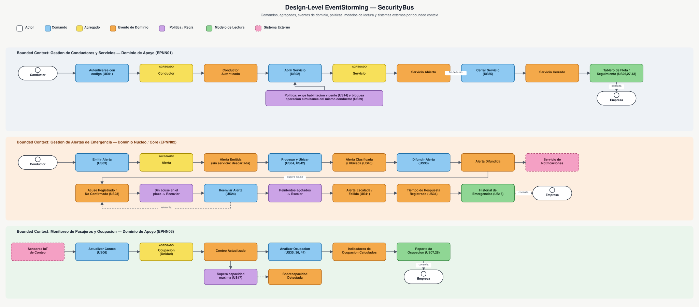
</p>

<p align="center"><em>Figura 4.1. Design-Level EventStorming — Gestión de Conductores y Servicios, Gestión de Alertas de Emergencia (dominio núcleo) y Monitoreo de Ocupación.</em></p>

**Gestión de Conductores y Servicios.** El conductor se autentica con su código vigente (US01) sobre el agregado `Conductor`, lo que produce el evento `Conductor Autenticado`. Antes de aceptar el comando `Abrir Servicio` (US02) sobre el agregado `Servicio`, una política verifica que la habilitación esté vigente (US14) y bloquea cualquier intento de operación simultánea del mismo conductor en otra unidad (US39). El servicio permanece abierto hasta que el conductor emite `Cerrar Servicio` (US25); ambos estados alimentan el modelo de lectura _Tablero de Flota / Seguimiento_ que consulta la empresa (US26, US27, US43).

**Gestión de Alertas de Emergencia (dominio núcleo).** El conductor emite la alerta (US03) sobre el agregado `Alerta`; si no existe un servicio en curso, la alerta se descarta en el mismo paso. Una vez emitida, el sistema la procesa, le asocia la ubicación (US04, US42) y la clasifica por gravedad (US40) antes de difundirla a los destinatarios configurados (US33), lo que involucra al sistema externo de notificaciones. La central debe acusar recepción (US23); dos políticas gobiernan lo que ocurre si no lo hace: una reenvía la alerta cuando se vence el plazo (US24) y otra la escala cuando los reintentos se agotan (US41). El tiempo de respuesta se mide (US34) y todo el recorrido queda disponible en el _Historial de Emergencias_ que consulta la empresa (US16).

**Monitoreo de Pasajeros y Ocupación.** Los sensores IoT reportan el ingreso y salida de pasajeros, lo que actualiza el conteo del agregado `Ocupación` (US06). Una política evalúa si se superó la capacidad máxima configurada y, de ser así, dispara el evento `Sobrecapacidad Detectada` (US17). En paralelo, el sistema analiza la ocupación para calcular promedios, detectar variaciones anómalas y comparar unidades (US35, US36, US44), publicando los resultados en el _Reporte de Ocupación_ que consulta la empresa (US07, US28).

#### 4.6.2. Software Architecture Context Diagram

Siguiendo el modelo C4, el diagrama de contexto (Nivel 1) sitúa a la Plataforma SecurityBus frente a las personas que la usan y los sistemas externos de los que depende, sin exponer aún su estructura interna:

<p align="center">
  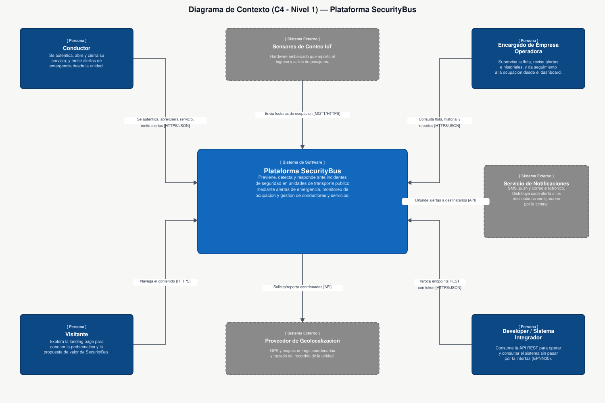
</p>

<p align="center"><em>Figura 4.2. Diagrama de Contexto (C4 — Nivel 1) de la Plataforma SecurityBus.</em></p>

Cuatro tipos de usuario interactúan con la plataforma: el **conductor**, que se autentica, abre y cierra su servicio y emite alertas desde la unidad; el **encargado de la empresa operadora**, que supervisa la flota y revisa alertas e historiales; el **visitante**, que explora la landing page para evaluar la propuesta de valor; y el **developer o sistema integrador**, que consume la API REST sin pasar por ninguna interfaz gráfica (EPNN05). La plataforma, a su vez, depende de tres sistemas externos: los **sensores de conteo IoT** embarcados en cada unidad, un **servicio de notificaciones** (SMS, push y correo) que distribuye las alertas a los destinatarios configurados, y un **proveedor de geolocalización** que entrega las coordenadas y el trazado del recorrido de cada unidad.

#### 4.6.3. Software Architecture Container Diagrams

El diagrama de contenedores (Nivel 2) descompone la Plataforma SecurityBus en sus unidades desplegables. Un API Gateway centraliza la autenticación y autorización de toda petición (US22, US50) y enruta el tráfico hacia cuatro microservicios, cada uno alineado a uno de los _bounded contexts_ de la sección 4.6:

<p align="center">
  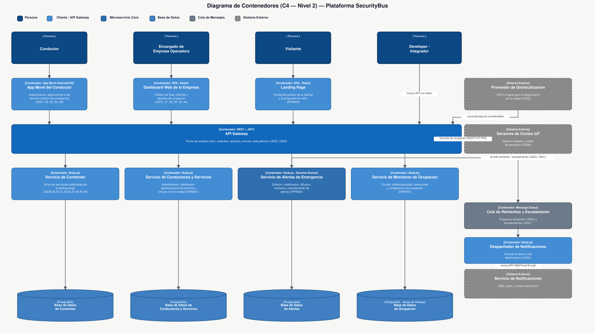
</p>

<p align="center"><em>Figura 4.3. Diagrama de Contenedores (C4 — Nivel 2) de la Plataforma SecurityBus.</em></p>

Los tres clientes (la app móvil del conductor, el dashboard web de la empresa y la landing page) y el developer externo acceden siempre a través del API Gateway, nunca directamente a un microservicio. El **Servicio de Alertas de Emergencia**, alineado al dominio núcleo, se distingue de los demás por delegar sus reintentos y escalamientos (US24, US41) a una **Cola de Reintentos y Escalamiento**, que a su vez alimenta un **Despachador de Notificaciones** encargado de integrar con el servicio externo de SMS, push y correo. Los servicios de **Conductores y Servicios**, **Monitoreo de Ocupación** y **Contenido** siguen el mismo patrón: cada uno persiste su propio estado en una base de datos dedicada, evitando el acoplamiento entre _bounded contexts_ a nivel de datos.

#### 4.6.4. Software Architecture Components Diagrams

<center>
<h4>Components Diagram — Authentication Service</h4>

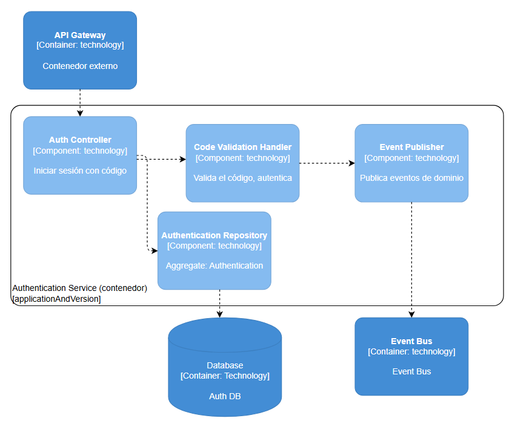

<h4>Components Diagram — User Service</h4>


<h4>Components Diagram — Profile Service</h4>

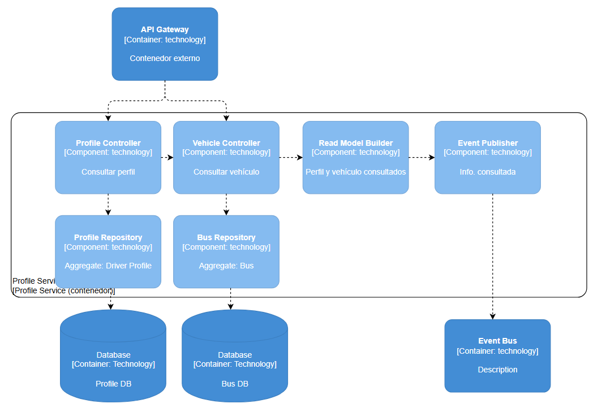

<h4>Components Diagram — Monitoring Service</h4>


</center>

---

### 4.7. Software Object-Oriented Design

#### 4.7.1 Class Diagrams

La arquitectura del sistema se ha modelado bajo el enfoque de Domain-Driven Design (DDD) para garantizar una alta cohesión y un bajo acoplamiento. Con el objetivo de facilitar el análisis del dominio y asegurar la legibilidad técnica, la representación visual del backend se ha segmentado. A continuación, se presentan los diagramas de clases correspondientes a los 4 Bounded Contexts identificados, detallando sus respectivos Agregados, Entidades y Objetos de Valor (Value Objects).

<center>
<h4>Bounded Context: Authentication Management</h4>

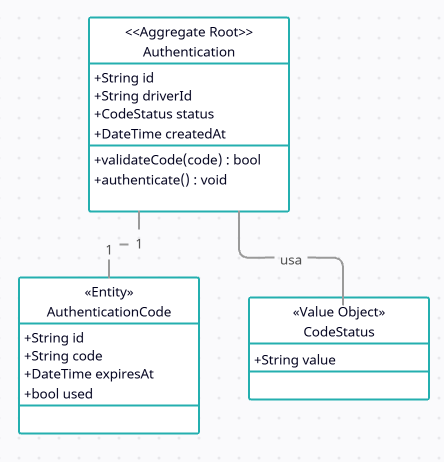

<h4>Bounded Context: User</h4>


<h4>Bounded Context: Profile</h4>

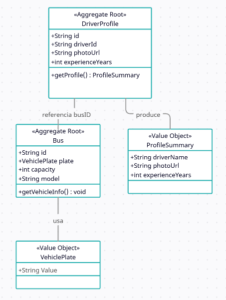

<h4>Bounded Context: Monitoring</h4>

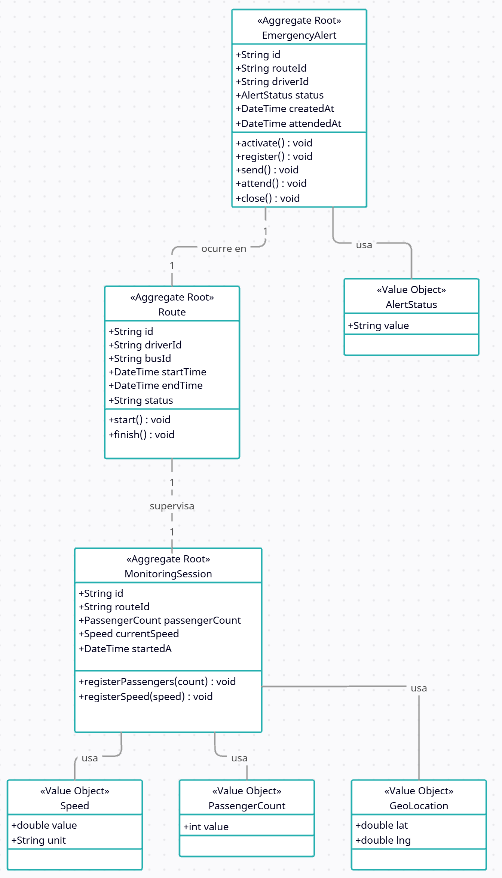

</center>

### 4.8. Database Design

Se adopta una estrategia de persistencia poliglota, con una base de datos independiente por Bounded Context (_database-per-service_), siguiendo el mismo límite que los Aggregates definidos en la sección 4.9. Authentication, User y Profile manejan datos estructurados de bajo volumen de escritura y se modelan como bases de datos **relacionales** (PostgreSQL). Monitoring recibe escritura de alta frecuencia (velocidad, pasajeros, ubicación) y necesita un esquema flexible para el historial de ubicación, por lo que se modela como base de datos **no relacional** orientada a documentos (MongoDB).

#### 4.8.1. Database Diagrams

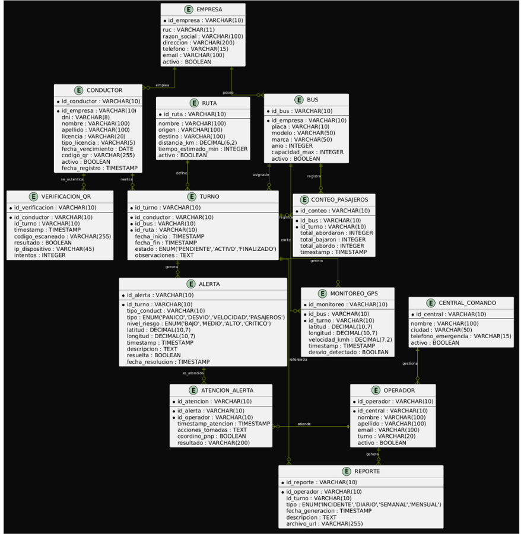

LINK:
https://www.plantuml.com/plantuml/uml/hLVXRjks4_-kfn3w_v3-XxfekcPT1moeOYkP2bloP3aOEWp2MJmxN2HIeoXtJTkds2FjnKP9L4qJYeesKJw4lj_TaR_Z7OzyNKaGiYvonpbnVxx7fyodKNWHNAvZRnhy-q_eNlgX7tlp-_fr92zToTqDbv8NBg42CqavSvpgXh8I11Jk1hARdU0r8rEUS-7-xzbvysTev9IXV5-YouMyvgOjCadbU_U3uwhlt7PqqNuTnWL1qK_GVgtyWZCvB5tHMtHFJvrFvdoU4FoTrd_flVAKlWKQ3lNqjaBl-vNfcE0MwbmsO0W5AbKAkQd0EC4AI_VxCqCeWDqqmXTdpWEaW1ycmSoR-QjxxxhUbaV-OXdxA--H2vMhntglldCfIR4e1LRW_kHUUV7q5oz-VFhi_oqycRJ_H9sPu6a72hZbBAruHY4_ijN6RPPbb3C3VDw34dFSSiPDmxCEmWBee4F89Dqt5kTHDFUzKEN4WQCgdDbwcaHno_BpBvDdnXcfCyd57Ko_70_2g27ziHCoNcm43Ywun3odX0zXESsGPHJCuFIneILF1t0Tdorcrv3k6xIWYdxZVkObVWjcdD0TJ_yIfj-pi-406ku4xcWbHGCcmS9V9TvYUHJVU9rq2TGCpAYAMjwHEkF1uOBka0qc3bQICZu8gKL24vRqfcXe-zDWuSqV__3aUHywB5Jm6WS549uMj9aX21F_qe-_d4JdwrNBKVqtAMxgwfjJfimX6v8Nd63EpTtj0H0P3CY1KMvnoQ24Z18WQG5_VmtFP1s7KSkq7PbSPIqO7sKxKaZZ0Hj95vs5bD6C7kMW0Mufin4NAmbjVVdXUl7uPEc7iy1NKJXvSk9Da-0gKeEB8FJcmLjl5ftepDjKAFRG74rODIxztvAZy5pvSN0HJ5KFZiBqr-v4iMHcoFOew9PchSDxH6ua-98M3TEYj0FGrpjM6J04meVANc1LvnA8NVcqJ0cjIbvHbIgcvGjjI9b49dbbf9OP9c_kn_fGw8PcK2178M4y72DyIzx7QXWszjmBWscppwfZNWNDuCgVHzEcXQhnqbjvR_muMkczPtIFUIeeLhk3YtFlJMEty6UjlJTFcd_JE4YKPssOWo9TayEXerRpvAN6EDiDWwDxHx3A12tRjD5Ps6yNvXBkEAShdjUDYUdExeI97wKzy-v4iuLMNvGuNlCZ9JsoYrn2diA62mA2MmUnHZVmfuLPbjo21i9fyLz4OQ0wls9xkUp87qbCvWLdL7BnyEJlaIygFtbtgDyKruR6IztZnXDgJtbAK69crVjHA_UNKPpuRMZq-AYXOyc5n2-4X9SeW7pLGMPNRX2gAjMdzIpmuhRuLlx2K-TrMuxXQgr6PeFO8KC1TlgFLHE8x9hkULgBt3uRZuf6hIFsvkaqKjFFkjveoOvAHja9oB_btfFHcW2n6xnn9KwnGB6pBt_wTZpUrwEb7tipVGVkVnZhjdRDMlWulM-_x8vSwNMUs5VWSPPUueTj6pORa2cpEf54DjwQHnlMIE2iUZHcid8JikwoaKfU087AJD2CSq4eusd9oWDXgt5RBwXF3_7EZFrvUvlnL-uoRcfnwSqVuD7PFp0_VfnC-8V3IqnnmABC4MmDTTbMMCahHCSvg6kqlQ0gN23az1QSvlbXOmItbA6Z7Da8L7J7WF01nzQ5JYbNc48jcopBm74w5rgvoogbqnr0nw3TMvMQVaw1kQOnDKFFwbPDrAX4SqPBvR0gfo_vNgy_tUrrswZ0BOecTvKF-zJJohthrbSbAMTALuT5gzWrg9PUjJL1A05hRKFQ8AdInGVExMYwdYTUazT-9Q5o5NyeGM26pDtJgeQyG2RngL9OKR5NKeM2omL11iB5t2KKTW8AU7hVTIdxYVhSfQ05gZcsD8TMOgRdvFThIjJSVmYwkvQJzhtTPRsDg9nnFlliYmg4e9lUQoSqB0b_noQ7cXnMq7CEOjQiNJuHLDSuRZEn3LjTYuc9ACU3m66s5UvgHi2zvQnds6eSp7BSoebTsbh9yjsbdSQiqDgrQZ1UWf3eKgOAXdBHolewiBqSbwbpzClMxOlnCD7RXYH1WTbrJrRhs4pwodBwmK6XBYVsDUPEAhhfsvJCgUoYFSnexO2jvpYlaP6woFy3

---

## Capítulo V: Product Implementation, Validation & Deployment

### 5.1. Software Configuration Management

#### 5.1.1. Software Development Environment Configuration

Para establecer el entorno de desarrollo del software, se han seleccionado diferentes herramientas, plataformas y guías de trabajo. La siguiente tabla muestra cada recurso utilizado, junto con la finalidad que cumple dentro del proyecto y el medio mediante el cual se puede acceder a este.

| Proceso | Recurso o plataforma | Finalidad | Medio de acceso o Enlace |
|---------|----------------------|-----------|--------------------------|
|Especificación de requisitos|Convenciones Gherkin|Definir condiciones de aceptación y criterios funcionales de manera clara y precisa| [Guía Gherkin](https://cucumber.io/docs/gherkin/)
|Desarrollo Landing Page| Visual Studio Code | Desarrollar, modificar y optimizar el código fuente de la aplicación web|[Visual Studio Code](https://code.visualstudio.com/)|
|Administrador de versiones| Git | Controlar las modificaciones realizadas y administrar las diferentes versiones del proyecto|[Git](https://git-scm.com/)|
|Diseño de experiencia e interfaz| Figma | Elaborar prototipos y organizar visualmente la interfaz de usuario|[Figma](https://figma.com)|
|Publicación y despliegue| Github Pages | Publicar y alojar la página web para permitir su acceso en línea|[Github Pages](https://pages.github.com/)|
|Planificación y gestión del proyecto| Jira Software | Administrar el Product Backlog, planificar los Sprints y realizar el seguimiento de las actividades mediante una metodología ágil|[Jira](https://www.atlassian.com/es/software/jira)|
|Diagramas| PlantUML | Crear representaciones UML relacionadas con la estructura y funcionamiento del sistema|[PlantUML](https://plantuml.com/)|
|Modelado de procesos| UXPressia | Desarrollar herramientas de análisis UX enfocadas en las necesidades y experiencia del usuario|[UXPressia](https://uxpressia.com/)|

#### 5.1.2. Source Code Management

El control del código fuente se realizará mediante GitHub, utilizado como repositorio central para almacenar el proyecto y facilitar el trabajo colaborativo. Además de permitir que los integrantes trabajen sobre una misma base de código, esta plataforma proporciona un historial de las modificaciones realizadas, lo que permite identificar los cambios efectuados durante el desarrollo y mantener su trazabilidad.

Para organizar el proceso de desarrollo, el equipo ha establecido un flujo de trabajo que combina elementos de Git Flow con prácticas de GitHub Flow. Esta organización busca separar adecuadamente el desarrollo de nuevas funcionalidades, la integración de cambios y la gestión de versiones estables, permitiendo que el proyecto pueda incorporar progresivamente nuevas características sin perder el control sobre el código existente.

La estrategia de ramas definida para el proyecto se distribuye de la siguiente manera:

**main:** mantiene la versión estable del sistema que está preparada para ser desplegada.<br>
**develop:** funciona como rama de integración de los avances antes de incorporarlos a la versión estable.<br>
**feature/:** se emplea para desarrollar funcionalidades nuevas o realizar mejoras específicas.<br>
**hotfix/:** se utiliza para solucionar problemas urgentes encontrados en la versión desplegada.

El desarrollo de una nueva funcionalidad comienza creando una rama independiente a partir de develop. Esta forma de trabajo permite que cada modificación sea desarrollada de manera aislada, reduciendo la posibilidad de afectar otras partes del proyecto mientras se encuentra en proceso de implementación.

Una vez que la funcionalidad o corrección ha sido completada, el resultado se incorpora mediante un Pull Request. Antes de realizar la fusión, los demás integrantes pueden revisar los cambios efectuados. De esta manera, la integración no depende únicamente del desarrollador que realizó la modificación, sino que también incorpora una instancia de revisión colaborativa.

**Convención para los commits**

Como complemento al manejo de ramas, se utilizará Conventional Commits para mantener una estructura uniforme en los mensajes de confirmación. Esto permite reconocer rápidamente qué tipo de modificación se realizó y facilita la consulta posterior del historial del proyecto.

Los prefijos considerados son:

| Prefijo | Uso |
|---------|-----|
| **feat** | Incorporación de una nueva funcionalidad. |
| **fix** | Corrección de un error existente. |
| **docs** | Actualización o modificación de documentación. |
| **refactor** | Reorganización o mejora interna del código sin modificar su funcionalidad. |
| **style** | Cambios relacionados con el formato o estilo del código. |
| **test** | Creación o modificación de pruebas. |

**Esquema de versionado**

El proyecto también empleará Semantic Versioning, representado mediante el formato MAJOR.MINOR.PATCH. Este mecanismo permitirá identificar de forma ordenada la evolución de las versiones y diferenciar los cambios realizados según su impacto sobre el sistema.

En conjunto, el uso de GitHub, la estrategia de ramas, los Pull Requests, Conventional Commits y Semantic Versioning proporciona una estructura de trabajo que facilita el control de las modificaciones y la colaboración entre los integrantes. Asimismo, estas prácticas contribuyen a que el código pueda mantenerse y ampliarse de forma organizada durante las siguientes iteraciones del proyecto.

#### 5.1.3. Source Code Style Guide & Conventions
Para evitar diferencias innecesarias en la forma de desarrollar los distintos componentes del sistema, se establecen criterios comunes de programación. Estas reglas serán aplicadas a los lenguajes empleados en el proyecto: HTML, CSS, JavaScript y C#.

Una de las reglas generales consiste en utilizar el inglés para nombrar variables, clases, archivos, comentarios técnicos y elementos de la documentación interna. Con ello se busca mantener una nomenclatura uniforme y facilitar la comprensión del código independientemente del integrante que lo revise o modifique.

Las convenciones adoptadas toman como referencia buenas prácticas provenientes de Google Style Guides, MDN JavaScript, MDN JavaScript Guidelines y Microsoft C# Coding Conventions. También se consideran criterios relacionados con la accesibilidad y la legibilidad del código.

**HTML**

La construcción de la interfaz se realizará mediante HTML5 semántico, buscando que los elementos del documento tengan una organización lógica y que el contenido sea accesible.

Para ello, se tendrán en cuenta las siguientes reglas:

+ Las secciones principales utilizarán etiquetas semánticas como &lt;header&gt;, &lt;nav&gt;, &lt;main&gt;, &lt;section&gt;, &lt;article&gt; y &lt;footer&gt;.
+ Las etiquetas y atributos HTML se escribirán en minúsculas.
+ Todas las etiquetas deberán cerrarse correctamente.
+ Las imágenes incluirán el atributo alt para proporcionar información alternativa y favorecer la accesibilidad.
+ Cuando corresponda, las imágenes definirán sus dimensiones mediante width y height.
+ El documento HTML establecerá lang="en" en la etiqueta &lt;html&gt;.
+ Se incluirán elementos básicos de metadatos, entre ellos &lt;title&gt; y &lt;meta name="descripcion"&gt;.
+ Se evitará incorporar estilos y scripts directamente dentro del HTML cuando no sea necesario.

Ejemplo:
```HTML
<section class="hero-banner">
    
</section>
```

**CSS**

Los estilos estarán organizados de manera modular, procurando que puedan reutilizarse y mantenerse con facilidad. Para la nomenclatura de las clases se utilizará kebab-case y se aplicará la metodología BEM (Block Element Modifier) para establecer una estructura coherente.

También se seguirán estos criterios:

+ Utilizar nombres de clases descriptivos.
+ Organizar las propiedades CSS siguiendo una secuencia lógica relacionada con el layout, box model, tipografía y apariencia visual.
+ Priorizar unidades relativas como rem, %, vh y vw.
+ No especificar unidades cuando el valor establecido sea cero.
+ Diseñar bajo un enfoque mobile-first para facilitar la adaptación a diferentes tamaños de pantalla.
+ Centralizar las variables reutilizables dentro de :root.

Ejemplo: 

```CSS
:root{ 
--primary-color: #2563eb; 
--secondary-color: #64748b; 
} 
.main-header{ 
    padding: 1rem; 
    background-color: var(--primary-color); 
}
```

**JavaScript**

En el caso de JavaScript, las convenciones estarán orientadas a mantener una estructura clara y facilitar la reutilización y modificación del código.

Se aplicarán las siguientes reglas:

+ Las variables y funciones utilizarán camelCase.
+ Las clases y constructores utilizarán PascalCase.
+ Para declarar variables se emplearán const y let, evitando var.
+ Las funcionalidades se distribuirán en archivos independientes de acuerdo con su responsabilidad.
+ Los eventos se gestionarán mediante addEventListener() en lugar de utilizar eventos directamente en el HTML.
+ Los comentarios se reservarán principalmente para explicar fragmentos cuya lógica sea compleja o poco evidente.
+ Los nombres de las funciones deberán describir la acción que realizan.

Ejemplo:

```JavaScript
const submitButton = document.querySelector("#submit-button"); 
function validateForm(){ 
    return true; 
}
```

**C#**

Para los componentes relacionados con el backend y la lógica de negocio se seguirán las convenciones recomendadas para C# por Microsoft.

Entre los principales criterios se encuentran:

+ Aplicar PascalCase a clases, métodos y propiedades.
+ Utilizar camelCase para variables locales y parámetros.
+ Nombrar los métodos mediante expresiones descriptivas que representen acciones.
+ Considerar el principio Single Responsibility Principle (SRP) para distribuir adecuadamente las responsabilidades.
+ Evitar líneas excesivamente extensas para facilitar la lectura.
+ Incorporar comentarios breves en métodos críticos cuando sea necesario.
+ Organizar los componentes utilizando las capas controllers, services, repositories y models.

Ejemplo:
```C#
public class UserService { 
    public bool ValidateCredentials(string userEmail, string password) { 
        return true; 
        } 
    }
```

**Gherkin**

Para expresar los criterios de aceptación y estructurar las pruebas funcionales se empleará Gherkin. Su utilización permitirá describir el comportamiento esperado del sistema mediante una estructura comprensible tanto para los integrantes técnicos como para los stakeholders.

Los escenarios deberán cumplir con las siguientes condiciones:

Seguir la estructura Given-When-Then.
Utilizar un lenguaje comprensible para personas sin conocimientos técnicos.
Contar con títulos específicos que permitan identificar fácilmente el escenario.
Emplear Scenario Outline cuando sea necesario representar diferentes casos que mantengan una estructura similar.

Ejemplo:

```gherkin
Feature: User Login 
Scenario: Sucessful login 
    Given the user is on the login page 
    When the user enters valid credential 
    Then the system should redirect to the dashboard
```

**Principios generales de codificación**

Además de las reglas específicas para cada lenguaje, el desarrollo se orientará mediante cinco principios generales:

+ Readability First: priorizar que el código pueda entenderse fácilmente.
+ Consistency: conservar criterios de desarrollo uniformes en toda la solución.
+ Modularity: separar las responsabilidades en módulos claramente definidos.
+ Scalability: mantener una estructura que pueda soportar el crecimiento futuro del sistema.
+ Maintainability: facilitar la corrección, modificación y evolución del código.

#### 5.1.4. Software Deployment Configuration

**Despliegue de la Landing Page**

La Landing Page será desarrollada utilizando HTML, CSS y JavaScript y posteriormente publicada mediante GitHub Pages. Para ello, primero será necesario mantener correctamente organizados los archivos dentro del repositorio remoto.

**Organización del repositorio**

El archivo index.html deberá encontrarse directamente en la raíz del repositorio, debido a que será utilizado como archivo inicial durante el proceso de publicación. Los recursos complementarios se distribuirán en carpetas independientes según su función, permitiendo diferenciar los estilos, scripts e imágenes y facilitando el mantenimiento posterior.

La estructura prevista será la siguiente:

```
/ 
|---index.html 
|---css/ 
|   |__ styles.css 
|---js/ 
|  |__ main.js 
|---assets/ 
|       |__ images/
```
**Configuración de GitHub Pages**

Una vez que los archivos se encuentren disponibles en el repositorio, se configurará GitHub Pages como servicio de publicación de la Landing Page.

La configuración contempla las siguientes acciones:

1. Acceder al repositorio del proyecto en GitHub.
2. Ingresar a Settings.
3. Seleccionar la sección Pages.
4. Establecer la rama main como fuente de publicación.
5. Seleccionar la carpeta raíz /root como directorio de despliegue.
6. Guardar la configuración.

Después de completar la configuración, GitHub realizará automáticamente el proceso necesario para generar y publicar el sitio.

**Acceso a la versión publicada**

Cuando el despliegue haya finalizado, GitHub proporcionará una dirección pública desde la cual será posible acceder a la Landing Page.

La estructura esperada de la dirección será:

```
https://<usernanme>.github.io/<repository-name>/
```

Esta dirección corresponderá al acceso público de la versión oficial del producto.

**Actualización del sitio**

El proceso de despliegue también contempla las futuras modificaciones realizadas por el equipo. Cada cambio efectuado en la Landing Page deberá registrarse mediante un nuevo commit y enviarse al repositorio.

Cuando los cambios sean incorporados a la rama principal, GitHub Pages actualizará automáticamente el contenido publicado. Así, la versión disponible en línea podrá mantenerse sincronizada con la versión estable más reciente del código fuente.


### 5.2. Landing Page, Services & Applications Implementation

#### 5.2.1. Sprint 1

##### 5.2.1.1. Spring Planning 1
Para este primer Sprint, el equipo estableció como objetivo principal la implementación y despliegue de la primera versión de la Landing Page.

| Campo | Detalle |
|-------|---------|
| Sprint # | Sprint 1 |
| Date | 2026-09-06 |
| Time | 05:00 PM |
| Location | Reunión virtual vía Google Meet |
| Prepared By | Pillaca Gonzales, Andy Saúl |
| Attendees | Justo Yauricasa, Alexander Paolo / Pillaca Gonzales, Andy Saúl /Alvarado Millan, Boris / Martinez Ramos, Bryan Felix / Nawrocki Loureiro, Ian Andre |
| Sprint N-1 Review Summary | Dado que este es el Sprint inicial del proyecto, no se cuenta con un ciclo anterior para revisión. En consecuencia, la implementación del producto comienza formalmente desde sus cimientos. |
| Sprint N-1 Retrospective Summary | Al tratarse de la iteración inicial, no se cuenta con un proceso de retrospectiva previo. No obstante, el equipo estableció el compromiso de asegurar una comunicación fluida y acatar los plazos previstos. |
| Sprint 1 Goal | Nos enfocamos en el desarrollo y lanzamiento de la primera versión de la Landing Page, orientada a comunicar nuestra propuesta de valor: mejorar la seguridad y monitorieo en el transporte público. Consideramos que transmite con claridad los beneficios del sistema a potenciales clientes, lo cual se validará cuando el sitio esté en línea, cuente con todas las secciones clave y permita una navegación fluida. |
| Sprint N Velocity | 09 |
| Sum of Story Points | 09 |

##### 5.2.1.2. Aspect Leaders and Collaborators

| Team Member | GitHub Username | Configuración del Repositorio y CI/CD (L/C) | Estructura Base del Landing Page (L/C) | Funcionalidades Interactivas (L/C) | Corrección de Contenido (L/C) |
|------------|-----------------|---------------------------------------------|----------------------------------------|-----------------------------------|-------------------------------|
| Alvarado Millan, Boris | borisalvaradomillanPE | L | C | C | C |
| Justo Yauricasa, Alexander Paolo | AlexanderrJusto | C | C | C | L |
| Martinez Ramos, Bryan Felix | BryanMR1 | C | L | L | C |
| Pillaca Gonzales, Andy Saúl | apillacag | C | C | C | L |
| Nawrocki Loureiro, Ian Andre | IanNaw | C | C | C | L |

##### 5.2.1.3. Sprint Backlog 1
Se presenta el desglose tecnico de las historias seleccionadas para esta iteracion inicial. El proposito prioritario del Sprint abarca el despliegue de la pagina de aterrizaje y el cimiento de la arquitectura tecnologica del proyecto. Seguidamente, se incluye la imagen del tablero de Trello y la tabla de estados correspondiente a los elementos de trabajo.

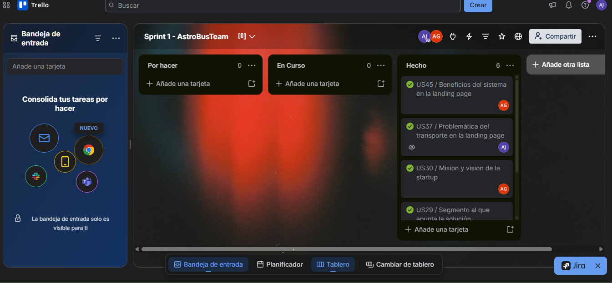

link: https://trello.com/invite/b/6aada76451c89821aa1c576d/ATTI9ede0c7d6fa24ae911466aeadaa1cec5C94715BC/sprint-1-astrobusteam 

| Sprint # | Sprint 1 | | | | | | |
|----------|----------|-|-|-|-|-|-|
| **User Story** | | **Work-item / Task** | | | | | |
| Story Id | Story Title | Task Id | Task Title | Task Description | Estimation (Hours) | Assigned To | Status (To-do / In-Process / To-Review / Done) |
| US29 | Segmento al que apunta la solución | T-01 | Segmento al que apunta | Mostramos a como y andonde apunta nuestro sistema. | 2 | Alvarado Millan, Boris | Done |
| US37 | Problemática del transporte en la landing page | T-02 | Problematica | Mostrar la desbentajas del traspodte publico sin nuestro aplicacativo. | 2 | Justo Yauricasa, Alexander Paolo | Done |
| US38 | Propuesta de valor en la landing page | T-03 | Propuesta de valor | Mostrar los valores que tiene nuestra aplicativo en el trasporte publico. | 1 | Martinez Ramos, Bryan Felix | Done |
| US45 | Beneficios del sistema en la landing page | T-04 | Beneficios | Mostrar los beneficios que tiene nuestra aplicativo en el trasporte publico. | 1 | Pillaca Gonzales, Andy Saúl | Done |
| US46 | Equipo detrás de la solución | T-05 | Equipo | Mostramos las soluciones que tene nuestro aplicatico en el traspote publico | 2 | Nawrocki Loureiro, Ian Andre | Done |
| US30 | Mision y vision de la startup | T-06 | Mision y vision | Mostromos la vision y mision en la Landing Page. | 1 | Pillaca Gonzales, Andy Saúl | Done |


##### 5.2.1.4. Development Evidence for Sprint Review

##### 5.2.1.5. Execution Evidence for Sprint Review

Durante el primer Sprint, la prioridad del equipo fue la implementación y el lanzamiento de la primera versión de la página. El propósito central fue posicionar la propuesta de valor en materia de seguridad para el transporte público mediante una estructura que abarca desde la presentación general y los beneficios, hasta testimonios, funcionalidades clave y canales de contacto. 

La Landing Page incluye las siguientes secciones:

- **Hero:** Sección inicial que presenta el mensaje principal "Protege tu ruta, asegura tu futuro" e incorpora los accesos "Empezar ahora" y "Ver características" para orientar al usuario hacia las principales opciones de la plataforma.


- **Caracteristicas:** Presenta las funciones principales de SecurityBus, como la validación del conductor mediante código QR, el botón de pánico para situaciones de emergencia, el control de pasajeros a bordo y el seguimiento de la unidad durante el recorrido.

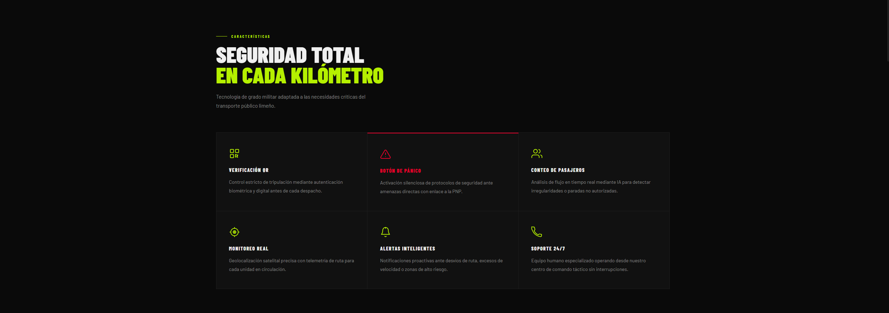

- **Funcionalidad** Expone de forma resumida el funcionamiento de SecurityBus, abarcando desde la verificación del conductor hasta las acciones previstas ante una situación de emergencia.


- **Navegacion:** Barra de navegación que facilita el acceso a las distintas secciones disponibles en la Landing Page de SecurityBus.


- **Estadistica:** Muestra datos relevantes que permiten contextualizar los principales problemas relacionados con la seguridad en el transporte público.

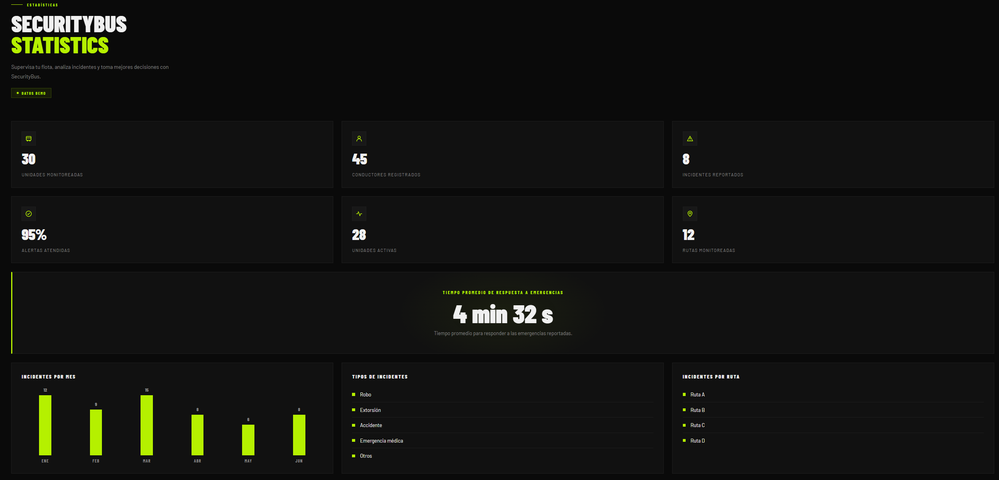

- **Interfaz:** Utiliza una apariencia moderna en modo oscuro, acompañada de elementos visuales y tonalidades contrastantes que refuerzan la identidad de SecurityBus.

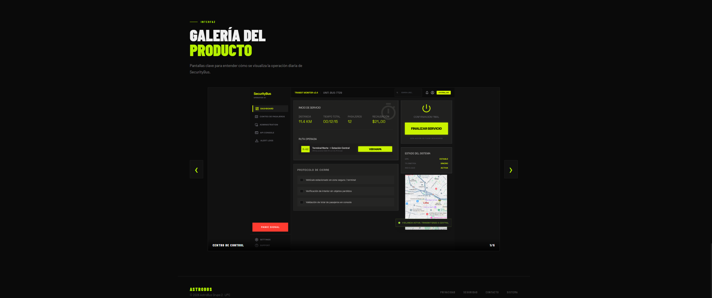

Link a la Landing Page: [SecurityBus Landing Page](https://astrobusteam.github.io/SecurityBus-landing-page-aw/)

##### 5.2.1.6. Services Documentation Evidence for Sprint Review

En el Sprint 1 de SecurityBus, el desarrollo estuvo centrado únicamente en la construcción de la Landing Page estática. Durante esta etapa no se implementaron servicios web, por lo que aún no se dispone de endpoints que requieran documentación. El desarrollo y la documentación de estos servicios se abordarán en los siguientes Sprints.

##### 5.2.1.7. Software Deployment Evidence for Sprint Review

Las funcionalidades desarrolladas durante este Sprint comprenden tanto la estructura principal de navegación como distintos elementos destinados a mejorar la experiencia del usuario en la Landing Page de SecurityBus. Para su construcción se estableció una organización basada en componentes reutilizables, un sistema de enrutamiento y estilos globales alineados con la identidad visual definida previamente para el proyecto.

El proceso de desarrollo se gestionó mediante Git Flow, utilizando ramas específicas para trabajar las diferentes funcionalidades antes de incorporarlas al proyecto mediante pull requests. Esta metodología permitió mantener una adecuada organización del código y facilitar el trabajo colaborativo entre los integrantes del equipo de AstroBus, quienes participaron en las distintas actividades relacionadas con el desarrollo front-end.

Asimismo, se realizaron ajustes orientados al diseño responsive, buscando que la Landing Page pueda visualizarse correctamente en distintos tamaños de pantalla. También se consideraron aspectos relacionados con el rendimiento y la accesibilidad web, tomando como referencia los estándares WCAG para ofrecer una interfaz más accesible a los diferentes usuarios vinculados con la propuesta de SecurityBus.

- 1: Primera funcionalidad: Implementación de la sección Hero, encargada de presentar el propósito principal de SecurityBus, acompañada de indicadores relacionados con el impacto de la propuesta y botones de llamada a la acción.
- 2: Segunda funcionalidad: Desarrollo de la sección de Características, donde se presentan las seis funcionalidades principales del sistema: Verificación QR, Botón de Pánico, Conteo de Pasajeros, Monitoreo Real, Alertas Inteligentes y Soporte 24/7.
- 3: Tercera funcionalidad: Incorporación de la sección ¿Cómo funciona SecurityBus?, en la que se explica el funcionamiento general de la propuesta mediante cuatro etapas: Inicio de Turno, Monitoreo Constante, Alerta Inmediata e Intervención.

---

### Despliegue en GitHub Pages

1. Se creó el repositorio público en la organización de GitHub del equipo SecurityBus y se subió el código fuente de la landing page construida con React + Vite.
   
2. En el repositorio. Dentro de **Pages**, como origen de publicación, se guardaron los cambios para activar la publicación automática.
   
3. Se configuraron los archivos necesarios para que los assets funcionen correctamente bajo el subdominio de GitHub Pages.
   
4. Se creó el archivo de workflow para automatizar el build y despliegue mediante GitHub Actions cada vez que se realice un push a la rama
   
5. Una vez activado el despliegue, GitHub Pages generó la URL pública del sitio desde donde cualquier usuario puede acceder a la landing page de SecurityBus sin necesidad de credenciales.
    
---

##### 5.2.1.8. Team Collaboration Insights during Sprint

Durante el Sprint 1, los integrantes del equipo AstroBus participaron de manera conjunta en el desarrollo de la Landing Page de SecurityBus, quedando sus aportes registrados mediante los commits realizados en el repositorio del proyecto. Las actividades fueron distribuidas entre los miembros del equipo, permitiendo avanzar de forma organizada en la implementación de las diferentes secciones, funcionalidades, contenido y aspectos visuales de la página.

Para administrar los cambios realizados durante el desarrollo, el equipo utilizó GitFlow como estrategia de control de versiones. El trabajo se realizó principalmente sobre la rama develop, utilizando ramas específicas para cada capitulo. 
Posteriormente, los cambios fueron integrados mediante Pull Requests, permitiendo revisar las modificaciones antes de incorporarlas a las ramas principales del proyecto.

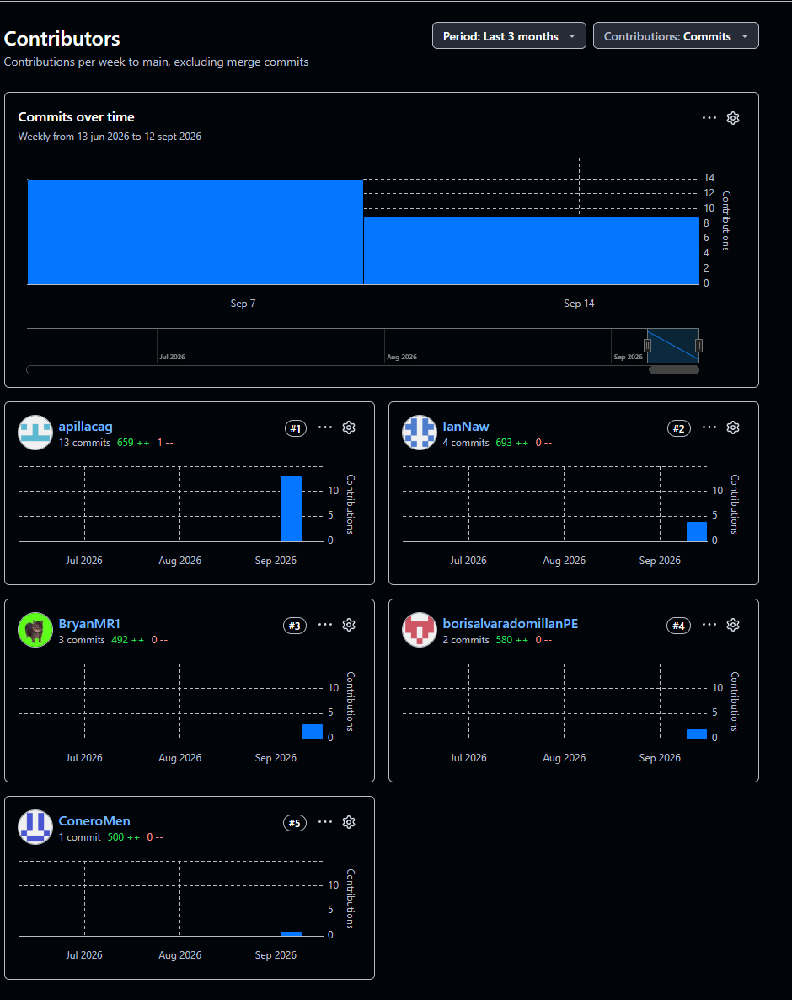

## Conclusiones

### Conclusiones y Recomendaciones

SecurityBus plantea una solución tecnológica orientada a mejorar la seguridad en el transporte público, considerando las necesidades tanto de las empresas de transporte como de los conductores durante la operación de las unidades.

La propuesta integra funcionalidades como la verificación del conductor mediante código QR, botón de pánico, conteo de pasajeros y monitoreo de las unidades, permitiendo abordar diferentes situaciones relacionadas con el control y la seguridad durante los recorridos.

El proyecto busca facilitar una respuesta más rápida ante situaciones de riesgo y proporcionar a las empresas información que les permita tener un mayor conocimiento de lo que ocurre durante la operación de sus unidades.

Asimismo, SecurityBus busca complementar las medidas tradicionales de seguridad mediante herramientas digitales que permitan mejorar la comunicación y supervisión entre conductores y empresas de transporte.

**Recomendaciones**

Se recomienda priorizar una experiencia de uso sencilla y rápida, especialmente en funcionalidades destinadas a situaciones de emergencia, evitando procesos complejos que puedan dificultar su utilización por parte del conductor.

Es importante continuar validando las necesidades de conductores y empresas de transporte, con el propósito de asegurar que las funcionalidades desarrolladas respondan a situaciones reales presentes durante los recorridos.

También se recomienda garantizar la confiabilidad de funciones críticas como el botón de pánico, la verificación mediante QR y el monitoreo, debido a que su correcto funcionamiento resulta fundamental dentro de la propuesta de seguridad de SecurityBus.

Finalmente, se recomienda desarrollar SecurityBus de manera progresiva, evaluando los resultados obtenidos con los usuarios y utilizando esta información para mejorar las funcionalidades y adaptar la plataforma a las necesidades del transporte público.

---

## Bibliografía

Brandolini, A. (2021). Introducing EventStorming: An act of deliberate collective learning. Leanpub. https://leanpub.com/introducing_eventstorming

Brown, S. (2020). The C4 model for visualising software architecture. C4 Model. https://c4model.com/

Cucumber. (s.f.). Gherkin Reference: Syntax and Keywords. https://cucumber.io/docs/gherkin/

EmailJS. (2024). EmailJS Official Documentation. https://www.emailjs.com/docs/

Evans, E. (2003). Domain-Driven Design: Tackling Complexity in the Heart of Software. Addison-Wesley Professional. https://www.oreilly.com/library/view/domain-driven-design-tackling/0321125215/

GitHub. (2024). GitHub Actions and GitHub Pages Documentation. https://docs.github.com/

Gothelf, J., & Seiden, J. (2021). Lean UX: Designing Great Products with Agile Teams (3.ª ed.). O'Reilly Media. https://www.oreilly.com/library/view/lean-ux-3rd/9781492048596/

---

## Anexos

**<center>Anexo A: Guía de entrevistas por segmentos</center>**<br>

Segmento 1: Empresas y organizaciones de transporte publico

|#|Preguntas de Entrevista|
|-|-----------------------|
|1|¿Cómo gestionan actualmente las emergencias que ocurren durante el recorrido de sus unidades?|
|2|¿Cuándo ocurre un asalto, extorsión o incidente, ¿cuál es el procedimiento que siguen para atenderlo?|
|3|¿Qué dificultades encuentran para conocer en tiempo real lo que sucede dentro de una unidad?|
|4|¿Cuáles son los riesgos de seguridad que más afectan a su empresa y a sus conductores?|
|5|¿Cuánto tiempo suele transcurrir entre el incidente y que la empresa sea informada?|
|6|¿Qué herramientas tecnológicas utilizan actualmente para monitorear sus vehículos y conductores?|
|7|¿Considera útil que el conductor pueda activar un botón de pánico con envío automático de ubicación GPS? ¿Por qué?|
|8|¿Qué información sería indispensable que reciba la central al momento de una alerta de emergencia?|
|9|¿Qué factores influirían en la decisión de implementar este sistema en su organización?|
|10|¿Qué beneficios esperaría obtener de una plataforma de seguridad y monitoreo de transporte publico?|

Segmento 2: Conductores de transporte público

|#|Preguntas de Entrevista|
|-|-----------------------|
|1|¿Qué situaciones de inseguridad has vivido o presenciado durante tu jornada laboral?|
|2|¿Qué tipo de apoyo o asistencia esperas recibir por parte de tu empresa después de reportar una emergencia?|
|3|¿En qué momentos del recorrido sientes que existe mayor riesgo de sufrir un asalto o una amenaza?|
|4|¿Cuando ocurre una emergencia, ¿cómo solicitas ayuda actualmente?|
|5|¿Qué tan seguro te sentirías utilizando un botón de pánico que envíe una alerta de forma silenciosa?|
|6|¿Qué tan importante consideras que la empresa conozca tu ubicación en tiempo real durante una emergencia?|
|7|¿Qué dificultades enfrentas para comunicarte con tu empresa mientras estás conduciendo?|
|8|¿Qué información te gustaría que recibiera la central al activar una alerta de emergencia?|
|9|¿Crees que un sistema de seguridad y seguimiento podría ayudarte a reaccionar mejor ante situaciones de riesgo? ¿Por qué?|
|10|¿Qué características considerarías indispensables en una aplicación de seguridad para conductores?|

**<center>Anexo B: Gestión del Product Backlog en Trello</center><br>

**Referencia:** AstroBus. (2026). Product Backlog de SecurityBus. Trello.
<a href="https://trello.com/invite/b/6aada76451c89821aa1c576d/ATTI9ede0c7d6fa24ae911466aeadaa1cec5C94715BC/sprint-1-astrobusteam">https://trello.com/invite/b/6aada76451c89821aa1c576d/ATTI9ede0c7d6fa24ae911466aeadaa1cec5C94715BC/sprint-1-astrobusteam</a>

Se presenta el desglose tecnico de las historias seleccionadas para esta iteracion inicial. El proposito prioritario del Sprint abarca el despliegue de la pagina de aterrizaje y el cimiento de la arquitectura tecnologica del proyecto. Seguidamente, se incluye la imagen del tablero de Trello y la tabla de estados correspondiente a los elementos de trabajo.


**<center>Anexo C: Prototipado y Diseño de Interfaces en Figma</center><br>
**Referencia:** AstroBus. (2026). Design System & Mockups de SecurityBus. Figma.
<a href="https://www.figma.com/design/dZGVlWuEfGy76GBO9a8nmO/SecurityBus?node-id=194-17020&t=qkGb9pUHIXJa9Tu6-0">https://www.figma.com/design/dZGVlWuEfGy76GBO9a8nmO/SecurityBus?node-id=194-17020&t=qkGb9pUHIXJa9Tu6-0</a>

<center>Captura o Evidencia del Diseño de Interfaces - Figma</center><br>


